# WordPress Clone Manager - API Guide

> **Status:** ✅ `/clone` endpoint is **WORKING** and tested for basic use cases

## 🎯 What This Does

This service **automatically clones WordPress sites** without any manual steps. Just provide admin credentials, and it:

1. ✅ Installs the migration plugin automatically
2. ✅ Exports the source WordPress site
3. ✅ Creates a fresh target WordPress instance (optional)
4. ✅ Imports everything to the target
5. ✅ Returns the cloned site URL

**No clicking, no manual plugin installation, no copy-pasting API keys.**

---

## 🏗️ Architecture Overview

```mermaid
graph TB
    subgraph "Developer/User"
        USER[👤 Developer with<br/>WordPress Credentials]
    end
    
    subgraph "Setup Service (FastAPI)"
        API[🚀 /clone Endpoint<br/>Port 8000]
        AUTH[🔐 WordPress Auth]
        PLUGIN[📦 Plugin Installer]
        BROWSER[🌐 Playwright Browser<br/>Automation]
    end
    
    subgraph "Source WordPress"
        SRC_WP[🌍 Source Site<br/>e.g., production]
        SRC_PLUGIN[Custom Migrator Plugin]
        SRC_EXPORT[📤 Export API]
    end
    
    subgraph "Target WordPress"
        TGT_WP[🎯 Target Site<br/>Fresh/Staging]
        TGT_PLUGIN[Custom Migrator Plugin]
        TGT_IMPORT[📥 Import API]
    end
    
    subgraph "AWS Infrastructure (Optional)"
        EC2[☁️ Auto-Provisioned<br/>EC2 Instance]
        DOCKER[🐳 Docker Container<br/>WordPress + MySQL]
    end
    
    USER -->|POST /clone with credentials| API
    
    API -->|1. Authenticate| AUTH
    AUTH -->|Login| SRC_WP
    
    API -->|2. Install Plugin| BROWSER
    BROWSER -->|Upload & Activate| SRC_WP
    SRC_WP -->|Generate API Key| SRC_PLUGIN
    
    API -->|3. Setup Target| EC2
    EC2 -->|Provision| DOCKER
    DOCKER -->|WordPress Ready| TGT_WP
    
    API -->|4. Clone Content| SRC_EXPORT
    SRC_EXPORT -->|ZIP Archive| TGT_IMPORT
    
    TGT_IMPORT -->|Restore| TGT_WP
    API -->|5. Return Cloned URL| USER
    
    style API fill:#4CAF50,stroke:#2E7D32,color:#fff
    style SRC_WP fill:#2196F3,stroke:#1565C0,color:#fff
    style TGT_WP fill:#FF9800,stroke:#E65100,color:#fff
    style USER fill:#9C27B0,stroke:#6A1B9A,color:#fff
```



---

## 🔄 Step-by-Step Flow

### **Scenario 1: Clone with Auto-Provisioned Target** ✅ WORKING


### **Scenario 2: Clone to Existing Target** ✅ WORKING

```mermaid
sequenceDiagram
    participant User
    participant API as Setup Service
    participant Source as Source WordPress
    participant Target as Target WordPress
    
    User->>API: POST /clone<br/>{source + target credentials}
    
    API->>Source: Setup plugin
    Source-->>API: ✅ Source API key
    
    API->>Target: Setup plugin + enable import
    Target-->>API: ✅ Target API key
    
    API->>Source: Export
    Source-->>API: ✅ Archive URL
    
    API->>Target: Import archive
    Target-->>API: ✅ Done
    
    API-->>User: ✅ Clone complete
```



---

## 🚀 API Endpoints

### Base URL
```
http://35.171.228.29:8000
```

### Interactive Documentation
- **Swagger UI:** http://35.171.228.29:8000/docs
- **ReDoc:** http://35.171.228.29:8000/redoc

---

### ✅ `POST /clone` - **WORKING & TESTED**

Clone a WordPress site from source to target.

#### Request Body

```json
{
  "source": {
    "url": "https://source-wordpress.com",
    "username": "admin",
    "password": "admin_password"
  },
  "target": {
    "url": "https://target-wordpress.com",
    "username": "admin",
    "password": "admin_password"
  },
  "auto_provision": false
}
```

**OR with auto-provisioning:**

```json
{
  "source": {
    "url": "https://source-wordpress.com",
    "username": "admin",
    "password": "admin_password"
  },
  "auto_provision": true,
  "ttl_minutes": 60
}
```

#### Parameters

| Field | Type | Required | Description |
|-------|------|----------|-------------|
| `source.url` | string | ✅ Yes | Source WordPress URL (must include http:// or https://) |
| `source.username` | string | ✅ Yes | WordPress admin username |
| `source.password` | string | ✅ Yes | WordPress admin password |
| `target.url` | string | ⚠️ If `auto_provision=false` | Target WordPress URL |
| `target.username` | string | ⚠️ If `auto_provision=false` | Target admin username |
| `target.password` | string | ⚠️ If `auto_provision=false` | Target admin password |
| `auto_provision` | boolean | No (default: `true`) | Auto-create AWS target if `true` |
| `ttl_minutes` | integer | No (default: `60`) | How long auto-provisioned target lives (5-120 min) |

#### Response (Success)

```json
{
  "success": true,
  "message": "Clone completed successfully",
  "source_api_key": "abc123def456...",
  "target_api_key": "xyz789uvw012...",
  "target_import_enabled": true,
  "provisioned_target": {
    "target_url": "https://clone-20240115-143022.temp.yourdomain.com",
    "wordpress_username": "admin",
    "wordpress_password": "auto_generated_pass_123",
    "expires_at": "2024-01-15T15:30:22Z",
    "ttl_minutes": 60,
    "customer_id": "clone-20240115-143022"
  }
}
```

#### Response (Error)

```json
{
  "detail": "Source setup failed: Invalid WordPress credentials"
}
```

#### Common Error Codes

| Status Code | Error | Cause | Solution |
|-------------|-------|-------|----------|
| 401 | AUTH_FAILED | Invalid username/password | Check credentials |
| 403 | NOT_ADMIN | User is not administrator | Use admin account |
| 500 | PLUGIN_UPLOAD_FAILED | Can't write to wp-content/plugins | Check file permissions |
| 500 | EXPORT_FAILED | Source export failed | Check source site logs |
| 500 | IMPORT_FAILED | Target import failed | Check target site logs |
| 503 | NO_CAPACITY | No EC2 capacity | Wait or scale infrastructure |

---

### ✅ `POST /setup` - **WORKING**

Install plugin and get API key for a single WordPress site.

#### Request Body

```json
{
  "url": "https://wordpress-site.com",
  "username": "admin",
  "password": "password",
  "role": "target"
}
```

#### Response

```json
{
  "success": true,
  "api_key": "abc123def456...",
  "plugin_status": "activated",
  "import_enabled": true,
  "message": "Setup completed successfully"
}
```

---

### ✅ `GET /health` - **WORKING**

Health check endpoint.

#### Response

```json
{
  "status": "healthy",
  "version": "1.0.0"
}
```

---

### ⚠️ `POST /provision` - **PARTIALLY WORKING**

Provision ephemeral WordPress target on AWS EC2.

**Known Issue:** Auto-provisioned containers currently lack MySQL configuration. See [DEPLOYMENT_STATUS.md](../DEPLOYMENT_STATUS.md) for details.

#### Request Body

```json
{
  "customer_id": "client-abc-123",
  "ttl_minutes": 30
}
```

#### Response

```json
{
  "success": true,
  "target_url": "http://44.223.105.204:8001",
  "wordpress_username": "admin",
  "wordpress_password": "wp_pass_abc123",
  "expires_at": "2024-01-15T15:30:00Z",
  "status": "running"
}
```

---

## 💡 Usage Examples

### Example 1: Clone Production to Staging

```bash
curl -X POST http://35.171.228.29:8000/clone \
  -H "Content-Type: application/json" \
  -d '{
    "source": {
      "url": "https://mysite.com",
      "username": "admin",
      "password": "prod_password"
    },
    "target": {
      "url": "https://staging.mysite.com",
      "username": "admin",
      "password": "staging_password"
    },
    "auto_provision": false
  }'
```

**What happens:**
1. Service installs plugin on production site ✅
2. Service installs plugin on staging site ✅
3. Exports production database + files ✅
4. Imports to staging ✅
5. Staging now matches production ✅

**Time:** ~60-120 seconds depending on site size

---

### Example 2: Quick Test Clone (Auto-Provision)

```bash
curl -X POST http://35.171.228.29:8000/clone \
  -H "Content-Type: application/json" \
  -d '{
    "source": {
      "url": "https://mysite.com",
      "username": "admin",
      "password": "password"
    },
    "auto_provision": true,
    "ttl_minutes": 30
  }'
```

**Response:**
```json
{
  "success": true,
  "provisioned_target": {
    "target_url": "http://44.223.105.204:8001",
    "wordpress_username": "admin",
    "wordpress_password": "wp_temp_xyz789",
    "expires_at": "2024-01-15T15:45:00Z"
  }
}
```

**What you get:**
- Fresh WordPress site ✅
- Contains all content from mysite.com ✅
- Auto-deletes after 30 minutes ✅

---

### Example 3: Python Client

```python
import requests

def clone_wordpress(source_url, source_user, source_pass, target_url=None, target_user=None, target_pass=None):
    """Clone WordPress site using the API"""
    
    payload = {
        "source": {
            "url": source_url,
            "username": source_user,
            "password": source_pass
        }
    }
    
    if target_url:
        payload["target"] = {
            "url": target_url,
            "username": target_user,
            "password": target_pass
        }
        payload["auto_provision"] = False
    else:
        payload["auto_provision"] = True
        payload["ttl_minutes"] = 60
    
    response = requests.post(
        "http://35.171.228.29:8000/clone",
        json=payload,
        timeout=300
    )
    
    response.raise_for_status()
    return response.json()


# Usage
result = clone_wordpress(
    source_url="https://mysite.com",
    source_user="admin",
    source_pass="password"
)

print(f"Clone complete!")
print(f"Target URL: {result['provisioned_target']['target_url']}")
print(f"Credentials: {result['provisioned_target']['wordpress_username']} / {result['provisioned_target']['wordpress_password']}")
```

---

### Example 4: JavaScript/Node.js Client

```javascript
async function cloneWordPress(sourceUrl, sourceUser, sourcePass, options = {}) {
  const payload = {
    source: {
      url: sourceUrl,
      username: sourceUser,
      password: sourcePass
    },
    auto_provision: options.autoProvision !== false,
    ttl_minutes: options.ttlMinutes || 60
  };
  
  if (options.targetUrl) {
    payload.target = {
      url: options.targetUrl,
      username: options.targetUser,
      password: options.targetPass
    };
    payload.auto_provision = false;
  }
  
  const response = await fetch('http://35.171.228.29:8000/clone', {
    method: 'POST',
    headers: { 'Content-Type': 'application/json' },
    body: JSON.stringify(payload)
  });
  
  if (!response.ok) {
    const error = await response.json();
    throw new Error(error.detail || 'Clone failed');
  }
  
  return response.json();
}

// Usage
cloneWordPress('https://mysite.com', 'admin', 'password')
  .then(result => {
    console.log('Clone complete!');
    console.log('Target URL:', result.provisioned_target.target_url);
  })
  .catch(error => {
    console.error('Clone failed:', error.message);
  });
```

---

## ✅ What's Working

| Feature | Status | Notes |
|---------|--------|-------|
| WordPress authentication | ✅ Working | Cookie-based auth via wp-login.php |
| Plugin upload | ✅ Working | Multipart form upload via /wp-admin/update.php |
| Plugin activation | ✅ Working | Playwright browser automation |
| API key retrieval | ⚠️ Mostly working | Works via browser session during activation |
| Export operation | ✅ Working | Calls plugin's /wp-json/custom-migrator/v1/export |
| Import operation | ✅ Working | Calls plugin's /wp-json/custom-migrator/v1/import |
| `/clone` endpoint | ✅ Working | End-to-end clone with user-provided target |
| `/setup` endpoint | ✅ Working | Single-site setup |
| `/health` endpoint | ✅ Working | Health checks |

---

## ⚠️ Known Issues

### 1. API Key Retrieval After Browser Activation
**Status:** Workaround implemented

**Issue:** After Playwright activates the plugin, subsequent HTTP requests can't retrieve the API key due to session mismatch.

**Workaround:** API key is now extracted directly from the browser session during activation.

**Tracked in:** `STATUS_SUMMARY.md`

---

### 2. Auto-Provisioned Targets Missing MySQL
**Status:** Known limitation

**Issue:** Auto-provisioned EC2 containers use vanilla WordPress image without MySQL database.

**Impact:** `/provision` endpoint and auto-provisioning in `/clone` partially broken.

**Workaround:** Use user-provided target with `auto_provision: false`

**Solution:** Update EC2 provisioner to use docker-compose with WordPress + MySQL

**Tracked in:** `DEPLOYMENT_STATUS.md`

---

## 🔒 Security Considerations

### Current Status: ⚠️ No Authentication

The API currently has **no authentication** and should only be used in trusted networks.

### Before Production:

1. **Add API Key Authentication**
   ```bash
   curl -X POST http://api.yourdomain.com/clone \
     -H "X-API-Key: your-secret-key" \
     -H "Content-Type: application/json" \
     -d '{...}'
   ```

2. **Enable HTTPS**
   - Put behind Nginx/Apache with SSL certificate
   - Use Let's Encrypt for free SSL

3. **Add Rate Limiting**
   - Prevent abuse (e.g., 10 requests/hour per IP)

4. **Validate WordPress Credentials**
   - Never log passwords
   - Use encrypted storage for sensitive data

---

## 📊 Performance

| Operation | Typical Time | Notes |
|-----------|-------------|-------|
| Plugin installation | 5-10 seconds | Upload + activate |
| WordPress authentication | 2-3 seconds | Cookie-based login |
| Site export (small site <100MB) | 10-30 seconds | Database + files |
| Site export (large site >1GB) | 2-5 minutes | Depends on size |
| Site import | 30-60 seconds | Extract + restore DB |
| **Total clone time (small site)** | **1-2 minutes** | End-to-end |
| **Total clone time (large site)** | **5-10 minutes** | End-to-end |

---

## 🐛 Troubleshooting

### Error: "Invalid WordPress credentials"
- ✅ Check username/password are correct
- ✅ Ensure user has **administrator** role
- ✅ Try logging in manually to WordPress admin

### Error: "Plugin upload failed"
- ✅ Check WordPress site has write permissions for `wp-content/plugins/`
- ✅ Verify disk space is available
- ✅ Check PHP `upload_max_filesize` setting

### Error: "Export failed"
- ✅ Check source site has enough disk space
- ✅ Verify `wp-content/uploads/` is writable
- ✅ Check source site error logs

### Error: "Import failed"
- ✅ Ensure "Allow Import" is enabled on target (automatic in `/clone`)
- ✅ Check target site has enough disk space
- ✅ Verify archive URL is accessible from target

### Clone takes too long
- ⏱️ Default timeout: 600 seconds (10 minutes)
- Increase timeout: Set `TIMEOUT=900` environment variable
- Large sites (>1GB) may take 10-15 minutes

---

## 🎓 How It Works Under the Hood

### 1. WordPress Authentication
```python
# 1. POST to wp-login.php with credentials
# 2. Extract wordpress_logged_in_* cookies
# 3. Verify admin access by checking /wp-admin/ returns 200
```

### 2. Plugin Installation (Playwright)
```python
# 1. Launch headless Chrome via Playwright
# 2. Navigate to /wp-admin/plugin-install.php?tab=upload
# 3. Upload plugin ZIP file
# 4. Click "Install Now"
# 5. Click "Activate Plugin"
# 6. Extract API key from settings page
```

### 3. Export/Import (Plugin API)
```bash
# Export
POST /wp-json/custom-migrator/v1/export
Header: X-Migrator-Key: {api_key}
Response: {download_url: "http://.../*.zip"}

# Import
POST /wp-json/custom-migrator/v1/import
Header: X-Migrator-Key: {api_key}
Body: {archive_url: "http://.../*.zip"}
```

---

## 📝 Next Steps

### Recommended Improvements:
1. ✅ Fix auto-provisioning (add MySQL to Docker setup)
2. 🔒 Add API authentication
3. 🌐 Add HTTPS support
4. 📊 Add clone progress tracking
5. 🔔 Add webhook notifications on completion
6. 📈 Add monitoring/observability (metrics, traces)

---

## 📞 Support

- **API Docs:** http://35.171.228.29:8000/docs
- **Status:** Check `DEPLOYMENT_STATUS.md` for current issues
- **Architecture:** Check `INTEGRATION_ARCHITECTURE.md` for technical details

---

## ✨ Quick Reference

**Clone a site (auto-provision target):**
```bash
curl -X POST http://35.171.228.29:8000/clone \
  -H "Content-Type: application/json" \
  -d '{"source":{"url":"https://mysite.com","username":"admin","password":"pass"}}'
```

**Clone to specific target:**
```bash
curl -X POST http://35.171.228.29:8000/clone \
  -H "Content-Type: application/json" \
  -d '{
    "source":{"url":"https://source.com","username":"admin","password":"pass1"},
    "target":{"url":"https://target.com","username":"admin","password":"pass2"},
    "auto_provision":false
  }'
```

**Check health:**
```bash
curl http://35.171.228.29:8000/health
```

---

**Last Updated:** 2024-01-15  
**Service Version:** 1.0.0  
**Deployment:** AWS EC2 (35.171.228.29:8000)
