# WordPress Clone Manager - API Guide

> **Status:** ✅ System is **READY** for production-grade cloning

## 🎯 What This Does

This service **automatically clones WordPress sites** without any manual steps. It handles the entire lifecycle:
1. ✅ **Auth**: Automates login to the source site.
2. ✅ **Inject**: Installs the custom migration plugin.
3. ✅ **Provision**: Spins up an AWS EC2 instance with a **MySQL** backend.
4. ✅ **Transfer**: Exports data from source and imports to target.
5. ✅ **Persist**: Restores your admin access on the new clone.

---

## 🏗️ Architecture Overview

```mermaid
graph TD
    subgraph User["👤 User"]
        DEV[Developer]
    end

    subgraph MGMT["🚀 Management Host (10.0.4.2)"]
        API[FastAPI Manager]
        PW[Playwright Browser]
        TF[Terraform Engine]
    end

    subgraph SOURCE["🌍 Source Site"]
        WP_SRC[Source WordPress]
        PL_SRC[Migrator Plugin]
    end

    subgraph TARGET["☁️ Target AWS EC2"]
        NGINX[Nginx Proxy]
        WP_TGT[Target WordPress]
        DB_TGT[MySQL Database]
    end

    DEV -->|POST /clone| API
    API -->|1. Setup| PW
    PW -->|Install Plugin| WP_SRC
    
    API -->|2. Infrastructure| TF
    TF -->|Deploy| TARGET
    
    WP_SRC -->|3. Export ZIP| PL_SRC
    PL_SRC -->|4. Import| WP_TGT
    WP_TGT -->|5. Store| DB_TGT
```



---

## 🔄 Step-by-Step Flow

### **Standard Workflow: Auto-Provisioned Clone**

```mermaid
sequenceDiagram
    participant User
    participant API as Management Service
    participant Source as Source WordPress
    participant Target as Target EC2 (MySQL)
    
    User->>API: POST /clone {url, username, password}
    
    Note over API: Phase 1: Source Preparation
    API->>Source: Login & Install Migrator Plugin
    Source-->>API: ✅ Plugin Active + API Key
    
    Note over API: Phase 2: Infrastructure
    API->>Target: Provision EC2 with 50GB gp3
    Target-->>API: ✅ Target Ready (MySQL Backend)
    
    Note over API: Phase 3: Migration
    API->>Source: Trigger Export (Background)
    Source-->>API: ✅ Archive URL Ready
    
    API->>Target: Trigger Import from URL
    Target-->>API: ✅ Import Complete
    
    Note over API: Phase 4: Persistence
    API->>Target: Re-inject Admin Credentials
    
    API-->>User: ✅ Success! Cloned URL: http://.../clone-xxx/
```



---

## 🚀 API Endpoints

### Base URL
```
http://10.0.4.2:8000
```

---

### `POST /clone`

Clone a site from source to an ephemeral target.

#### Request Body
```json
{
  "source": {
    "url": "https://yoursite.com",
    "username": "admin",
    "password": "password123"
  },
  "auto_provision": true,
  "ttl_minutes": 60
}
```

#### Response (Success)
```json
{
  "success": true,
  "message": "Clone completed successfully",
  "provisioned_target": {
    "target_url": "http://ec2-ip.aws.com/clone-abc-123/",
    "wordpress_username": "admin",
    "wordpress_password": "password123",
    "expires_at": "2026-01-16T12:00:00Z"
  }
}
```

---

### `POST /restore`

**NEW**: Restore content from staging/backup to production with selective preservation.

This endpoint is designed for the workflow: Clone production→staging → Edit staging → Restore staging→production.

#### Key Features
- **Preserves production plugins** by default (prevents plugin downgrades)
- **Restores themes** from staging (deploys design changes)
- **Restores database and uploads** (content and media)
- **Integrity verification** (warns about missing plugins/themes)

#### Request Body
```json
{
  "source": {
    "url": "https://staging.yoursite.com",
    "username": "admin",
    "password": "staging_pass"
  },
  "target": {
    "url": "https://yoursite.com",
    "username": "admin",
    "password": "production_pass"
  },
  "preserve_plugins": true,
  "preserve_themes": false
}
```

#### Request Parameters

| Parameter | Type | Default | Description |
|-----------|------|---------|-------------|
| `source` | object | required | Staging/backup WordPress credentials |
| `target` | object | required | Production WordPress credentials |
| `preserve_plugins` | boolean | `true` | Keep production plugins (recommended) |
| `preserve_themes` | boolean | `false` | Keep production themes (not recommended) |

#### Response (Success)
```json
{
  "success": true,
  "message": "Restore completed successfully",
  "source_api_key": "source-key-abc123",
  "target_api_key": "target-key-def456",
  "integrity": {
    "status": "healthy",
    "warnings": []
  },
  "options": {
    "preserve_plugins": true,
    "preserve_themes": false
  }
}
```

#### Response (With Warnings)
```json
{
  "success": true,
  "message": "Restore completed successfully",
  "integrity": {
    "status": "warnings",
    "warnings": [
      "Active plugin not found: old-plugin/old-plugin.php"
    ]
  },
  "options": {
    "preserve_plugins": true,
    "preserve_themes": false
  }
}
```

#### Use Cases

**Scenario 1: Deploy design changes while preserving plugin updates**
```json
{
  "preserve_plugins": true,   // ✅ Keep production plugin updates
  "preserve_themes": false    // ✅ Deploy staging theme changes
}
```

**Scenario 2: Full restoration (emergency rollback)**
```json
{
  "preserve_plugins": false,  // ⚠️ Restore everything from backup
  "preserve_themes": false    // ⚠️ May downgrade plugins!
}
```

---

## ✅ What's Working

| Feature | Status | Notes |
|---------|--------|-------|
| **MySQL Backend** | ✅ Working | Full compatibility for all plugins |
| **Subpath Routing** | ✅ Working | Routes multiple clones via Nginx |
| **Log Streaming** | ✅ Working | Logs viewable in Grafana (Loki) |
| **OTLP Traces** | ✅ Working | Bottlenecks visible in Tempo |
| **Disk Cleanup** | ✅ Working | Proactive `docker system prune` on hosts |

---

## 🔒 Security Considerations

1.  **Network Isolation**: All management traffic stays within the private VPC (10.0.4.0/24).
2.  **No Plaintext Keys**: Sensitive TF states and PEM keys are excluded from version control.
3.  **Credential Persistence**: The system ensures you are never locked out of your clone after an import.

---

**Last Updated:** 2026-01-16  
**Service Version:** 1.2.0
