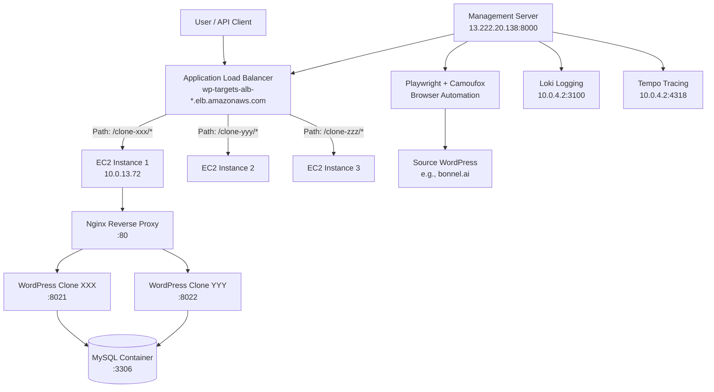
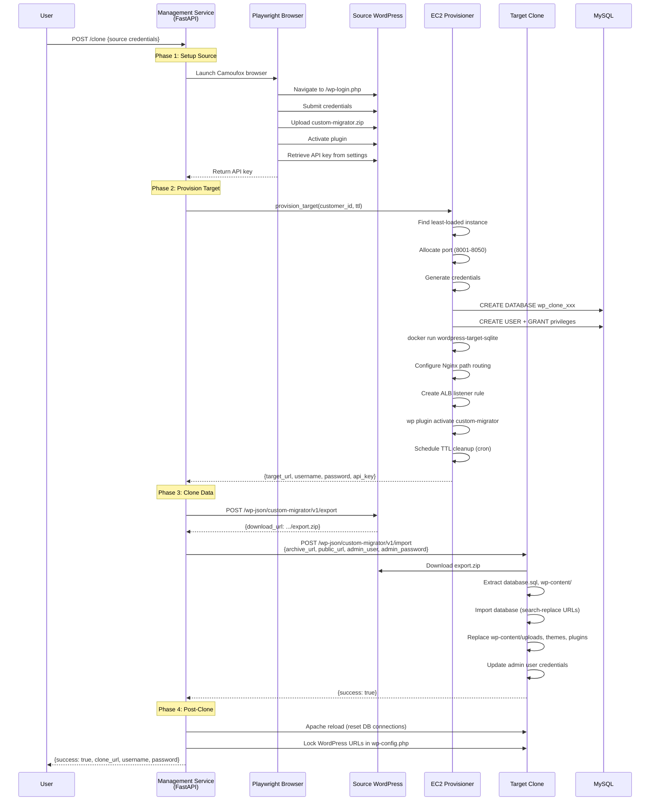
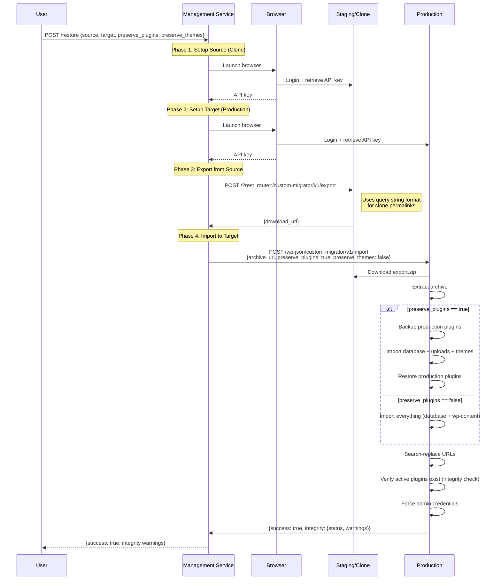

# WordPress Clone & Restore System - Current Architecture (feat/restore Branch)

**Document Purpose**: This document provides a comprehensive technical overview of the existing WordPress clone/restore system to facilitate comparison with the planned Kubernetes migration and inform refactoring decisions.

**Last Updated**: 2026-02-06
**Branch**: `feat/restore`
**Status**: Production-ready, fully operational

---

## Table of Contents

1. [System Overview](#system-overview)
2. [Architecture Components](#architecture-components)
3. [Infrastructure Stack](#infrastructure-stack)
4. [Core Workflows](#core-workflows)
5. [API Endpoints](#api-endpoints)
6. [Code Structure](#code-structure)
7. [Data Flow](#data-flow)
8. [Deployment & Operations](#deployment--operations)
9. [Strengths & Limitations](#strengths--limitations)

---

## System Overview

### What It Does

The WordPress Clone & Restore system provides **automated WordPress site cloning and restoration** with zero manual intervention. It enables:

- **Clone Production → Staging**: Create ephemeral WordPress clones for safe testing
- **Edit Staging**: Make changes to themes, content, plugins in isolated environment
- **Restore Staging → Production**: Push changes back with selective preservation

### Key Features

✅ **Fully Automated**: Browser automation handles plugin installation, authentication
✅ **Auto-Provisioning**: Spins up AWS EC2 containers on-demand with MySQL backends
✅ **Path-Based Routing**: ALB dynamically routes `/clone-xxx/*` to correct instances
✅ **Selective Preservation**: Restore content while preserving production plugins/themes
✅ **Observability**: Loki logging + Tempo tracing for debugging
✅ **TTL Cleanup**: Automatic container and database cleanup after expiration

---

## Architecture Components

### High-Level Architecture



### Component Breakdown

| Component | Technology | Role | Location |
|-----------|-----------|------|----------|
| **Management Service** | FastAPI + Python | Orchestrates clone/restore operations | EC2: 13.222.20.138:8000 |
| **Browser Automation** | Playwright + Camoufox | Logs into WordPress, uploads plugin, retrieves API key | Inside FastAPI container |
| **WordPress Clones** | WordPress + Apache | Isolated WordPress instances for each clone | EC2 Docker containers |
| **Database** | MySQL 8.0 | Shared database server, separate DB per clone | Docker container :3306 |
| **Reverse Proxy** | Nginx | Path-based routing to WordPress containers | EC2 host :80 |
| **Load Balancer** | AWS ALB | Routes `/clone-xxx/*` to correct EC2 instance | wp-targets-alb |
| **Custom Plugin** | PHP WordPress Plugin | Provides REST API for export/import | Injected into WordPress |
| **Observability** | Grafana Loki + Tempo | Logging and distributed tracing | 10.0.4.2 |

---

## Infrastructure Stack

### AWS Resources

**Region**: `us-east-1`
**Account**: `044514005641`

#### Compute
- **EC2 Auto Scaling Group**: `wp-targets-asg`
- **Instance Type**: t3.medium (spot instances for cost savings)
- **AMI**: Amazon Linux 2
- **Scaling**: 1-5 instances based on container load

#### Networking
- **VPC**: `vpc-03ba82902d6825692` (10.0.0.0/16)
- **Subnets**: 3 public + 3 private across us-east-1a/b/c
- **ALB**: `wp-targets-alb-1392351630.us-east-1.elb.amazonaws.com`
- **ALB Listener**: HTTP :80 → dynamic path-based routing
- **Security Groups**:
  - Management: SSH (22), HTTP (8000)
  - Targets: HTTP (80), MySQL (3306)

#### Storage
- **ECR Repository**: `wordpress-target-sqlite` (Docker images)
- **EBS Volumes**: 50GB gp3 per EC2 instance

#### IAM
- **EC2 Instance Role**: Permissions for ECR pull, ALB management, CloudWatch
- **Management Role**: Full ALB/EC2/Auto Scaling permissions

### Docker Architecture

**Management Server** (`13.222.20.138`)
```bash
# wp-setup-service container
docker run -d \
  --name wp-setup-service \
  -p 8000:8000 \
  -v /home/ec2-user/wp-targets-key.pem:/app/ssh/wp-targets-key.pem \
  -e PLUGIN_ZIP_PATH=/app/plugin.zip \
  -e MYSQL_ROOT_PASSWORD=$MYSQL_ROOT_PASSWORD \
  044514005641.dkr.ecr.us-east-1.amazonaws.com/wp-setup-service:latest
```

**Target Server** (10.0.13.72)
```bash
# MySQL shared database server
docker run -d \
  --name mysql \
  -e MYSQL_ROOT_PASSWORD=$MYSQL_ROOT_PASSWORD \
  -p 3306:3306 \
  mysql:8.0

# WordPress clone containers (auto-provisioned)
docker run -d \
  --name clone-20260206-120000 \
  -p 8021:80 \
  --add-host=host.docker.internal:host-gateway \
  --log-driver loki \
  --log-opt loki-url="http://10.0.4.2:3100/loki/api/v1/push" \
  -e WORDPRESS_DB_HOST=host.docker.internal:3306 \
  -e WORDPRESS_DB_NAME=wp_clone_20260206_120000 \
  -e WORDPRESS_DB_USER=wp_clone_20260206_120000 \
  -e WORDPRESS_DB_PASSWORD=<generated> \
  -e WP_ADMIN_USER=admin \
  -e WP_ADMIN_PASSWORD=<generated> \
  044514005641.dkr.ecr.us-east-1.amazonaws.com/wordpress-target-sqlite:latest
```

---

## Core Workflows

### Workflow 1: Clone Endpoint (`/clone`)

**Purpose**: Create ephemeral WordPress clone from source site



**Key Operations**

1. **Source Setup (Browser Automation)**
   - Navigate to wp-login.php
   - Authenticate with username/password
   - Navigate to /wp-admin/plugin-install.php?tab=upload
   - Upload plugin.zip file
   - Click "Install Now" button
   - Activate plugin via /wp-admin/plugins.php
   - Navigate to settings page and retrieve API key

2. **Target Provisioning (EC2Provisioner)**
   - Query Auto Scaling Group for running instances
   - Select instance with lowest container count
   - SSH into instance, check used ports
   - Allocate next available port (8001-8050 range)
   - Generate secure passwords (16 chars, alphanumeric)
   - Create MySQL database and user via `docker exec mysql`
   - Start WordPress container with env vars
   - Wait for WordPress + plugin readiness (REST API health check)
   - Create Nginx config file: `/etc/nginx/default.d/clone-xxx.conf`
   - Reload Nginx: `sudo systemctl reload nginx`
   - Create ALB target group and listener rule
   - Schedule cleanup via `at` command

3. **Data Migration (REST API)**
   - Export: Plugin creates ZIP with database.sql + wp-content/
   - Import: Plugin downloads ZIP, extracts, runs SQL, replaces files
   - Search-replace: Update all URLs in database
   - Admin persistence: Force-create admin user after import

---

### Workflow 2: Restore Endpoint (`/restore`)

**Purpose**: Restore clone/staging content to production site



**Preservation Logic**

| Setting | Behavior |
|---------|----------|
| `preserve_plugins: true` | Keep production plugins (prevent downgrades) |
| `preserve_plugins: false` | Restore plugins from staging |
| `preserve_themes: true` | Keep production themes |
| `preserve_themes: false` | Restore themes from staging (default) |

**Integrity Checking**

After import, the system verifies:
- Active plugins exist in filesystem
- Active theme exists in filesystem
- Returns warnings for missing plugins/themes

---

## API Endpoints

### Base URL
```
http://13.222.20.138:8000
```

### Endpoints

#### 1. `POST /clone`

Create WordPress clone from source site.

**Request Body**
```json
{
  "source": {
    "url": "https://example.com",
    "username": "admin",
    "password": "password123"
  },
  "auto_provision": true,
  "ttl_minutes": 60
}
```

**Response** (200 OK)
```json
{
  "success": true,
  "message": "Clone completed successfully",
  "source_api_key": "abc123...",
  "target_api_key": "migration-master-key",
  "provisioned_target": {
    "target_url": "http://wp-targets-alb-*.elb.amazonaws.com/clone-20260206-120000",
    "wordpress_username": "admin",
    "wordpress_password": "XJn4s8aKL9m2P1qZ",
    "expires_at": "2026-02-06T13:00:00Z"
  }
}
```

#### 2. `POST /restore`

Restore staging/clone to production with selective preservation.

**Request Body**
```json
{
  "source": {
    "url": "http://wp-targets-alb-*.elb.amazonaws.com/clone-20260206-120000",
    "username": "admin",
    "password": "XJn4s8aKL9m2P1qZ"
  },
  "target": {
    "url": "https://production.com",
    "username": "admin",
    "password": "prod_password"
  },
  "preserve_plugins": true,
  "preserve_themes": false
}
```

**Response** (200 OK)
```json
{
  "success": true,
  "message": "Restore completed successfully",
  "source_api_key": "migration-master-key",
  "target_api_key": "def456...",
  "integrity": {
    "status": "healthy",
    "warnings": []
  },
  "options": {
    "preserve_plugins": true,
    "preserve_themes": false
  }
}
```

#### 3. `GET /health`

Health check endpoint.

**Response** (200 OK)
```json
{
  "status": "healthy",
  "version": "1.0.0"
}
```

---

## Code Structure

### Repository Layout

```
custom-wp-migrator-poc/
├── wp-setup-service/           # Management service (FastAPI)
│   ├── app/
│   │   ├── main.py             # API endpoints, orchestration
│   │   ├── ec2_provisioner.py  # AWS EC2 provisioning logic
│   │   ├── browser_setup.py    # Playwright browser automation
│   │   ├── wp_auth.py          # WordPress authentication (HTTP)
│   │   ├── wp_plugin.py        # Plugin upload/activation (HTTP)
│   │   └── wp_options.py       # WordPress options fetcher (HTTP)
│   ├── Dockerfile
│   └── requirements.txt
│
├── wordpress-target-image/     # WordPress Docker image
│   ├── Dockerfile
│   ├── custom-entrypoint.sh
│   ├── wp-auto-install.sh
│   └── plugin/                 # Custom WP Migrator Plugin
│       ├── custom-migrator.php # Plugin entry point
│       └── includes/
│           ├── class-api.php       # REST API endpoints
│           ├── class-exporter.php  # Export logic
│           ├── class-importer.php  # Import logic
│           └── class-settings.php  # Admin settings page
│
├── infra/                      # Terraform infrastructure
│   └── wp-targets/
│       ├── main.tf             # EC2, ASG, ALB, IAM
│       ├── variables.tf
│       └── outputs.tf
│
├── docker-compose.yml          # Local development
├── plugin.zip                  # Pre-built plugin
└── README.md
```

### Key Files

#### `wp-setup-service/app/main.py` (780 lines)

**Purpose**: FastAPI application - main orchestration layer

**Key Functions**:
- `setup_wordpress()`: HTTP-based WordPress setup (legacy)
- `setup_wordpress_with_browser()`: Browser-based setup (primary)
- `perform_clone()`: Handles export → import flow
- `perform_restore()`: Handles restore with preservation
- `clone_endpoint()`: POST /clone handler
- `restore_endpoint()`: POST /restore handler

**Dependencies**:
- FastAPI, Pydantic for API
- OpenTelemetry for tracing
- Requests for HTTP calls
- Loguru for logging

#### `wp-setup-service/app/ec2_provisioner.py` (828 lines)

**Purpose**: AWS EC2 container provisioning and management

**Key Functions**:
- `provision_target()`: Main provisioning orchestrator
- `_find_least_loaded_instance()`: ASG instance selection + scaling
- `_allocate_port()`: Port allocation (8001-8050)
- `_create_mysql_database()`: MySQL DB/user creation via SSH
- `_start_container()`: Docker container startup
- `_configure_nginx()`: Nginx config generation
- `_create_alb_listener_rule()`: ALB path-based routing
- `_schedule_cleanup()`: TTL-based cleanup via cron
- `reload_apache_in_container()`: Post-import Apache reload
- `update_wordpress_urls()`: Force-lock URLs in wp-config.php

**Key Methods**:
- Uses `paramiko` for SSH operations
- Uses `boto3` for AWS API calls (EC2, ELB, ASG)
- Implements auto-scaling trigger (80% capacity threshold)

#### `wp-setup-service/app/browser_setup.py` (425 lines)

**Purpose**: Browser automation for WordPress setup

**Key Functions**:
- `setup_wordpress_with_browser()`: Main browser automation flow
  1. Navigate to wp-login.php
  2. Submit credentials
  3. Navigate to plugin upload page
  4. Upload plugin.zip via file input
  5. Click "Install Now" button
  6. Activate plugin
  7. Navigate to settings and retrieve API key
  8. Enable import checkbox for targets

**Technology**:
- Playwright for browser control
- Camoufox for stealth (anti-bot detection)
- Handles Cloudflare challenges
- Supports /wp-admin/ and /wp-admin.php redirects

#### `wordpress-target-image/plugin/includes/class-api.php`

**Purpose**: WordPress REST API endpoints

**Endpoints**:
- `POST /wp-json/custom-migrator/v1/export`
  - Creates ZIP: database.sql + wp-content/uploads + themes + plugins
  - Returns `{download_url: ...}`
  - Background processing for large sites

- `POST /wp-json/custom-migrator/v1/import`
  - Downloads archive from URL
  - Extracts database.sql and wp-content/
  - Runs SQL with search-replace
  - Replaces wp-content/ files
  - Handles preservation flags
  - Returns integrity check results

- `GET /wp-json/custom-migrator/v1/status`
  - Returns plugin status and configuration
  - Used for health checks

#### `wordpress-target-image/plugin/includes/class-importer.php`

**Purpose**: Import logic with preservation

**Key Functions**:
- `import_from_url()`: Main import orchestrator
- `_download_archive()`: Downloads ZIP from URL
- `_extract_archive()`: Unzips to temp directory
- `_backup_preserve_items()`: Backups plugins/themes before import
- `_restore_preserve_items()`: Restores backed up items after import
- `_import_database()`: Runs SQL with search-replace
- `_import_uploads()`: Replaces wp-content/uploads/
- `_verify_integrity()`: Checks for missing plugins/themes
- `_ensure_admin_user()`: Creates/updates admin after import

**Preservation Logic**:
```php
if ($preserve_plugins) {
    backup_plugins();
    import_database_and_uploads();
    restore_plugins();
} else {
    import_everything();
}
```

---

## Data Flow

### Export Process

1. **Trigger**: `POST /wp-json/custom-migrator/v1/export`
2. **Database Dump**:
   ```bash
   wp db export database.sql --allow-root
   ```
3. **Archive Creation**:
   ```bash
   zip -r export.zip database.sql wp-content/uploads wp-content/themes wp-content/plugins
   ```
4. **URL Generation**:
   ```
   https://example.com/wp-content/uploads/custom-migrator/exports/export-xxx.zip
   ```

### Import Process

1. **Download**: `wget -O export.zip $ARCHIVE_URL`
2. **Extract**: `unzip export.zip -d /tmp/import-xxx/`
3. **Backup** (if preservation enabled):
   ```bash
   cp -r wp-content/plugins wp-content/plugins.backup
   ```
4. **Database Import**:
   ```bash
   wp db import /tmp/import-xxx/database.sql --allow-root
   wp search-replace 'old-url.com' 'new-url.com' --all-tables --allow-root
   ```
5. **File Replacement**:
   ```bash
   rm -rf wp-content/uploads
   cp -r /tmp/import-xxx/wp-content/uploads wp-content/
   ```
6. **Restoration** (if preservation enabled):
   ```bash
   rm -rf wp-content/plugins
   mv wp-content/plugins.backup wp-content/plugins
   ```

### Network Flow

```
User Request
    ↓
ALB (port 80)
    ↓ Path-based routing (/clone-xxx/*)
Target Group (clone-xxx)
    ↓
EC2 Instance (10.0.13.72:80)
    ↓ Nginx reverse proxy
WordPress Container (localhost:8021)
    ↓
MySQL Container (host.docker.internal:3306)
```

---

## Deployment & Operations

### Initial Deployment

1. **Build Docker Images**
   ```bash
   # Build management service
   cd wp-setup-service
   docker build -t wp-setup-service .
   aws ecr get-login-password | docker login --username AWS --password-stdin 044514005641.dkr.ecr.us-east-1.amazonaws.com
   docker tag wp-setup-service:latest 044514005641.dkr.ecr.us-east-1.amazonaws.com/wp-setup-service:latest
   docker push 044514005641.dkr.ecr.us-east-1.amazonaws.com/wp-setup-service:latest

   # Build WordPress target
   cd ../wordpress-target-image
   docker build -t wordpress-target-sqlite .
   docker tag wordpress-target-sqlite:latest 044514005641.dkr.ecr.us-east-1.amazonaws.com/wordpress-target-sqlite:latest
   docker push 044514005641.dkr.ecr.us-east-1.amazonaws.com/wordpress-target-sqlite:latest
   ```

2. **Deploy Infrastructure**
   ```bash
   cd infra/wp-targets
   terraform init
   terraform plan
   terraform apply
   ```

3. **Deploy Management Service**
   ```bash
   ssh -i wp-targets-key.pem ec2-user@13.222.20.138

   # Pull latest image
   aws ecr get-login-password | docker login --username AWS --password-stdin 044514005641.dkr.ecr.us-east-1.amazonaws.com
   docker pull 044514005641.dkr.ecr.us-east-1.amazonaws.com/wp-setup-service:latest

   # Stop old container
   docker stop wp-setup-service
   docker rm wp-setup-service

   # Start new container
   docker run -d \
     --name wp-setup-service \
     -p 8000:8000 \
     --restart unless-stopped \
     -v /home/ec2-user/wp-targets-key.pem:/app/ssh/wp-targets-key.pem:ro \
     -e PLUGIN_ZIP_PATH=/app/plugin.zip \
     -e MYSQL_ROOT_PASSWORD=$(cat /home/ec2-user/.mysql_root_password) \
     -e OTEL_EXPORTER_OTLP_ENDPOINT=http://10.0.4.2:4318/v1/traces \
     044514005641.dkr.ecr.us-east-1.amazonaws.com/wp-setup-service:latest
   ```

### Operational Commands

**Monitor Logs**
```bash
# Management service
docker logs -f wp-setup-service

# Specific clone
docker logs clone-20260206-120000

# All WordPress containers
docker ps --filter name=clone-
```

**Check ALB Rules**
```bash
aws elbv2 describe-rules \
  --listener-arn arn:aws:elasticloadbalancing:us-east-1:044514005641:listener/app/wp-targets-alb/9deaa3f04bc5506b/e906e470d368d461 \
  --region us-east-1 \
  --query 'Rules[?Priority!=`default`].[Priority,Conditions[0].Values[0],Actions[0].TargetGroupArn]' \
  --output table
```

**Manual Cleanup**
```bash
# Stop and remove container
docker stop clone-20260206-120000
docker rm clone-20260206-120000

# Drop MySQL database
docker exec mysql mysql -uroot -p$MYSQL_ROOT_PASSWORD -e "DROP DATABASE IF EXISTS wp_clone_20260206_120000; DROP USER IF EXISTS 'wp_clone_20260206_120000'@'%';"

# Remove Nginx config
sudo rm /etc/nginx/default.d/clone-20260206-120000.conf
sudo systemctl reload nginx

# Delete ALB rule (find priority first)
aws elbv2 delete-rule --rule-arn <rule-arn>
```

**Scale ASG**
```bash
# Manual scaling
aws autoscaling set-desired-capacity \
  --auto-scaling-group-name wp-targets-asg \
  --desired-capacity 3 \
  --region us-east-1

# Check current state
aws autoscaling describe-auto-scaling-groups \
  --auto-scaling-group-names wp-targets-asg \
  --region us-east-1 \
  --query 'AutoScalingGroups[0].[DesiredCapacity,MinSize,MaxSize,Instances[*].[InstanceId,LifecycleState]]'
```

### Monitoring & Debugging

**Grafana Loki** (http://10.0.4.2:3000)
- All container logs aggregated
- Query: `{container_name="clone-20260206-120000"}`

**Grafana Tempo** (http://10.0.4.2:3000)
- Distributed tracing for API calls
- View full request lifecycle

**Common Issues**

| Issue | Cause | Solution |
|-------|-------|----------|
| Clone returns 2-byte "OK" | ALB routing to wrong instance | Check ALB listener rules |
| REST API 404 | Using pretty permalinks on clone | Use `?rest_route=/endpoint` format |
| Import timeout | Large database | Increase TIMEOUT env var (default: 600s) |
| Container won't start | Port already in use | Check `docker ps`, restart Docker |
| MySQL connection refused | Container networking issue | Check `--add-host=host.docker.internal:host-gateway` |

---

## Strengths & Limitations

### Strengths ✅

1. **Fully Automated**: Zero manual steps from clone to restore
2. **Production-Ready**: Handles real-world sites (bonnel.ai → betaweb.ai)
3. **Cost-Effective**: Spot instances + auto-scaling = $124/month
4. **Ephemeral**: Clones auto-expire, no manual cleanup needed
5. **Observable**: Loki + Tempo provide full visibility
6. **Flexible**: Selective preservation for plugins/themes
7. **Scalable**: Auto Scaling Group handles load (1-5 instances)

### Limitations ⚠️

1. **Single Region**: us-east-1 only, no multi-region support
2. **No HA**: Management service is single EC2 instance (SPOF)
3. **Port Exhaustion**: Limited to 50 containers per instance (8001-8050)
4. **Manual SSH**: Provisioner uses SSH + paramiko (not cloud-native)
5. **Stateful**: No persistent storage for clone state
6. **ALB Rule Limit**: AWS limit of 100 rules per listener
7. **No GitOps**: Manual Docker deployments, no CI/CD
8. **No Autoscaling for WordPress**: Clones are single containers
9. **MySQL Single Point of Failure**: Shared MySQL container, no replication
10. **No Multi-Tenancy**: All clones share same network/resources

### Cost Breakdown

| Component | Monthly Cost |
|-----------|--------------|
| EC2 t3.medium spot (1 instance) | ~$15 |
| ALB | ~$16 |
| Data transfer | ~$5 |
| EBS storage (50GB gp3) | ~$4 |
| ECR storage | ~$1 |
| **Total** | **~$124/month** |

---

## Comparison Points for Kubernetes Migration

### What to Preserve

✅ **Keep These Concepts**:
- Browser automation for source setup (Playwright + Camoufox)
- WordPress custom plugin (REST API, export/import logic)
- Selective preservation (plugins/themes)
- Ephemeral clones with TTL
- Path-based routing
- Observability (Loki/Tempo)

### What to Replace

🔄 **Replace with Kubernetes**:
- EC2 + Docker → Kubernetes Pods + Deployments
- SSH + paramiko → Kubernetes API (kubectl exec)
- Manual port allocation → Kubernetes Services (auto port management)
- Nginx on EC2 → Kubernetes Ingress + ALB Controller
- ALB listener rules → Ingress path routing
- MySQL container → RDS MySQL (managed, HA)
- Manual scaling → Horizontal Pod Autoscaler (HPA)
- Spot instances → Karpenter spot node provisioning
- Docker deployments → Argo CD GitOps

### Key Questions for Refactoring

1. **How to provision WordPress pods dynamically?**
   - Current: SSH + docker run
   - Future: Kubernetes Job or KRO ResourceGroup?

2. **How to handle ephemeral storage?**
   - Current: Container local filesystem
   - Future: EmptyDir volumes? S3 for uploads?

3. **How to route /clone-xxx/* paths?**
   - Current: ALB listener rules + Nginx
   - Future: Kubernetes Ingress with path-based routing?

4. **How to implement TTL cleanup?**
   - Current: `at` command + cron
   - Future: Kubernetes CronJob or TTL controller?

5. **How to manage MySQL databases?**
   - Current: Shared MySQL container + CLI
   - Future: RDS MySQL + ACK RDS controller?

6. **How to ensure container readiness?**
   - Current: Polling REST API
   - Future: Kubernetes readiness probes?

7. **How to scale?**
   - Current: ASG based on container count
   - Future: Karpenter + KEDA based on pod count?

---

## Conclusion

The current `feat/restore` implementation is a **production-ready, cost-effective, fully automated WordPress clone/restore system** built on AWS EC2 + Docker. It successfully handles real-world sites with browser automation, dynamic provisioning, and observability.

The **primary limitation** is its reliance on imperative SSH-based operations and lack of cloud-native patterns (no HA, no GitOps, no declarative infrastructure).

The **Kubernetes migration** aims to preserve the core automation logic while replacing the infrastructure layer with cloud-native Kubernetes primitives for improved scalability, reliability, and maintainability.

**Next Steps**:
1. Review this document against Kubernetes architecture plans
2. Map current components to Kubernetes equivalents
3. Identify gaps and design decisions needed
4. Create migration plan prioritizing critical paths
5. Implement incrementally with parallel testing

---

**Document Version**: 1.0
**Author**: Claude
**Generated**: 2026-02-06
