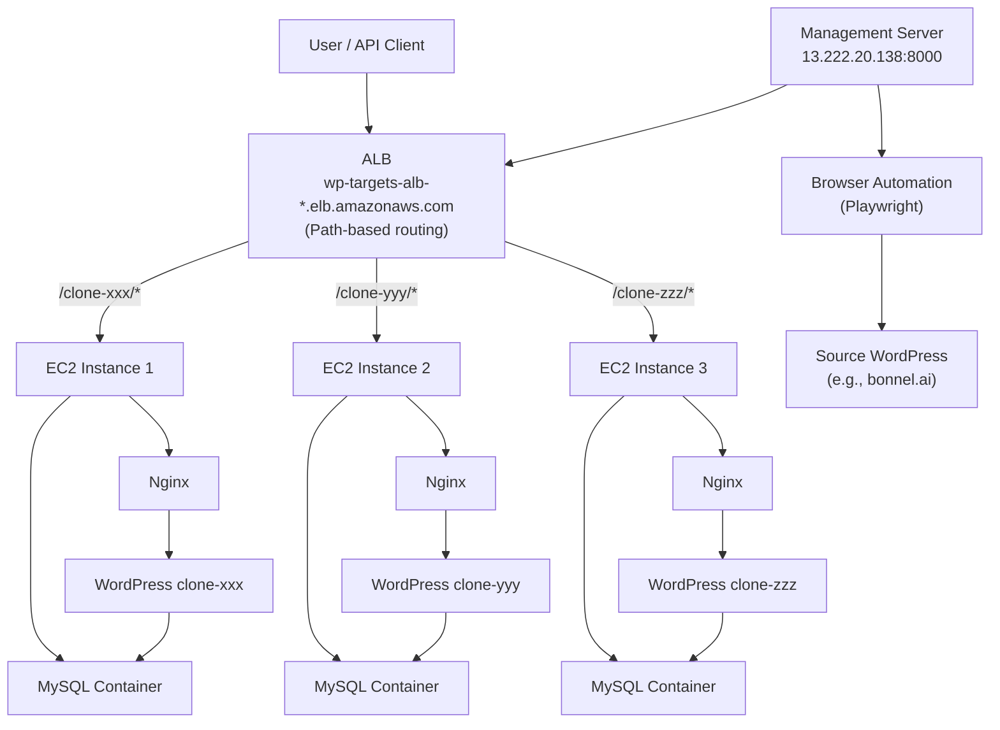

# WordPress Clone & Restore System

## Architecture



---

## Important Notes

### API Key Retrieval
- The restore endpoint uses browser automation to retrieve the actual API key from clones
- Clones from bonnel.ai will have bonnel.ai's original API key
- Use the `/clone` endpoint response to get the admin password for the clone

### Working Configuration
- ✅ ALB path-based routing routes each clone to correct EC2 instance
- ✅ Each EC2 instance has MySQL container (shared database server)
- ✅ Each WordPress clone gets its own database in MySQL
- ✅ Restore workflow: Source → Clone → Production works end-to-end

---

## Postman API Collection

### Request 1: Create Clone (`/clone` endpoint)
- **Method**: `POST`
- **URL**: `http://13.222.20.138:8000/clone`
- **Headers**: 
  - `Content-Type: application/json`
- **Body** (raw JSON):
```json
{
  "source": {
    "url": "https://bonnel.ai",
    "username": "Charles",
    "password": "xkZ%HL6v5Z5)MP9K"
  }
}
```

**Curl Command:**
```bash
curl -X POST http://13.222.20.138:8000/clone \
  -H "Content-Type: application/json" \
  -d '{
    "source": {
      "url": "https://bonnel.ai",
      "username": "Charles",
      "password": "xkZ%HL6v5Z5)MP9K"
    }
  }'
```

---

### Request 2: Restore Clone to Production (`/restore` endpoint)
- **Method**: `POST`
- **URL**: `http://13.222.20.138:8000/restore`
- **Headers**: 
  - `Content-Type: application/json`
- **Body** (raw JSON):
```json
{
  "source": {
    "url": "http://wp-targets-alb-1392351630.us-east-1.elb.amazonaws.com/clone-YYYYMMDD-HHMMSS",
    "username": "admin",
    "password": "password-from-clone-response"
  },
  "target": {
    "url": "https://betaweb.ai",
    "username": "Charles",
    "password": "xkZ%HL6v5Z5)MP9K"
  },
  "preserve_themes": false,
  "preserve_plugins": false
}
```

**Curl Command:**
```bash
curl -X POST http://13.222.20.138:8000/restore \
  -H "Content-Type: application/json" \
  -d '{
    "source": {
      "url": "http://wp-targets-alb-1392351630.us-east-1.elb.amazonaws.com/clone-YYYYMMDD-HHMMSS",
      "username": "admin",
      "password": "password-from-clone-response"
    },
    "target": {
      "url": "https://betaweb.ai",
      "username": "Charles",
      "password": "xkZ%HL6v5Z5)MP9K"
    },
    "preserve_themes": false,
    "preserve_plugins": false
  }'
```

---

### Request 3: Test Clone REST API Export (WordPress REST API)
- **Method**: `POST`
- **URL**: `http://wp-targets-alb-1392351630.us-east-1.elb.amazonaws.com/clone-YYYYMMDD-HHMMSS/index.php?rest_route=/custom-migrator/v1/export`
- **Headers**: 
  - `X-Migrator-Key: migration-master-key`
- **Body**: (empty)

**Curl Command:**
```bash
curl -X POST \
  "http://wp-targets-alb-1392351630.us-east-1.elb.amazonaws.com/clone-YYYYMMDD-HHMMSS/index.php?rest_route=/custom-migrator/v1/export" \
  -H "X-Migrator-Key: migration-master-key"
```

---

### Request 4: Health Check (`/health` endpoint)
- **Method**: `GET`
- **URL**: `http://13.222.20.138:8000/health`
- **Headers**: (none needed)
- **Body**: (empty)

**Curl Command:**
```bash
curl http://13.222.20.138:8000/health
```
