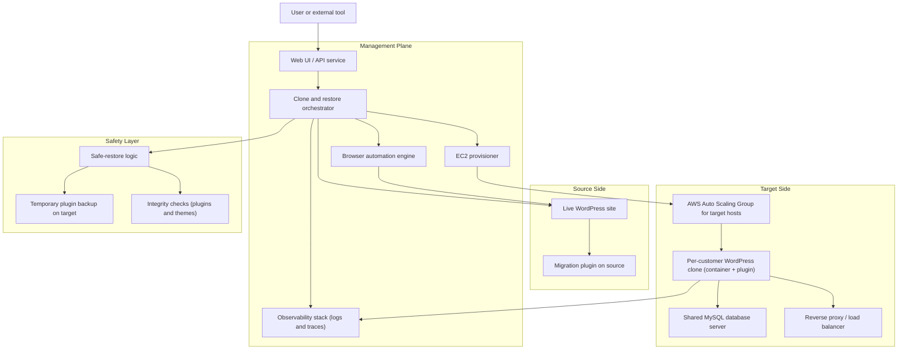

# WordPress Clone & Restore Manager

> **Audience:** Non-technical stakeholders who want to understand **what exists**, **where it runs**, and **how cloning & safe restore work**.

## What This System Is

This system is a **WordPress copy and safety layer**. It:

- **Clones a live WordPress site** into a safe, temporary environment for testing changes.
- **Restores changes back to the live site** using a **safe-restore** process that protects critical parts of production.
- **Watches everything with logs and traces**, so we can see what happened if something goes wrong.

No one needs to log into servers or manually install plugins; the system behaves like a **robot user in a browser** that does the clicking for you.

## High-Level Architecture (Conceptual Map)

You can read this as:

- **User or external tool** talks to a **single service** (the management plane).
- The service then reaches out to:
  - The **live WordPress site** (source).
  - The **AWS infrastructure** where temporary clones live (targets).
  - The **observability stack** that captures logs and traces.
  - The **safe-restore layer**, which makes sure we do not break production when pushing changes back.

## Where Things Live

### Management Plane (Control Layer)

- Runs on a **dedicated EC2 "management" instance** in a private AWS network.
- Hosts the **Web UI / API Service** that receives clone and restore requests.
- Hosts the **Browser Automation Engine** that behaves like a human using a browser:
  - Navigates to the WordPress admin screen.
  - Logs in with the credentials you provide.
  - Uploads, activates, and configures the migration plugin.
- Hosts the **Clone & Restore Orchestrator** that:
  - Coordinates source setup.
  - Coordinates target provisioning and clone creation.
  - Drives the safe restore back into production.
- Hosts the **Observability Stack** (logs and traces) used for debugging and monitoring.

### Source Side (Live Site)

- This is your **existing WordPress site** (production or a customer site) hosted wherever it already lives.
- The system:
  - Logs in using admin credentials.
  - Installs and activates the **Custom Migrator** plugin if it is not already active.
  - Uses that plugin to **export the site** into an archive that includes database content, themes, plugins, and media.

### Target Side (Clone Environment in AWS)

- An **Auto Scaling Group** of EC2 instances acts as a **pool of target hosts**.
- On those hosts, we run:
  - **WordPress containers** (one per clone/customer) with the migration plugin already pre-wired.
  - A **shared MySQL server** that stores the data for each clone in a separate database.
  - An **Nginx-based reverse proxy / load balancer** that routes traffic to the right clone using a unique path or URL.
- Each clone is **temporary and isolated**:
  - It has its own admin credentials.
  - It can be given a **time-to-live (TTL)** after which it is automatically cleaned up.

### Safety Layer (For Restore Back to Production)

- Lives inside the **WordPress migration plugin** running on the target (production) site.
- Provides **safe-restore behavior**:
  - Creates a **temporary backup** of existing production plugins before applying a restore.
  - Applies the new content, themes, and other changes from staging.
  - Restores or preserves critical plugins to avoid downgrading or breaking an updated production environment.
  - Runs **integrity checks** after the restore and reports potential problems.
- The temporary backups are stored on the **production WordPress host** (inside the container’s file system) and are automatically cleaned up when the restore completes successfully.

## How a Clone Works (Non-Technical Walkthrough)

This is what happens when someone clicks **“Clone”** in the UI or an external tool calls the clone process.

1. **Request Enters the Management Plane**
   - The UI / API receives a request with:
     - Where the **live site** is.
     - Admin credentials.
     - Whether we should **auto-provision** a new target or use an existing one.

2. **Robot Browser Logs Into the Live Site**
   - The system starts a **headless browser** (no visible window) that behaves like a person:
     - Goes to the WordPress login page.
     - Types the username and password.
     - Clicks “Log In”.
   - Once inside the dashboard, it:
     - Uploads the migration plugin ZIP if not present.
     - Activates the plugin.
     - Visits the plugin settings screen to generate or read an **API key** used for exports.

3. **Target Environment is Prepared**
   - If auto-provisioning is enabled:
     - The **EC2 provisioner** picks a target host from the Auto Scaling group.
     - It chooses a free port and creates a **new WordPress container** for this customer clone.
     - It creates a **dedicated MySQL database** for that clone.
     - It wires Nginx so that a clean URL or path points to the clone.
   - The system then uses the same automated techniques to ensure the migration plugin is active and ready on the target clone.

4. **Content is Exported from the Live Site**
   - The source plugin prepares an **export archive** (database plus files) behind the scenes.
   - The management plane requests that archive through the plugin.

5. **Content is Imported into the Clone**
   - The management plane tells the target plugin to **import the archive**.
   - The target WordPress clone now looks and behaves like the live site at the time of export.

6. **Result is Returned**
   - The system returns:
     - Where the clone is reachable.
     - Admin credentials for that clone.
     - When it will expire (if using TTL).
   - At this point, editors or external tools can safely test changes on the clone instead of touching the real production site.

## How a Safe Restore Works (Pushing Changes Back)

When the changes made on the clone (staging) environment are ready, the system can **push those changes back** into the live site using a **safe-restore** process.

1. **Both Environments Are Prepared**
   - The management plane uses the browser automation engine to:
     - Log into the **staging/clone** site (source for restore) and ensure the plugin can export the latest state.
     - Log into the **live production** site (target for restore) and ensure the plugin is ready to accept imports.

2. **Production Plugins Are Safely Backed Up**
   - Before touching anything on the production site, the plugin on production:
     - Creates a **temporary backup copy of the currently installed plugins**.
     - This snapshot lives on the production host’s file system for the duration of the restore.

3. **New Content Is Applied to Production**
   - The system exports content from staging (database, themes, media, etc.).
   - The production plugin **imports that content**, so design and content changes made on staging flow into production.

4. **Critical Plugins Are Preserved**
   - After the import, the safe-restore logic:
     - **Restores the backed-up production plugins** so that any newer versions on production are not accidentally downgraded.
     - Ensures the migration plugin itself remains active so we do not cut off our own access.

5. **Integrity Checks Run After the Restore**
   - The plugin performs **sanity checks**, such as:
     - Are all active plugins present on disk?
     - Does the current active theme exist and load correctly?
   - Any warnings are surfaced back through the management plane so operators know if follow-up investigation is needed.

6. **Backups Are Cleaned Up Once It Is Safe**
   - If the restore completes and integrity checks look reasonable, the **temporary plugin backup** is removed.
   - If something fails mid-way, the presence of the backup allows for **manual recovery** by an operator, using standard WordPress and filesystem tools on the production host.

## How Observability Helps When Something Breaks

- Every clone and restore operation sends **logs and traces** to the observability stack on the management host.
- This means that when a non-technical user reports “the clone failed” or “restore didn’t work”, an operator can:
  - See **which step** failed (login, plugin activation, export, import, backup, etc.).
  - Correlate the failure with the specific clone or customer ID.
  - Avoid guessing; they have a timeline of what the system did.

## What To Remember (Executive Summary)

- **There is one control plane** (management host) that talks to everything else.
- **Clones live in AWS** as temporary WordPress containers with real MySQL, behind a reverse proxy.
- **The live site is never edited by hand** during clone or restore; everything is driven by browser automation and plugins.
- **Safe restore always takes a temporary plugin backup** on production before applying changes from staging.
- **Logs and traces** are centralised, so when something fails, we can see exactly which step went wrong without touching customer credentials.
