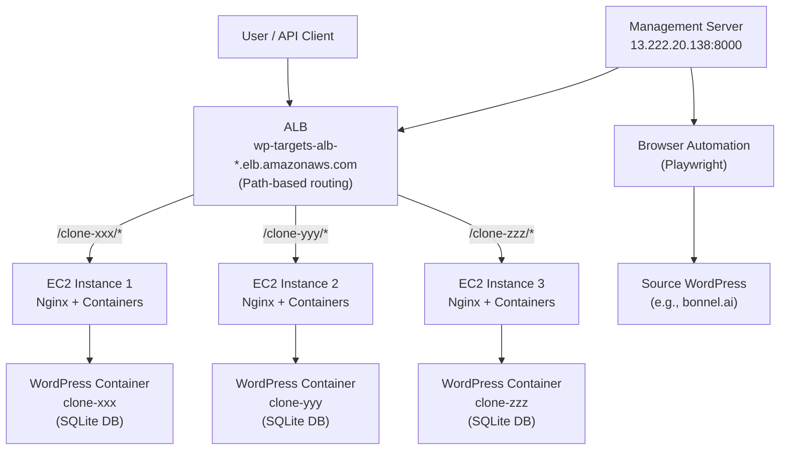

# WordPress Clone & Restore System

## Architecture



---

## Postman API Collection

### Request 1: Create Clone
- **Method**: `POST`
- **URL**: `http://13.222.20.138:8000/clone`
- **Headers**: 
  - `Content-Type: application/json`
- **Body** (raw JSON):
```json
{
  "source": {
    "url": "https://bonnel.ai",
    "username": "Charles",
    "password": "xkZ%HL6v5Z5)MP9K"
  }
}
```

### Request 2: Restore Clone to Production
- **Method**: `POST`
- **URL**: `http://13.222.20.138:8000/restore`
- **Headers**: 
  - `Content-Type: application/json`
- **Body** (raw JSON):
```json
{
  "source": {
    "url": "http://wp-targets-alb-1392351630.us-east-1.elb.amazonaws.com/clone-YYYYMMDD-HHMMSS",
    "username": "admin",
    "password": "password-from-clone-response"
  },
  "target": {
    "url": "https://betaweb.ai",
    "username": "Charles",
    "password": "xkZ%HL6v5Z5)MP9K"
  },
  "preserve_themes": false,
  "preserve_plugins": false
}
```

### Request 3: Test Clone REST API Export
- **Method**: `POST`
- **URL**: `http://wp-targets-alb-1392351630.us-east-1.elb.amazonaws.com/clone-YYYYMMDD-HHMMSS/index.php?rest_route=/custom-migrator/v1/export`
- **Headers**: 
  - `X-Migrator-Key: migration-master-key`
- **Body**: (empty)

### Request 4: Health Check
- **Method**: `GET`
- **URL**: `http://13.222.20.138:8000/health`
- **Headers**: (none needed)
- **Body**: (empty)
