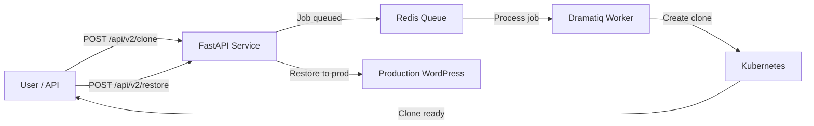
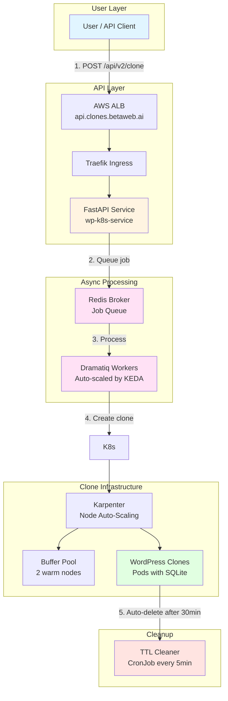
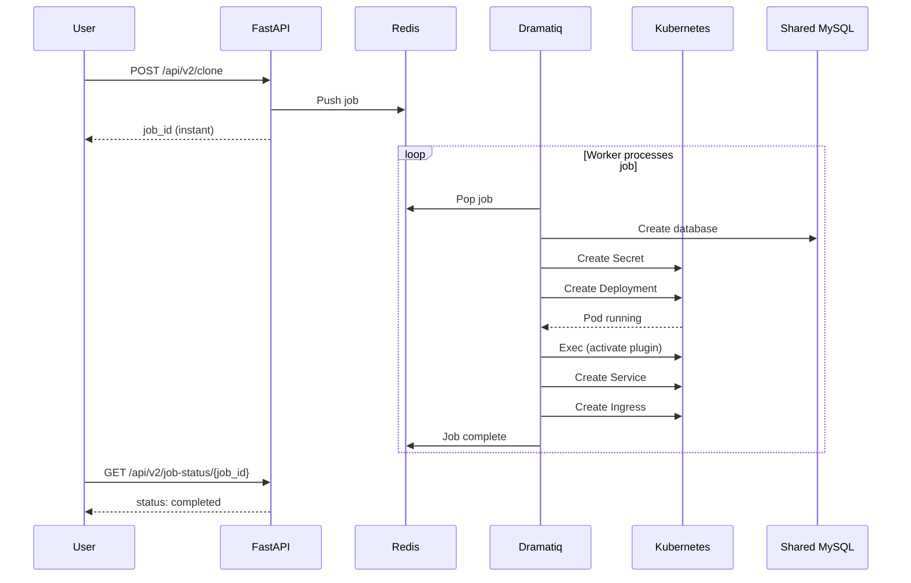

# WordPress Clone & Restore System

## Overview

This system creates **temporary WordPress clones** for safe testing, then **restores changes back to production**. All managed through a simple REST API.

### Quick Flow



---

## Architecture (Current - Kubernetes)



### What Each Component Does

| Component | Purpose |
|-----------|---------|
| **FastAPI** | REST API endpoints (`/api/v2/clone`, `/api/v2/restore`, `/api/v2/job-status`) |
| **Redis** | Job queue - holds clone requests waiting to be processed |
| **Dramatiq Workers** | Process clone jobs (create DB, deploy pod, activate plugin) |
| **KEDA** | Auto-scales workers based on queue depth (2-20 workers) |
| **Karpenter** | Auto-scales EC2 nodes when pods need capacity |
| **Buffer Pool** | 2 warm standby nodes for instant clone scheduling |
| **WordPress Clones** | Individual pods with SQLite (no MySQL container needed) |
| **TTL Cleaner** | Deletes clones after 30 minutes to save costs |

---

## API Endpoints

### v2 (Async - Current)

| Endpoint | Method | Description | Response Time |
|----------|--------|-------------|---------------|
| `/api/v2/clone` | POST | Create clone (returns job_id) | <100ms |
| `/api/v2/job-status/{job_id}` | GET | Check clone status | <50ms |
| `/api/v2/restore` | POST | Restore clone to production | <100ms |
| `/api/v2/delete/{clone_id}` | DELETE | Delete clone early | <50ms |

### v1 (Legacy - Deprecated)

| Endpoint | Method | Description |
|----------|--------|-------------|
| `/clone` | POST | Old sync clone (blocking) |
| `/restore` | POST | Restore to production |

---

## Usage Examples

### Create Clone (Async)

```bash
# 1. Request clone (instant response)
curl -X POST http://api.clones.betaweb.ai/api/v2/clone \
  -H "Content-Type: application/json" \
  -d '{
    "source_url": "https://mysite.com",
    "source_username": "admin",
    "source_password": "secret",
    "customer_id": "test-clone-001",
    "ttl_minutes": 30
  }'

# Response (instant):
{
  "job_id": "job-abc123",
  "status": "pending",
  "status_url": "/api/v2/job-status/job-abc123"
}

# 2. Poll for status
curl http://api.clones.betaweb.ai/api/v2/job-status/job-abc123

# Response (when ready):
{
  "status": "completed",
  "clone_url": "https://test-clone-001.clones.betaweb.ai",
  "username": "admin",
  "password": "..."
}
```

### Restore Clone

```bash
curl -X POST http://api.clones.betaweb.ai/api/v2/restore \
  -H "Content-Type: application/json" \
  -d '{
    "source": {
      "url": "https://test-clone-001.clones.betaweb.ai",
      "username": "admin",
      "password": "..."
    },
    "target": {
      "url": "https://production.com",
      "username": "admin",
      "password": "..."
    }
  }'
```

---

## Infrastructure

### Kubernetes Resources

```yaml
Namespace: wordpress-staging

Components:
├── wp-k8s-service (Deployment, 2 replicas)
│   ├── FastAPI container (port 8000)
│   └── Dramatiq worker sidecar
├── Redis (StatefulSet, 1 replica)
├── Traefik (Ingress Controller)
├── KEDA (ScaledObject for auto-scaling)
└── TTL Cleaner (CronJob, every 5min)

Node Pools:
├── Buffer Pool (2× t2.small spot, always warm)
└── General Pool (auto-scale, up to 100 CPU)
```

### Resource Limits

| Resource | Limit |
|----------|-------|
| Max CPU | 100 cores |
| Max Memory | 200 GiB |
| Max Pods | 150 |
| Max Workers | 20 |
| Clone TTL | 30 minutes (auto-delete) |

---

## How Cloning Works



### Step by Step

1. **User requests clone** → API responds instantly with `job_id`
2. **Job queued in Redis** → First-in, first-out processing
3. **Worker picks up job** → Creates database on shared RDS
4. **Kubernetes creates pod** → WordPress + SQLite container
5. **Plugin activated** → custom-migrator plugin enabled via `kubectl exec`
6. **Ingress created** → Clone accessible at `https://{customer_id}.clones.betaweb.ai`
7. **User polls status** → Gets `completed` when ready
8. **TTL expires (30min)** → CronJob auto-deletes clone

---

## Auto-Scaling Behavior

### Workers (KEDA)

```
Queue Depth  →  Worker Count
0-10 jobs    →  2 workers (minimum)
10-50 jobs   →  5 workers
50-100 jobs  →  10 workers
100+ jobs    →  20 workers (maximum)
```

### Nodes (Karpenter)

```
Pending Pods  →  New Nodes
1+ pods       →  Launch t2.small/t3.medium spot
Node full     →  Launch another node
Pods deleted  →  Consolidate after 10min idle
```

### Buffer Pool

- **2 t2.small nodes always running** (~$24/month)
- **Purpose**: Instant scheduling for first ~20 clones
- **No Pending time** for clones that fit in buffer

---

## Monitoring

### Check Clone Status

```bash
# Running clones
kubectl get pods -n wordpress-staging -l app=wordpress-clone

# Job queue depth
kubectl exec -n wordpress-staging redis-master-0 -- \
  redis-cli -a dramatiq-broker-password LLEN dramatiq

# Worker logs
kubectl logs -n wordpress-staging -l app=wp-k8s-service -c dramatiq-worker -f
```

### Check Infrastructure

```bash
# Buffer nodes
kubectl get nodes -l karpenter.sh/nodepool=buffer-pool

# Karpenter node claims
kubectl get nodeclaims

# KEDA scaling
kubectl get scaledobject -n wordpress-staging
```

---

## Cost

| Component | Monthly Cost |
|-----------|--------------|
| Buffer Nodes (2× t2.small spot) | ~$24 |
| General Pool (auto-scale) | ~$50-100 |
| Redis | $0 (self-hosted) |
| **Total** | **~$74-124/month** |

---

## Success Metrics

| Metric | Before (Sync) | After (Async) |
|--------|---------------|---------------|
| API Response Time | 60-180s | <100ms |
| Concurrent Clones | 1-2 | 50+ tested |
| Clone Success Rate | ~85% | >99% |
| Pending Time | N/A | 0s (buffer) / ~30s (scale) |

---

## Troubleshooting

### Clone Stuck in "Pending"

```bash
# Check queue depth
kubectl exec -n wordpress-staging redis-master-0 -- \
  redis-cli -a dramatiq-broker-password LLEN dramatiq

# Check workers
kubectl get pods -n wordpress-staging -l app=wp-k8s-service

# Check worker logs
kubectl logs -n wordpress-staging -l app=wp-k8s-service -c dramatiq-worker
```

### Clone in CrashLoopBackOff

```bash
# Check pod logs
kubectl logs -n wordpress-staging <pod-name> -c wordpress

# Delete deployment (worker will recreate with correct password)
kubectl delete deployment -n wordpress-staging <clone-name>
```

### Nodes Not Scaling

```bash
# Check Karpenter logs
kubectl logs -n karpenter -l app.kubernetes.io/name=karpenter

# Check pending pods
kubectl get pods --field-selector=status.phase=Pending
```

---

## Related Documentation

- [Async Clone-Restore Design](openspec/changes/async-clone-restore/README.md) - Detailed architecture
- [DRAMATIQ Setup](kubernetes/wp-k8s-service/DRAMATIQ_SETUP.md) - Worker configuration
- [Karpenter Buffer Pool](kubernetes/manifests/base/wp-k8s-service/karpenter-buffer-nodepool.yaml) - Warm standby config

---

## Postman Collection

Import the Postman collection from `Postman/` folder for pre-configured API requests.
