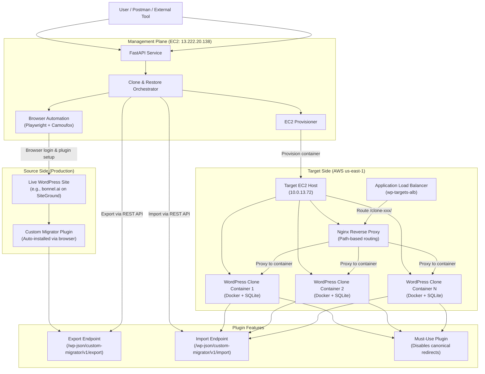

# WordPress Clone & Restore Manager

> **Audience:** Non-technical stakeholders who want to understand **what exists**, **where it runs**, and **how cloning & safe restore work**.

## What This System Is

This system is a **WordPress copy and safety layer**. It:

- **Clones a live WordPress site** into a safe, temporary environment for testing changes.
- **Restores changes back to the live site** using a **safe-restore** process that protects critical parts of production.
- **Watches everything with logs and traces**, so we can see what happened if something goes wrong.

No one needs to log into servers or manually install plugins; the system behaves like a **robot user in a browser** that does the clicking for you.

## High-Level Architecture (Conceptual Map)



You can read this as:

- **User or external tool** talks to a **single service** (the management plane).
- The service then reaches out to:
  - The **live WordPress site** (source).
  - The **AWS infrastructure** where temporary clones live (targets).
  - The **observability stack** that captures logs and traces.
  - The **safe-restore layer**, which makes sure we do not break production when pushing changes back.

## Where Things Live

### Management Plane (Control Layer)

**Location:** EC2 instance at `13.222.20.138:8000` (us-east-1)

**Components:**
- **FastAPI Web Service** (`wp-setup-service` Docker container)
  - Exposes REST API endpoints: `/clone`, `/restore`, `/health`
  - Serves Web UI for manual testing at `http://13.222.20.138:8000/`
  - Handles auto-provisioning of target containers
  
- **Browser Automation Engine** (Playwright + Camoufox)
  - Behaves like a human user in a headless browser
  - Logs into WordPress admin with provided credentials
  - Uploads the Custom Migrator plugin ZIP (`plugin.zip`)
  - Activates the plugin and retrieves API key from settings page
  - Enables import on target sites
  - **Quirk:** Accepts both `/wp-admin/` and `/wp-admin.php` as valid admin URLs
  
- **Clone & Restore Orchestrator**
  - Coordinates source plugin setup via browser automation
  - Provisions target containers via EC2 provisioner
  - Calls REST API endpoints for export/import operations
  - Manages clone lifecycle and TTL expiration

### Source Side (Live Site)

**Location:** Any WordPress site accessible via HTTPS (e.g., `https://bonnel.ai` on SiteGround)

**Requirements:**
- WordPress admin credentials (username + password)
- Site must be accessible from management EC2
- **Important:** Use HTTPS URLs (HTTP causes 301 redirects that break POST requests)

**What Happens:**
1. Browser automation logs in with provided credentials
2. Custom Migrator plugin is uploaded and activated (if not present)
3. API key is retrieved from plugin settings
4. Export endpoint (`/wp-json/custom-migrator/v1/export`) is called to create archive
5. Archive includes: database (SQL), themes, plugins, uploads, and wp-config.php

**Known Issue:** Sites with SiteGround-specific plugins (sg-security, sg-cachepress, wordpress-starter) may cause redirect loops when cloned to subdirectory paths. These plugins work correctly when restoring back to SiteGround hosting.

### Target Side (Clone Environment in AWS)

**Architecture:**
- **Application Load Balancer (ALB):** `wp-targets-alb-1392351630.us-east-1.elb.amazonaws.com`
  - Public-facing entry point for all clones
  - Routes traffic based on path prefix (e.g., `/clone-20260124-035840/`)
  
- **Target EC2 Host:** `10.0.13.72` (private IP in us-east-1)
  - Runs Docker containers for WordPress clones
  - Runs Nginx reverse proxy for path-based routing
  - Each container uses SQLite (not shared MySQL)
  
- **WordPress Clone Containers:**
  - Docker image: `044514005641.dkr.ecr.us-east-1.amazonaws.com/wordpress-target-sqlite:latest`
  - Base: Official WordPress image + Apache + PHP 8.3
  - Pre-installed: Custom Migrator plugin, wp-cli
  - Storage: SQLite database (no MySQL dependency)
  - Naming: `clone-YYYYMMDD-HHMMSS` (e.g., `clone-20260124-035840`)
  
- **Nginx Configuration:**
  - Path-based routing: `/clone-xxx/` → container port
  - Proxy headers: `Host: localhost`, `X-Forwarded-Host: ALB-DNS`
  - Handles subdirectory WordPress installations

**Clone Isolation:**
- Each clone has unique admin credentials (username: `admin`, random password)
- Each clone has its own SQLite database file
- Each clone has a TTL (default 60 minutes) for automatic cleanup
- Clones are accessible via: `http://ALB-DNS/clone-TIMESTAMP/`

### Plugin Features (Custom Migrator)

**Export Endpoint:** `POST /wp-json/custom-migrator/v1/export`
- Creates a ZIP archive of the entire WordPress site
- Includes: database dump, wp-content (themes/plugins/uploads), wp-config.php
- Returns download URL for the archive
- Requires API key authentication via `X-Migrator-Key` header

**Import Endpoint:** `POST /wp-json/custom-migrator/v1/import`
- Accepts archive URL and imports content
- Disabled by default (must be enabled in plugin settings)
- Extracts database, themes, plugins, and uploads
- Updates wp-config.php with correct URL constants
- Creates must-use plugin to prevent canonical redirects
- Requires API key authentication

**Must-Use Plugin (force-url-constants.php):**
- Automatically created during import
- Disables WordPress canonical redirects
- Forces WordPress to use `WP_HOME` and `WP_SITEURL` constants
- Prevents redirect loops in subdirectory installations

**Safety Features:**
- Preserves target plugins option (`preserve_target_plugins`)
- Preserves target theme option (`preserve_target_theme`)
- Excludes Custom Migrator plugin from import to avoid duplication
- Sets correct URL constants in wp-config.php before WordPress loads

## How a Clone Works (Non-Technical Walkthrough)

This is what happens when someone clicks **“Clone”** in the UI or an external tool calls the clone process.

1. **Request Enters the Management Plane**
   - The API receives a POST request to `/clone` with:
     ```json
     {
       "source": {
         "url": "https://bonnel.ai",
         "username": "charles",
         "password": "your-password"
       },
       "auto_provision": true,
       "ttl_minutes": 60
     }
     ```
   - **Important:** Use HTTPS for the source URL (HTTP causes redirect issues)

2. **Robot Browser Logs Into the Live Site**
   - The system starts a **headless browser** (no visible window) that behaves like a person:
     - Goes to the WordPress login page.
     - Types the username and password.
     - Clicks “Log In”.
   - Once inside the dashboard, it:
     - Uploads the migration plugin ZIP if not present.
     - Activates the plugin.
     - Visits the plugin settings screen to generate or read an **API key** used for exports.

3. **Target Environment is Prepared**
   - If auto-provisioning is enabled:
     - The **EC2 provisioner** picks a target host from the Auto Scaling group.
     - It chooses a free port and creates a **new WordPress container** for this customer clone.
     - It creates a **dedicated MySQL database** for that clone.
     - It wires Nginx so that a clean URL or path points to the clone.
   - The system then uses the same automated techniques to ensure the migration plugin is active and ready on the target clone.

4. **Content is Exported from the Live Site**
   - The source plugin prepares an **export archive** (database plus files) behind the scenes.
   - The management plane requests that archive through the plugin.

5. **Content is Imported into the Clone**
   - The management plane tells the target plugin to **import the archive**.
   - The target WordPress clone now looks and behaves like the live site at the time of export.

6. **Result is Returned**
   - The system returns a JSON response:
     ```json
     {
       "success": true,
       "message": "Clone completed successfully",
       "source_api_key": "GL24zU5fHmxC0Hlh4c4WxVorOzzi4DCr",
       "target_api_key": "migration-master-key",
       "provisioned_target": {
         "target_url": "http://ALB-DNS/clone-20260124-035840",
         "wordpress_username": "admin",
         "wordpress_password": "F7n4xwasIMOimxSU",
         "expires_at": "2026-01-24T05:00:26.660750Z",
         "ttl_minutes": 60,
         "customer_id": "clone-20260124-035840"
       }
     }
     ```
   - **Response includes:** Clone URL, admin username, admin password, expiration time
   - At this point, editors or external tools can safely test changes on the clone

## How a Safe Restore Works (Pushing Changes Back)

When the changes made on the clone (staging) environment are ready, the system can **push those changes back** into the live site using a **safe-restore** process.

1. **Both Environments Are Prepared**
   - The management plane uses the browser automation engine to:
     - Log into the **staging/clone** site (source for restore) and ensure the plugin can export the latest state.
     - Log into the **live production** site (target for restore) and ensure the plugin is ready to accept imports.

2. **Production Plugins Are Safely Backed Up**
   - Before touching anything on the production site, the plugin on production:
     - Creates a **temporary backup copy of the currently installed plugins**.
     - This snapshot lives on the production host’s file system for the duration of the restore.

3. **New Content Is Applied to Production**
   - The system exports content from staging (database, themes, media, etc.).
   - The production plugin **imports that content**, so design and content changes made on staging flow into production.

4. **Critical Plugins Are Preserved**
   - After the import, the safe-restore logic:
     - **Restores the backed-up production plugins** so that any newer versions on production are not accidentally downgraded.
     - Ensures the migration plugin itself remains active so we do not cut off our own access.

5. **Integrity Checks Run After the Restore**
   - The plugin performs **sanity checks**, such as:
     - Are all active plugins present on disk?
     - Does the current active theme exist and load correctly?
   - Any warnings are surfaced back through the management plane so operators know if follow-up investigation is needed.

6. **Backups Are Cleaned Up Once It Is Safe**
   - If the restore completes and integrity checks look reasonable, the **temporary plugin backup** is removed.
   - If something fails mid-way, the presence of the backup allows for **manual recovery** by an operator, using standard WordPress and filesystem tools on the production host.

## How Observability Helps When Something Breaks

- Every clone and restore operation sends **logs and traces** to the observability stack on the management host.
- This means that when a non-technical user reports “the clone failed” or “restore didn’t work”, an operator can:
  - See **which step** failed (login, plugin activation, export, import, backup, etc.).
  - Correlate the failure with the specific clone or customer ID.
  - Avoid guessing; they have a timeline of what the system did.

## Current Known Issues & Limitations

### ✅ Fixed Issues
- **wp-admin redirect to localhost:** Fixed by removing `$_SERVER['HTTP_HOST']` override
- **wp-admin.php redirect:** Browser automation now accepts both `/wp-admin/` and `/wp-admin.php`
- **Duplicate plugins:** Importer excludes Custom Migrator plugin from import
- **Import checkbox timeout:** Added error handling and shorter timeouts

### ⚠️ Known Limitations
- **SiteGround plugin redirect loops:** Clones inherit SiteGround plugins (sg-security, sg-cachepress, wordpress-starter) that cause Apache internal redirect loops (AH00124) when accessing REST API endpoints in subdirectory paths. These plugins work correctly when restoring back to SiteGround hosting.
- **HTTPS requirement:** Source sites must use HTTPS URLs. HTTP URLs cause 301 redirects that break POST requests.
- **Clone TTL:** Clones expire after TTL period (default 60 minutes) and are automatically deleted.

## What To Remember (Executive Summary)

- **One control plane** (management EC2) orchestrates everything via REST API
- **Clones live in AWS** as Docker containers with SQLite, behind ALB + Nginx reverse proxy
- **Auto-provisioning** creates isolated clones with unique credentials and TTL
- **Browser automation** handles plugin installation without manual intervention
- **Path-based routing** allows multiple clones on single EC2 host
- **REST API endpoints** handle export/import operations with API key authentication
- **Response includes credentials** - URL, username, and password returned immediately
- **Use HTTPS** for source URLs to avoid redirect issues
