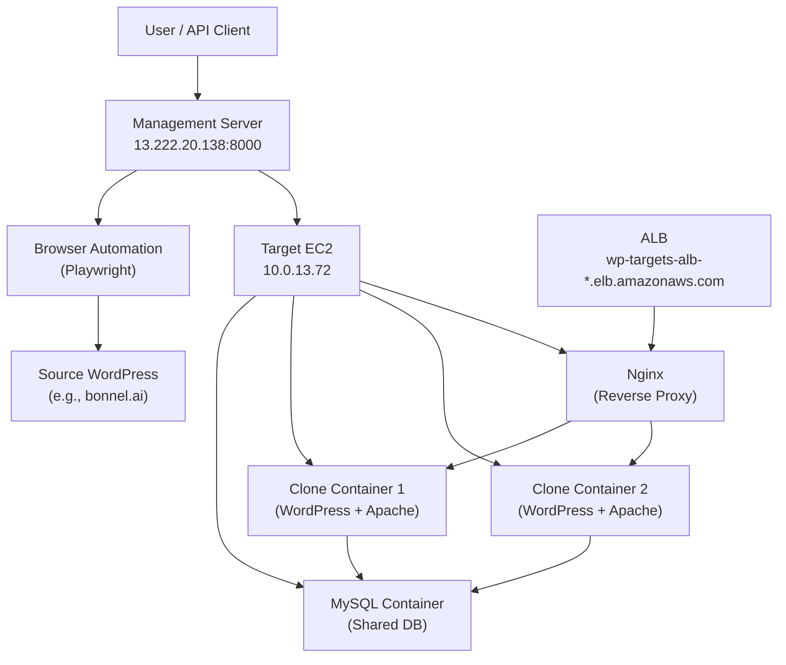

# WordPress Clone & Restore System

## What This Does

This system **clones WordPress sites** into temporary testing environments on AWS and **restores changes back to production**. You can:

1. **Clone a live WordPress site** (e.g., bonnel.ai) to a temporary AWS container
2. Make changes safely on the clone without touching production
3. **Restore changes back** to production with control over themes and plugins

**Key Feature:** Everything is automated via REST API - no manual server access or plugin installation needed.

## Current Status

### ✅ What's Working (Production Ready)
- **Clone endpoint**: Creates clones from any WordPress site with full REST API support
- **Restore endpoint**: Restores content, themes, and plugins from source to target
- **Auto-provisioning**: Automatically creates isolated containers with unique credentials
- **Browser automation**: Logs in, installs plugin, configures everything automatically
- **ALB path-based routing**: Dynamic listener rules route each clone to correct EC2 instance
- **Clone REST API**: Export/import endpoints fully functional on all clones
- **Preserve options**: Control whether to keep or replace target themes and plugins
- **Clone → Production restore**: Full workflow working end-to-end

### 🎯 System Ready
All core functionality is working. You can safely:
1. Clone any WordPress site to temporary AWS containers
2. Make changes on clones
3. Restore changes back to production with theme/plugin control

---

## Architecture



**Key Components:**
- **Management Server**: FastAPI service that orchestrates cloning
- **Browser Automation**: Playwright + Camoufox for plugin installation
- **Target EC2**: Runs Docker containers for WordPress clones
- **MySQL**: Shared database server, separate DB per clone
- **ALB + Nginx**: Path-based routing to clones (e.g., `/clone-20260124-035840/`)

---

## Quick Start

### Postman Collection (Copy & Paste Ready)

Import these requests into Postman for easy testing:

#### Request 1: Create Clone
- **Method**: `POST`
- **URL**: `http://13.222.20.138:8000/clone`
- **Headers**: 
  - `Content-Type: application/json`
- **Body** (raw JSON):
```json
{
  "source": {
    "url": "https://bonnel.ai",
    "username": "Charles",
    "password": "xkZ%HL6v5Z5)MP9K"
  }
}
```

#### Request 2: Restore Clone to Production
- **Method**: `POST`
- **URL**: `http://13.222.20.138:8000/restore`
- **Headers**: 
  - `Content-Type: application/json`
- **Body** (raw JSON):
```json
{
  "source": {
    "url": "http://wp-targets-alb-1392351630.us-east-1.elb.amazonaws.com/clone-YYYYMMDD-HHMMSS",
    "username": "admin",
    "password": "password-from-clone-response"
  },
  "target": {
    "url": "https://betaweb.ai",
    "username": "Charles",
    "password": "xkZ%HL6v5Z5)MP9K"
  },
  "preserve_themes": false,
  "preserve_plugins": false
}
```

#### Request 3: Test Clone REST API Export
- **Method**: `POST`
- **URL**: `http://wp-targets-alb-1392351630.us-east-1.elb.amazonaws.com/clone-YYYYMMDD-HHMMSS/index.php?rest_route=/custom-migrator/v1/export`
- **Headers**: 
  - `X-Migrator-Key: migration-master-key`
- **Body**: (empty)

#### Request 4: Health Check
- **Method**: `GET`
- **URL**: `http://13.222.20.138:8000/health`
- **Headers**: (none needed)
- **Body**: (empty)

---

### 1. Clone a WordPress Site

Creates a temporary copy of your WordPress site for testing.

**Endpoint:** `POST http://13.222.20.138:8000/clone`

**Request:**
```json
{
  "source": {
    "url": "https://bonnel.ai",
    "username": "your-username",
    "password": "your-password"
  }
}
```

**Parameters:**
- `url`: **Must use HTTPS** (HTTP redirects break POST requests)
- `username`: WordPress admin username
- `password`: WordPress admin password

**Response:**
```json
{
  "success": true,
  "clone_url": "http://wp-targets-alb-1392351630.us-east-1.elb.amazonaws.com/clone-20260127-001234",
  "wordpress_username": "admin",
  "wordpress_password": "F7n4xwasIMOimxSU",
  "api_key": "migration-master-key",
  "expires_at": "2026-01-27T02:12:34.567890Z",
  "message": "Clone created successfully"
}
```

**What you get:**
- `clone_url`: URL to access your cloned site
- `wordpress_username`: Admin username (always "admin")
- `wordpress_password`: Generated admin password
- `api_key`: API key for REST API access (always "migration-master-key")
- `expires_at`: When the clone will be deleted

---

### 2. Restore to Production

Restores content, themes, and plugins from source (clone or staging) to target (production).

**Endpoint:** `POST http://13.222.20.138:8000/restore`

**Request (Copy Everything):**
```json
{
  "source": {
    "url": "https://bonnel.ai",
    "username": "charles",
    "password": "source-password"
  },
  "target": {
    "url": "https://betaweb.ai",
    "username": "Charles",
    "password": "target-password"
  },
  "preserve_themes": false,
  "preserve_plugins": false
}
```

**Request (Keep Target Themes/Plugins):**
```json
{
  "source": {
    "url": "https://bonnel.ai",
    "username": "charles",
    "password": "source-password"
  },
  "target": {
    "url": "https://betaweb.ai",
    "username": "Charles",
    "password": "target-password"
  },
  "preserve_themes": true,
  "preserve_plugins": true
}
```

**Parameters:**
- `preserve_themes`:
  - `false` (default): Replace target themes with source themes
  - `true`: Keep target's existing themes
- `preserve_plugins`:
  - `false` (default): Replace target plugins with source plugins
  - `true`: Keep target's existing plugins

**Response:**
```json
{
  "success": true,
  "message": "Restore completed successfully",
  "source_api_key": "GL24zU5fHmxC0Hlh4c4WxVorOzzi4DCr",
  "target_api_key": "GL24zU5fHmxC0Hlh4c4WxVorOzzi4DCr"
}
```

**What happens:**
- Database content restored from source
- Themes copied (unless `preserve_themes: true`)
- Plugins copied (unless `preserve_plugins: true`)
- Uploads/media copied
- Custom Migrator plugin always preserved on target

---

## Infrastructure Details

### Management Server
- **IP**: 13.222.20.138
- **Service**: FastAPI (wp-setup-service)
- **Port**: 8000
- **What it does**: Orchestrates cloning, runs browser automation

### Target Server
- **IP**: 10.0.13.72 (private)
- **Components**:
  - Docker containers (one per clone)
  - MySQL container (shared, separate DB per clone)
  - Nginx reverse proxy
- **Access**: Via ALB at `wp-targets-alb-1392351630.us-east-1.elb.amazonaws.com`

### Clone Containers
- **Image**: `wordpress:latest` + Custom Migrator plugin + wp-cli
- **Database**: MySQL (shared server, separate database per clone)
- **Naming**: `clone-YYYYMMDD-HHMMSS`
- **Ports**: Dynamically assigned (e.g., 8021, 8022)
- **URL Pattern**: `http://ALB-DNS/clone-TIMESTAMP/`

---

## How It Works

### Clone Process

1. **You send a POST request** with source WordPress credentials
2. **Browser automation logs in** to the source site
   - Uploads Custom Migrator plugin
   - Activates plugin
   - Retrieves API key
3. **Container is provisioned** on target EC2
   - New MySQL database created
   - WordPress container started
   - Nginx routing configured
4. **Export from source** via plugin REST API
   - Creates ZIP with database, themes, plugins, uploads
5. **Import to clone** via plugin REST API
   - Extracts content
   - Updates URLs to ALB path
   - Creates must-use plugin to prevent redirects
6. **Response returned** with clone URL and credentials

### Restore Process

1. **Browser automation logs in** to both source and target
2. **Export from source** via plugin REST API
   - Creates ZIP with database, themes, plugins, uploads
3. **Import to target** via plugin REST API
   - Extracts content
   - Replaces or preserves themes based on `preserve_themes`
   - Replaces or preserves plugins based on `preserve_plugins`
   - Updates URLs to target domain
   - Creates must-use plugin to prevent redirects
4. **Response returned** with success status

---

## Important Notes

### Requirements
- **Use HTTPS**: Source URLs must be `https://` not `http://` (HTTP redirects break POST requests)
- **Clone TTL**: Clones auto-delete after expiration (default 60 minutes)
- **Credentials**: Must provide valid WordPress admin credentials

### Recently Fixed Issues
- ✅ ALB path-based routing (dynamic listener rules per clone)
- ✅ Clone REST API 500 errors (ALB routing fix)
- ✅ WordPress redirect loops (must-use plugin)
- ✅ wp-admin.php redirect (browser automation updated)
- ✅ Import checkbox timeout (error handling added)

---

## Technical Details

### API Endpoints
- **Clone**: `POST http://13.222.20.138:8000/clone`
- **Restore**: `POST http://13.222.20.138:8000/restore`
- **Health**: `GET http://13.222.20.138:8000/health`
- **Web UI**: `http://13.222.20.138:8000/`

### SSH Access
```bash
# Management server
ssh -i wp-targets-key.pem ec2-user@13.222.20.138

# Target server (from management)
ssh -i /home/ec2-user/wp-targets-key.pem ec2-user@10.0.13.72
```

### Docker Images
- **Management**: `wp-setup-service:latest`
- **WordPress**: `044514005641.dkr.ecr.us-east-1.amazonaws.com/wordpress-target-sqlite:latest`
  - Note: Name says "sqlite" but actually uses MySQL (legacy naming)

### AWS Resources
- **Region**: us-east-1
- **ALB**: wp-targets-alb-1392351630.us-east-1.elb.amazonaws.com
- **ECR**: 044514005641.dkr.ecr.us-east-1.amazonaws.com

---

## Documentation

- **API_TEST_PLAN.md**: Detailed API usage examples and quirks
- **OPERATIONAL_MEMORY.md**: Current status, what's working, what's not
- **README.md**: This file - overview and quick start
