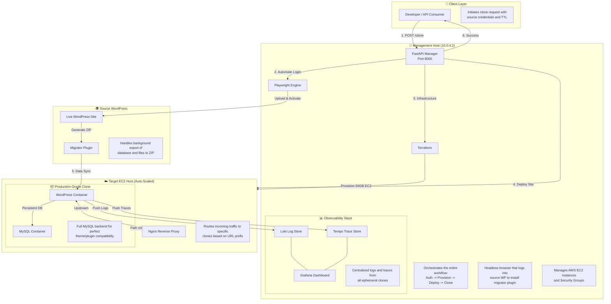

# WordPress Clone Manager

> **Status:** ✅ Service is **FULLY OPERATIONAL** with MySQL Backend & Observability

## 🎯 What This Does

This service **automatically clones WordPress sites** with production-grade fidelity. It eliminates manual migration steps by automating the entire lifecycle:

1.  ✅ **Zero-Touch Setup**: Automatically installs and activates the migration plugin on the source site via browser automation.
2.  ✅ **Design-Preserving Export**: Captures the entire database, plugins, themes, and media.
3.  ✅ **Ephemeral Infrastructure**: Provisions high-performance AWS EC2 targets with **MySQL backends** (replacing SQLite for 100% compatibility).
4.  ✅ **Path-Based Routing**: Supports multiple clones on a single host using subpaths (e.g., `/clone-xxx/`) via Nginx.
5.  ✅ **Credential Persistence**: Automatically re-injects your provided admin credentials after the database import.
6.  ✅ **Full Observability**: Integrated with Loki for logs and Tempo for OTLP traces.

---

## 🏗️ Architecture Overview



---

## 🚀 API Endpoints

### Base URL
```
http://10.0.4.2:8000
```

### Interactive Documentation
- **Swagger UI:** http://10.0.4.2:8000/docs

---

### `POST /clone`

Clone a WordPress site from source to an ephemeral AWS target.

#### Request Body

**Standard Clone Request:**
```json
{
  "source": {
    "url": "https://mysite.com",
    "username": "admin",
    "password": "secure_password"
  },
  "auto_provision": true,
  "ttl_minutes": 60
}
```

#### Key Parameters

| Field | Type | Description |
|-------|------|-------------|
| `source.url` | string | Full URL of the site to clone |
| `auto_provision` | boolean | If `true`, creates a fresh EC2 instance |
| `ttl_minutes` | integer | Minutes before the clone is auto-destroyed |

---

## ✅ Current System State

| Feature | Status | Technology |
|---------|--------|------------|
| **Database** | ✅ **MySQL** | Replaced SQLite for full plugin compatibility |
| **Routing** | ✅ **Path-Based** | Clones accessible via `/clone-{id}/` |
| **Storage** | ✅ **50GB EBS** | Increased from 8GB to support large site migrations |
| **Logging** | ✅ **Loki** | All container logs streamed to management host |
| **Tracing** | ✅ **Tempo** | OTLP traces available for debugging bottlenecks |
| **Auth** | ✅ **Persistent** | Admin credentials re-synced post-import |
| **Infrastructure** | ✅ **Terraform** | Automated EC2 gp3 volume provisioning |

---

## 📊 Performance & Limits

*   **Small Site (<200MB)**: ~2-3 minutes total.
*   **Large Site (>1GB)**: ~5-10 minutes (depends on source bandwidth).
*   **Concurrent Clones**: Supports up to 50 active containers per EC2 host (ports 8001-8050).
*   **Auto-Cleanup**: Background tasks prune inactive containers and reclaim disk space.

---

## 🛠️ Troubleshooting & Logs

If a clone fails, check the logs in Grafana:
1.  Open Grafana @ `http://10.0.4.2:3000`
2.  Go to **Explore** -> Select **Loki**
3.  Filter by `{container_name=~"clone-.*"}`

---

**Last Updated:** 2026-01-16  
**Service Version:** 1.2.0 (MySQL Edition)  
**Deployment:** AWS Private VPC (Management Host: 10.0.4.2)
