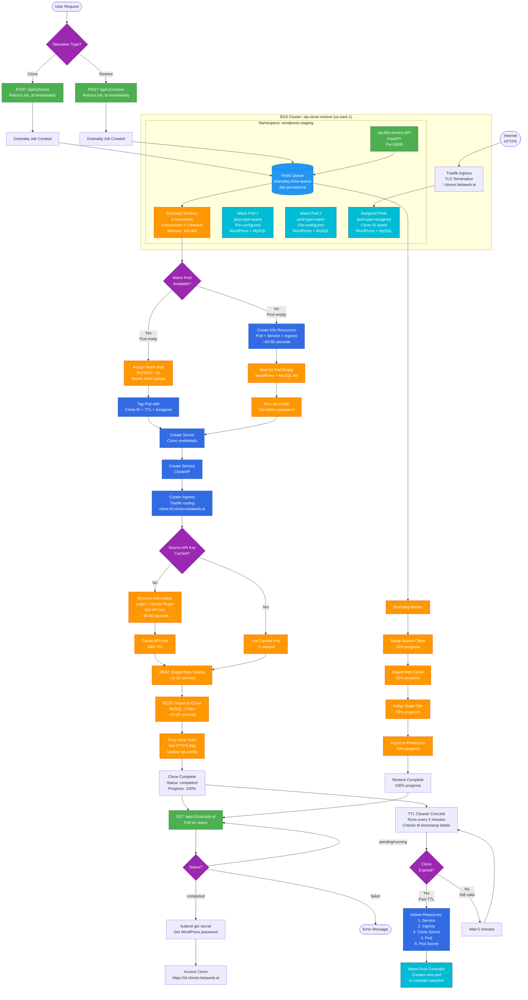

# WordPress Clone & Restore API

Simple API for cloning WordPress sites and restoring them to production.

## System Architecture

### Infrastructure Overview (Current Production)
- **Cluster:** EKS (wp-clone-restore) in us-east-1
- **Namespace:** wordpress-staging
- **Workers:** 4 concurrent (2 processes × 2 threads)
- **Load Balancer:** Traefik (TLS termination)
- **Queue:** Redis (async job processing via Dramatiq)
- **Storage:** Local MySQL sidecar per pod (no shared DB bottleneck)
- **Domain:** *.clones.betaweb.ai
- **Warm Pool:** 2-20 pods (dynamic scaling based on queue depth)

### Architecture Diagram

This diagram shows the complete clone workflow from user request to cleanup. Green boxes are API endpoints, blue is Redis queue, orange is worker operations, purple is decision points, navy is Kubernetes operations, and cyan is warm pool components.


```mermaid
flowchart TD
    Start([User Request]) --> CloneOrRestore{Operation Type?}
    
    %% Clone Flow
    CloneOrRestore -->|Clone| CloneAPI[POST /api/v2/clone<br/>Returns job_id immediately]
    CloneAPI --> CloneJob[Dramatiq Job Created]
    CloneJob --> RedisQueue[(Redis Queue)]
    RedisQueue --> Worker[Dramatiq Worker]
    
    Worker --> PoolCheck{Warm Pool<br/>Available?}
    
    %% Warm Pool Path (Fast: pre-configured pods)
    PoolCheck -->|Yes<br/>Pod ready| WarmAssign[Assign Warm Pod<br/>INSTANT ~2s<br/>Atomic label update]
    WarmAssign --> TagPod[Tag Pod with<br/>Clone ID + TTL + Assigned]
    TagPod --> CreateSecret[Create Secret<br/>Clone credentials]
    
    %% Cold Provision Path (Slow: create from scratch)
    PoolCheck -->|No<br/>Pool empty| ColdDeploy[Create K8s Resources<br/>Pod + Service + Ingress<br/>~60-80 seconds]
    ColdDeploy --> WaitReady[Wait for Pod Ready<br/>WordPress + MySQL init]
    WaitReady --> ConfigWP[Run wp-install<br/>Set admin password]
    ConfigWP --> CreateSecret
    
    %% Common Path (both warm & cold)
    CreateSecret --> CreateService[Create Service<br/>ClusterIP]
    CreateService --> CreateIngress[Create Ingress<br/>Traefik routing<br/>clone-id.clones.betaweb.ai]
    CreateIngress --> CheckCache{Source API Key<br/>Cached?}
    CheckCache -->|Yes| UseCache[Use Cached Key<br/>~1 second]
    CheckCache -->|No| BrowserSetup[Browser Automation<br/>Login + Upload Plugin<br/>Get API key<br/>~30-40 seconds]
    BrowserSetup --> CacheKey[Cache API Key<br/>24hr TTL]
    CacheKey --> Export[REST: Export from Source<br/>~15-20 seconds]
    UseCache --> Export
    Export --> Import[REST: Import to Clone<br/>MySQL + Files<br/>~15-20 seconds]
    Import --> PostClone[Post-clone fixes<br/>Set HTTPS flag<br/>Update wp-config]
    PostClone --> CloneComplete[Clone Complete<br/>Status: completed<br/>Progress: 100%]
    
    %% Restore Flow
    CloneOrRestore -->|Restore| RestoreAPI[POST /api/v2/restore<br/>Returns job_id immediately]
    RestoreAPI --> RestoreJob[Dramatiq Job Created]
    RestoreJob --> RedisQueue
    RedisQueue --> RestoreWorker[Dramatiq Worker]
    
    RestoreWorker --> SourceSetup[Setup Source Clone<br/>10% progress]
    SourceSetup --> SourceExport[Export from Clone<br/>30% progress]
    SourceExport --> TargetSetup[Setup Target Site<br/>50% progress]
    TargetSetup --> TargetImport[Import to Production<br/>70% progress]
    TargetImport --> RestoreComplete[Restore Complete<br/>100% progress]
    
    %% Monitoring & Cleanup
    CloneComplete --> Monitor[GET /api/v2/jobs/job-id<br/>Poll for status]
    RestoreComplete --> Monitor
    Monitor --> StatusCheck{Status?}
    StatusCheck -->|pending/running| Monitor
    StatusCheck -->|completed| GetCreds[kubectl get secret<br/>Get WordPress password]
    StatusCheck -->|failed| ShowError([Error Message])
    GetCreds --> Access[Access Clone<br/>https://id.clones.betaweb.ai]
    
    %% TTL Cleanup (Automatic)
    CloneComplete --> TTL[TTL Cleaner CronJob<br/>Runs every 5 minutes<br/>Checks ttl-timestamp labels]
    TTL --> CheckExpiry{Clone<br/>Expired?}
    CheckExpiry -->|Yes<br/>Past TTL| DeleteAll[Delete Resources:<br/>1. Service<br/>2. Ingress<br/>3. Clone Secret<br/>4. Pod<br/>5. Pod Secret]
    CheckExpiry -->|No<br/>Still valid| WaitNext[Wait 5 minutes]
    WaitNext --> TTL
    DeleteAll --> PoolReplenish[Warm Pool Controller<br/>Creates new pod<br/>to maintain baseline]
    
    %% Infrastructure Components (Current Deployment)
    subgraph EKS["EKS Cluster: wp-clone-restore (us-east-1)"]
        subgraph NS["Namespace: wordpress-staging"]
            WarmPod1[Warm Pod 1<br/>pool-type=warm<br/>Pre-configured<br/>WordPress + MySQL]
            WarmPod2[Warm Pod 2<br/>pool-type=warm<br/>Pre-configured<br/>WordPress + MySQL]
            ClonePods[Assigned Pods<br/>pool-type=assigned<br/>Clone ID labels<br/>WordPress + MySQL]
            RedisQueue[(Redis Queue<br/>dramatiq:clone-queue<br/>Job persistence)]
            Worker[Dramatiq Workers<br/>4 concurrent<br/>2 processes × 2 threads<br/>Memory: 1Gi-4Gi]
            WPAPI[wp-k8s-service API<br/>FastAPI<br/>Port 8000]
        end
        Traefik[Traefik Ingress<br/>TLS Termination<br/>*.clones.betaweb.ai]
    end
    
    Internet([Internet<br/>HTTPS]) --> Traefik
    Traefik --> ClonePods
    WPAPI --> RedisQueue
    
    %% Styling
    classDef apiClass fill:#4CAF50,stroke:#2E7D32,color:#fff
    classDef queueClass fill:#2196F3,stroke:#1565C0,color:#fff
    classDef workerClass fill:#FF9800,stroke:#E65100,color:#fff
    classDef decisionClass fill:#9C27B0,stroke:#6A1B9A,color:#fff
    classDef k8sClass fill:#326CE5,stroke:#1A4D8F,color:#fff
    classDef poolClass fill:#00BCD4,stroke:#006064,color:#fff
    
    class CloneAPI,RestoreAPI,Monitor,WPAPI apiClass
    class RedisQueue queueClass
    class Worker,RestoreWorker,WarmAssign,Export,Import,SourceSetup,SourceExport,TargetSetup,TargetImport,BrowserSetup,UseCache,CacheKey,PostClone,ConfigWP,WaitReady workerClass
    class CloneOrRestore,PoolCheck,StatusCheck,CheckExpiry,CheckCache decisionClass
    class TagPod,CreateService,CreateIngress,ColdDeploy,DeleteAll,CreateSecret k8sClass
    class WarmPod1,WarmPod2,PoolReplenish,ClonePods poolClass
```

## API Endpoints

### 1. Clone WordPress Site

Create a temporary clone of any WordPress site.

```bash
curl -X POST https://clones.betaweb.ai/api/v2/clone \
  -H "Content-Type: application/json" \
  -d '{
    "source_url": "https://example.com",
    "source_username": "admin",
    "source_password": "your-password",
    "customer_id": "my-clone-001",
    "ttl_minutes": 60
  }'
```

**Response:**
```json
{
  "job_id": "abc-123-xyz",
  "status": "pending",
  "progress": 0
}
```

**Check status:**
```bash
curl https://clones.betaweb.ai/api/v2/job-status/abc-123-xyz
```

**When completed (status: "completed"):**
```json
{
  "status": "completed",
  "progress": 100,
  "result": {
    "public_url": "https://my-clone-001.clones.betaweb.ai",
    "wordpress_username": "admin",
    "wordpress_password": "ABC123xyz..."
  }
}
```

**Access your clone:**
- URL: `https://my-clone-001.clones.betaweb.ai/wp-admin`
- Username: `admin` (from response)
- Password: `ABC123xyz...` (from response)

---

### 2. Restore Changes to Production

Push changes from a clone back to your production site.

```bash
curl -X POST https://clones.betaweb.ai/api/v2/restore \
  -H "Content-Type: application/json" \
  -d '{
    "source_url": "https://my-clone-001.clones.betaweb.ai",
    "source_username": "admin",
    "source_password": "ABC123xyz...",
    "target_url": "https://example.com",
    "target_username": "admin",
    "target_password": "production-password",
    "customer_id": "restore-001"
  }'
```

**Response:**
```json
{
  "job_id": "def-456-xyz",
  "status": "pending"
}
```

**Check status:**
```bash
curl https://clones.betaweb.ai/api/v2/job-status/def-456-xyz
```

Poll every 5-10 seconds until `status: "completed"`

---

### 3. Create Application Password

Generate a WordPress Application Password for REST API access (no manual login required).

```bash
curl -X POST https://clones.betaweb.ai/create-app-password \
  -H "Content-Type: application/json" \
  -d '{
    "url": "https://example.com",
    "username": "admin",
    "password": "your-password",
    "app_name": "My API Access"
  }'
```

**Response:**
```json
{
  "success": true,
  "application_password": "AbCd EfGh IjKl MnOp QrSt UvWx",
  "app_name": "My API Access",
  "message": "Application password created successfully"
}
```

**Use the application password:**
```bash
# Example: List WordPress posts using the application password
curl https://example.com/wp-json/wp/v2/posts \
  --user "admin:AbCd EfGh IjKl MnOp QrSt UvWx"
```

**Requirements:**
- WordPress 5.6 or higher
- HTTPS enabled (or local development environment)
- User must have admin privileges

---

## Quick Examples

### Clone → Edit → Restore Workflow

```bash
# 1. Create clone
CLONE_JOB=$(curl -s -X POST https://clones.betaweb.ai/api/v2/clone \
  -H "Content-Type: application/json" \
  -d '{
    "source_url": "https://mysite.com",
    "source_username": "admin",
    "source_password": "password123",
    "customer_id": "edit-homepage",
    "ttl_minutes": 120
  }' | jq -r '.job_id')

echo "Clone job: $CLONE_JOB"

# 2. Wait for completion (2-3 minutes)
while true; do
  STATUS=$(curl -s https://clones.betaweb.ai/api/v2/job-status/$CLONE_JOB | jq -r '.status')
  echo "Status: $STATUS"
  [ "$STATUS" = "completed" ] && break
  sleep 10
done

# 3. Get credentials
CLONE_INFO=$(curl -s https://clones.betaweb.ai/api/v2/job-status/$CLONE_JOB)
CLONE_URL=$(echo $CLONE_INFO | jq -r '.result.public_url')
CLONE_PASS=$(echo $CLONE_INFO | jq -r '.result.wordpress_password')

echo "Clone URL: $CLONE_URL/wp-admin"
echo "Username: admin"
echo "Password: $CLONE_PASS"

# 4. Make your edits at $CLONE_URL/wp-admin
# (Open in browser, edit content, save changes)

# 5. Restore to production
RESTORE_JOB=$(curl -s -X POST https://clones.betaweb.ai/api/v2/restore \
  -H "Content-Type: application/json" \
  -d "{
    \"source_url\": \"$CLONE_URL\",
    \"source_username\": \"admin\",
    \"source_password\": \"$CLONE_PASS\",
    \"target_url\": \"https://mysite.com\",
    \"target_username\": \"admin\",
    \"target_password\": \"password123\",
    \"customer_id\": \"restore-homepage\"
  }" | jq -r '.job_id')

echo "Restore job: $RESTORE_JOB"

# 6. Monitor restore
while true; do
  STATUS=$(curl -s https://clones.betaweb.ai/api/v2/job-status/$RESTORE_JOB | jq -r '.status')
  echo "Restore status: $STATUS"
  [ "$STATUS" = "completed" ] && break
  sleep 10
done

echo "Done! Changes are live on mysite.com"
```

---

## Important Notes

### Timing
- **Clone creation:** 60-120 seconds (depending on site size)
- **Restore:** 60-90 seconds
- **Create app password:** 15-30 seconds
- **Poll interval:** Check status every 5-10 seconds

### Clone Behavior
- **TTL:** Clones auto-delete after expiration (default: 60 minutes)
- **Credentials:** Username is always `admin`, password returned in job result
- **URL format:** `https://{customer_id}.clones.betaweb.ai`
- **Upload limits:** 128MB max file size (themes, plugins, media)

### Job Status Endpoint
- **Correct endpoint:** `/api/v2/job-status/{job_id}` ✅
- **Old endpoint:** `/api/v2/jobs/{job_id}` ❌ (404 error)
- Save your `job_id` from the initial response to check status

### Application Passwords
- Requires WordPress 5.6+ and HTTPS (or local environment)
- Use for REST API authentication without exposing main password
- Format: 24 characters split into 6 groups (e.g., "AbCd EfGh IjKl MnOp QrSt UvWx")
- Use with Basic Auth: `username:application_password`

## API Reference

### Endpoints Summary

| Endpoint | Method | Purpose | Returns |
|----------|--------|---------|---------|
| `/api/v2/clone` | POST | Create WordPress clone | `job_id` (async) |
| `/api/v2/restore` | POST | Restore clone to production | `job_id` (async) |
| `/api/v2/job-status/{job_id}` | GET | Check job progress | Status & credentials |
| `/create-app-password` | POST | Generate WordPress app password | Password (sync) |

### Request/Response Details

#### POST /api/v2/clone
```json
{
  "source_url": "https://example.com",
  "source_username": "admin",
  "source_password": "password",
  "customer_id": "unique-id",
  "ttl_minutes": 60
}
```
**Returns:** `{ "job_id": "...", "status": "pending" }`

#### POST /api/v2/restore
```json
{
  "source_url": "https://clone-id.clones.betaweb.ai",
  "source_username": "admin",
  "source_password": "clone-password",
  "target_url": "https://production.com",
  "target_username": "admin",
  "target_password": "prod-password",
  "customer_id": "restore-id"
}
```
**Returns:** `{ "job_id": "...", "status": "pending" }`

#### GET /api/v2/job-status/{job_id}
**Returns:**
```json
{
  "status": "completed",
  "progress": 100,
  "result": {
    "public_url": "https://clone-id.clones.betaweb.ai",
    "wordpress_username": "admin",
    "wordpress_password": "ABC123..."
  }
}
```
**Status values:** `pending` → `running` → `completed` or `failed`

#### POST /create-app-password
```json
{
  "url": "https://example.com",
  "username": "admin",
  "password": "password",
  "app_name": "My App"
}
```
**Returns:**
```json
{
  "success": true,
  "application_password": "AbCd EfGh IjKl MnOp QrSt UvWx",
  "app_name": "My App"
}
```

## Additional Documentation

See `/docs` folder for architecture and implementation details.
