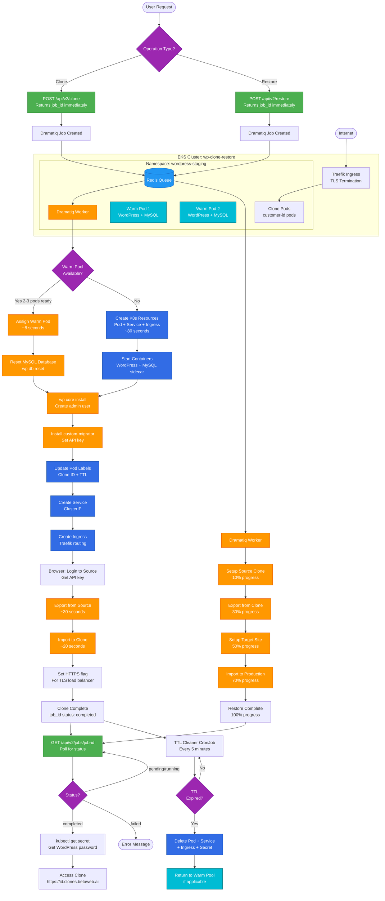

# WordPress Clone & Restore API

Simple API for cloning WordPress sites and restoring them to production.

## System Architecture

### Infrastructure Overview
- **Cluster:** EKS (wp-clone-restore) in us-east-1
- **Namespace:** wordpress-staging
- **Load Balancer:** Traefik (TLS termination)
- **Queue:** Redis (async job processing)
- **Storage:** Local MySQL sidecar per pod (no shared DB)
- **Domain:** *.clones.betaweb.ai


```mermaid
flowchart TD
    Start([User Request]) --> CloneOrRestore{Operation Type?}
    
    %% Clone Flow
    CloneOrRestore -->|Clone| CloneAPI[POST /api/v2/clone<br/>Returns job_id immediately]
    CloneAPI --> CloneJob[Dramatiq Job Created]
    CloneJob --> RedisQueue[(Redis Queue)]
    RedisQueue --> Worker[Dramatiq Worker]
    
    Worker --> PoolCheck{Warm Pool<br/>Available?}
    
    %% Warm Pool Path
    PoolCheck -->|Yes 2-3 pods ready| WarmAssign[Assign Warm Pod<br/>~8 seconds]
    WarmAssign --> ResetDB[Reset MySQL Database<br/>wp db reset]
    ResetDB --> WPInstall[wp core install<br/>Create admin user]
    WPInstall --> PluginSetup[Install custom-migrator<br/>Set API key]
    PluginSetup --> TagPod[Update Pod Labels<br/>Clone ID + TTL]
    
    %% Cold Provision Path
    PoolCheck -->|No| ColdDeploy[Create K8s Resources<br/>Pod + Service + Ingress<br/>~80 seconds]
    ColdDeploy --> Containers[Start Containers<br/>WordPress + MySQL sidecar]
    Containers --> WPInstall
    
    %% Common Path
    TagPod --> CreateService[Create Service<br/>ClusterIP]
    CreateService --> CreateIngress[Create Ingress<br/>Traefik routing]
    CreateIngress --> SetupSource[Browser: Login to Source<br/>Get API key]
    SetupSource --> Export[Export from Source<br/>~30 seconds]
    Export --> Import[Import to Clone<br/>~20 seconds]
    Import --> SetHTTPS[Set HTTPS flag<br/>For TLS load balancer]
    SetHTTPS --> CloneComplete[Clone Complete<br/>job_id status: completed]
    
    %% Restore Flow
    CloneOrRestore -->|Restore| RestoreAPI[POST /api/v2/restore<br/>Returns job_id immediately]
    RestoreAPI --> RestoreJob[Dramatiq Job Created]
    RestoreJob --> RedisQueue
    RedisQueue --> RestoreWorker[Dramatiq Worker]
    
    RestoreWorker --> SourceSetup[Setup Source Clone<br/>10% progress]
    SourceSetup --> SourceExport[Export from Clone<br/>30% progress]
    SourceExport --> TargetSetup[Setup Target Site<br/>50% progress]
    TargetSetup --> TargetImport[Import to Production<br/>70% progress]
    TargetImport --> RestoreComplete[Restore Complete<br/>100% progress]
    
    %% Monitoring & Cleanup
    CloneComplete --> Monitor[GET /api/v2/jobs/job-id<br/>Poll for status]
    RestoreComplete --> Monitor
    Monitor --> StatusCheck{Status?}
    StatusCheck -->|pending/running| Monitor
    StatusCheck -->|completed| GetCreds[kubectl get secret<br/>Get WordPress password]
    StatusCheck -->|failed| ShowError([Error Message])
    GetCreds --> Access[Access Clone<br/>https://id.clones.betaweb.ai]
    
    %% TTL Cleanup
    CloneComplete --> TTL[TTL Cleaner CronJob<br/>Every 5 minutes]
    TTL --> CheckExpiry{TTL<br/>Expired?}
    CheckExpiry -->|Yes| DeleteRes[Delete Pod + Service<br/>+ Ingress + Secret]
    CheckExpiry -->|No| TTL
    DeleteRes --> ReturnPool[Return to Warm Pool<br/>if applicable]
    
    %% Infrastructure Components
    subgraph EKS["EKS Cluster: wp-clone-restore"]
        subgraph NS["Namespace: wordpress-staging"]
            WarmPod1[Warm Pod 1<br/>WordPress + MySQL]
            WarmPod2[Warm Pod 2<br/>WordPress + MySQL]
            ClonePods[Clone Pods<br/>customer-id pods]
            RedisQueue
            Worker
        end
        Traefik[Traefik Ingress<br/>TLS Termination]
    end
    
    Internet([Internet]) --> Traefik
    Traefik --> ClonePods
    
    %% Styling
    classDef apiClass fill:#4CAF50,stroke:#2E7D32,color:#fff
    classDef queueClass fill:#2196F3,stroke:#1565C0,color:#fff
    classDef workerClass fill:#FF9800,stroke:#E65100,color:#fff
    classDef decisionClass fill:#9C27B0,stroke:#6A1B9A,color:#fff
    classDef k8sClass fill:#326CE5,stroke:#1A4D8F,color:#fff
    classDef poolClass fill:#00BCD4,stroke:#006064,color:#fff
    
    class CloneAPI,RestoreAPI,Monitor apiClass
    class RedisQueue queueClass
    class Worker,RestoreWorker,WarmAssign,ResetDB,WPInstall,PluginSetup,Export,Import,SourceSetup,SourceExport,TargetSetup,TargetImport workerClass
    class CloneOrRestore,PoolCheck,StatusCheck,CheckExpiry decisionClass
    class TagPod,CreateService,CreateIngress,ColdDeploy,Containers,DeleteRes k8sClass
    class WarmPod1,WarmPod2,ReturnPool poolClass
```

## Quick Start

### 1. Create a Clone

```bash
curl -X POST https://clones.betaweb.ai/api/v2/clone \
  -H "Content-Type: application/json" \
  -d '{
    "source_url": "https://betaweb.ai",
    "source_username": "Charles@toctoc.com.au",
    "source_password": "your-password",
    "customer_id": "my-clone-123",
    "ttl_minutes": 60
  }'
```

**Response:**
```json
{
  "job_id": "abc-123-xyz",
  "type": "clone",
  "status": "pending",
  "progress": 0,
  "created_at": "2026-02-26T06:47:54.247391",
  "ttl_expires_at": "2026-02-26T07:47:54.247395"
}
```

**Important:** Save the `job_id` - you'll need it to check status and get credentials!

### 2. Check Clone Status and Get Credentials

```bash
# Replace abc-123-xyz with your job_id from step 1
curl https://clones.betaweb.ai/api/v2/jobs/abc-123-xyz
```

Keep polling every 5-10 seconds until `status: "completed"` (~60-80 seconds)

**Response when complete:**
```json
{
  "job_id": "abc-123-xyz",
  "type": "clone",
  "status": "completed",
  "progress": 100,
  "result": {
    "public_url": "https://my-clone-123.clones.betaweb.ai",
    "internal_url": "http://my-clone-123.wordpress-staging.svc.cluster.local"
  }
}
```

### 3. Get Clone Credentials

The clone credentials are stored in a Kubernetes secret. You need to retrieve them:

```bash
# Get the password from the Kubernetes secret
kubectl get secret my-clone-123-credentials -n wordpress-staging \
  -o jsonpath='{.data.wordpress-password}' | base64 -d && echo
```

**Clone credentials:**
- **URL:** `https://my-clone-123.clones.betaweb.ai/wp-admin`
- **Username:** `admin` (always)
- **Password:** (from command above)

### 4. Make Changes to the Clone

1. Open `https://my-clone-123.clones.betaweb.ai/wp-admin` in your browser
2. Login with username `admin` and the password from step 3
3. Make your changes (edit pages, posts, settings, etc.)
4. Save your changes

### 5. Restore Clone to Production

Once you've made changes and are ready to push them to production:

```bash
curl -X POST https://clones.betaweb.ai/api/v2/restore \
  -H "Content-Type: application/json" \
  -d '{
    "source_url": "https://my-clone-123.clones.betaweb.ai",
    "source_username": "admin",
    "source_password": "password-from-step-3",
    "target_url": "https://betaweb.ai",
    "target_username": "Charles@toctoc.com.au",
    "target_password": "your-production-password",
    "customer_id": "restore-from-clone-123"
  }'
```

**Note:** Remove trailing slashes from URLs

**Response:**
```json
{
  "job_id": "def-456-xyz",
  "type": "restore",
  "status": "pending",
  "progress": 0
}
```

**Important:** Save the restore `job_id` to monitor progress!

### 6. Monitor Restore Progress

```bash
# Replace def-456-xyz with your restore job_id from step 5
curl https://clones.betaweb.ai/api/v2/jobs/def-456-xyz
```

Keep polling until `status: "completed"` (~60-90 seconds)

**Progress indicators:**
- `10%` - Job received and queued
- `30%` - Source setup complete
- `50%` - Target setup complete
- `70%` - Export from clone complete
- `100%` - Import to production complete

**Done!** Your changes are now live on `https://betaweb.ai`

## Timing

- **Clone creation:** 60-80 seconds (warm pool) / 80-120 seconds (cold provision)
- **Restore:** 60-90 seconds
- **Poll interval:** Every 5-10 seconds
- **Clone TTL:** Configurable (default 60 minutes, auto-deleted after expiry)

## Important Notes

### Clone Credentials
- Clone credentials are **NOT** returned in the API response
- You must retrieve the password from the Kubernetes secret using `kubectl`
- Username is always `admin`
- Credentials are stored in a secret named `{customer_id}-credentials`

### Job IDs
- **Save your job_id** from the clone/restore response
- You need it to check status: `GET /api/v2/jobs/{job_id}`
- Job IDs are UUIDs (e.g., `abc-123-xyz`)

### URLs
- Remove trailing slashes from URLs in API requests
- Clone URLs: `https://{customer_id}.clones.betaweb.ai`
- Internal URLs: `http://{customer_id}.wordpress-staging.svc.cluster.local`

### TTL and Auto-Cleanup
- Clones auto-delete after TTL expires (default 60 minutes)
- TTL cleaner runs every 5 minutes
- Extend TTL by setting `ttl_minutes` parameter when creating clone

## API Reference

All endpoints return JSON with a `job_id` for async operations.

### POST /api/v2/clone
Create a WordPress clone (non-blocking)

**Request Body:**
```json
{
  "source_url": "https://betaweb.ai",
  "source_username": "username",
  "source_password": "password",
  "customer_id": "unique-clone-id",
  "ttl_minutes": 60
}
```

**Response:** Returns immediately with `job_id`

### POST /api/v2/restore
Restore a clone to production (non-blocking)

**Request Body:**
```json
{
  "source_url": "https://clone-id.clones.betaweb.ai",
  "source_username": "admin",
  "source_password": "clone-password",
  "target_url": "https://production-site.com",
  "target_username": "target-username",
  "target_password": "target-password",
  "customer_id": "restore-job-id"
}
```

**Response:** Returns immediately with `job_id`

### GET /api/v2/jobs/{job_id}
Check status of any job (clone or restore)

**Response:**
```json
{
  "job_id": "abc-123-xyz",
  "type": "clone",
  "status": "completed",
  "progress": 100,
  "result": {
    "public_url": "https://clone-id.clones.betaweb.ai"
  },
  "error": null,
  "created_at": "2026-02-26T06:47:54.247391",
  "completed_at": "2026-02-26T06:49:00.123456",
  "ttl_expires_at": "2026-02-26T07:47:54.247395"
}
```

**Status values:** `pending`, `running`, `completed`, `failed`

## Additional Documentation

See `/docs` folder for architecture and implementation details.
