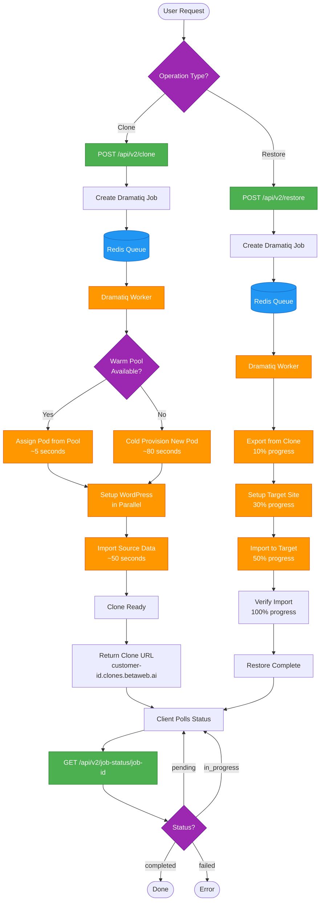

# WordPress Clone & Restore API

Simple API for cloning WordPress sites and restoring them to production.

## System Architecture


```mermaid
flowchart TD
    Start([User Request]) --> CloneOrRestore{Operation Type?}
    
    %% Clone Flow
    CloneOrRestore -->|Clone| CloneAPI[POST /api/v2/clone]
    CloneAPI --> CloneJob[Create Dramatiq Job]
    CloneJob --> CloneQueue[(Redis Queue)]
    CloneQueue --> CloneWorker[Dramatiq Worker]
    
    CloneWorker --> WarmPool{Warm Pool\nAvailable?}
    WarmPool -->|Yes| AssignPod[Assign Pod from Pool<br/>~5 seconds]
    WarmPool -->|No| ColdProvision[Cold Provision New Pod<br/>~80 seconds]
    
    AssignPod --> SetupWP[Setup WordPress<br/>in Parallel]
    ColdProvision --> SetupWP
    
    SetupWP --> ImportData[Import Source Data<br/>~50 seconds]
    ImportData --> CloneReady[Clone Ready]
    CloneReady --> CloneURL[Return Clone URL<br/>customer-id.clones.betaweb.ai]
    
    %% Restore Flow
    CloneOrRestore -->|Restore| RestoreAPI[POST /api/v2/restore]
    RestoreAPI --> RestoreJob[Create Dramatiq Job]
    RestoreJob --> RestoreQueue[(Redis Queue)]
    RestoreQueue --> RestoreWorker[Dramatiq Worker]
    
    RestoreWorker --> ExportSource[Export from Clone<br/>10% progress]
    ExportSource --> SetupTarget[Setup Target Site<br/>30% progress]
    SetupTarget --> ImportTarget[Import to Target<br/>50% progress]
    ImportTarget --> Verify[Verify Import<br/>100% progress]
    Verify --> RestoreComplete[Restore Complete]
    
    %% Status Polling
    CloneURL --> PollStatus[Client Polls Status]
    RestoreComplete --> PollStatus
    PollStatus --> StatusAPI[GET /api/v2/job-status/job-id]
    StatusAPI --> StatusCheck{Status?}
    StatusCheck -->|pending| PollStatus
    StatusCheck -->|in_progress| PollStatus
    StatusCheck -->|completed| Done([Done])
    StatusCheck -->|failed| Error([Error])
    
    %% Styling
    classDef apiClass fill:#4CAF50,stroke:#2E7D32,color:#fff
    classDef queueClass fill:#2196F3,stroke:#1565C0,color:#fff
    classDef workerClass fill:#FF9800,stroke:#E65100,color:#fff
    classDef decisionClass fill:#9C27B0,stroke:#6A1B9A,color:#fff
    
    class CloneAPI,RestoreAPI,StatusAPI apiClass
    class CloneQueue,RestoreQueue queueClass
    class CloneWorker,RestoreWorker,AssignPod,ColdProvision,SetupWP,ImportData,ExportSource,SetupTarget,ImportTarget workerClass
    class CloneOrRestore,WarmPool,StatusCheck decisionClass
```

## Quick Start

### 1. Create a Clone

```bash
curl -X POST https://clones.betaweb.ai/api/v2/clone \
  -H "Content-Type: application/json" \
  -d '{
    "source_url": "https://betaweb.ai",
    "source_username": "Charles@toctoc.com.au",
    "source_password": "6(4b`Nde1i_D",
    "customer_id": "my-clone-123",
    "ttl_minutes": 60
  }'
```

**Response:**
```json
{
  "job_id": "abc-123-xyz",
  "type": "clone",
  "status": "pending"
}
```

### 2. Check Clone Status

```bash
curl https://clones.betaweb.ai/api/v2/job-status/abc-123-xyz
```

Keep polling until `status: "completed"` (~60-75 seconds)

**Response when complete:**
```json
{
  "status": "completed",
  "progress": 100,
  "result": {
    "public_url": "https://my-clone-123.clones.betaweb.ai",
    "wordpress_username": "admin",
    "wordpress_password": "generated-password"
  }
}
```

### 3. Make Changes

Open the clone URL in your browser and make your changes:
- URL: `https://my-clone-123.clones.betaweb.ai/wp-admin`
- Username: `admin`
- Password: `generated-password` (from step 2)

### 4. Restore to Production

```bash
curl -X POST https://clones.betaweb.ai/api/v2/restore \
  -H "Content-Type: application/json" \
  -d '{
    "source_url": "https://my-clone-123.clones.betaweb.ai/",
    "source_username": "admin",
    "source_password": "generated-password",
    "target_url": "https://betaweb.ai/",
    "target_username": "Charles@toctoc.com.au",
    "target_password": "6(4b`Nde1i_D",
    "preserve_plugins": true,
    "preserve_themes": false,
    "customer_id": "restore-123"
  }'
```

**Response:**
```json
{
  "job_id": "def-456-xyz",
  "type": "restore",
  "status": "pending"
}
```

### 5. Check Restore Status

```bash
curl https://clones.betaweb.ai/api/v2/job-status/def-456-xyz
```

Keep polling until `status: "completed"` (~60 seconds)

**Done!** Your changes are now live on `https://betaweb.ai`

## Timing

- Clone creation: 60-75 seconds
- Restore: 60 seconds
- Poll job status every 5-10 seconds

## API Reference

All endpoints return JSON with a `job_id` for async operations.

### POST /api/v2/clone
Create a WordPress clone

### POST /api/v2/restore
Restore a clone to production

### GET /api/v2/job-status/{job_id}
Check status of any job

## Additional Documentation

See `/docs` folder for architecture and implementation details.
