# WordPress Clone & Restore System

## Architecture

```mermaid
graph TB
    subgraph "Client"
        USER["👤 API Client / Developer"]
    end

    subgraph "Management Server (13.222.20.138:5000)"
        API["🚀 FastAPI Service<br/>Port 5000"]

        subgraph "API Endpoints"
            HEALTH["GET /health"]
            SETUP["POST /setup"]
            CLONE["POST /clone"]
            RESTORE["POST /restore"]
            PROVISION["POST /provision"]
            APPPASS["POST /create-app-password"]
            LOGS["GET /logs"]
        end

        BROWSER["🌐 Camoufox Browser<br/>Automation Engine"]
        OTEL["📊 OpenTelemetry<br/>Traces to 10.0.4.2:4318"]
    end

    subgraph "Source WordPress Sites"
        SRC["🌍 Source Sites<br/>(HTTP/HTTPS)<br/>e.g., bonnel.ai, betaweb.ai"]
        SRC_PLUGIN["Custom Migrator Plugin<br/>REST API Endpoints"]
    end

    subgraph "ALB (wp-targets-alb-1392351630.us-east-1.elb.amazonaws.com)"
        ALB["⚖️ Application Load Balancer<br/>Path-based Routing"]
    end

    subgraph "Clone Infrastructure"
        subgraph "EC2 Instance 1"
            NGINX1["Nginx"]
            WP1["WordPress Clone 1<br/>/clone-YYYYMMDD-HHMMSS"]
            MYSQL1["MySQL Container"]
        end

        subgraph "EC2 Instance 2"
            NGINX2["Nginx"]
            WP2["WordPress Clone 2<br/>/clone-YYYYMMDD-HHMMSS"]
            MYSQL2["MySQL Container"]
        end

        subgraph "EC2 Instance N"
            NGINXN["Nginx"]
            WPN["WordPress Clone N<br/>/clone-YYYYMMDD-HHMMSS"]
            MYSQLN["MySQL Container"]
        end
    end

    subgraph "Target WordPress Sites"
        TGT["🎯 Target Sites<br/>(HTTP/HTTPS)<br/>Production/Staging"]
        TGT_PLUGIN["Custom Migrator Plugin<br/>Import Enabled"]
    end

    USER -->|"POST /clone<br/>POST /restore<br/>POST /setup"| API

    API --> HEALTH
    API --> SETUP
    API --> CLONE
    API --> RESTORE
    API --> PROVISION
    API --> APPPASS
    API --> LOGS

    API -->|"Browser Automation"| BROWSER
    BROWSER -->|"HTTPS/HTTP<br/>Login & Plugin Setup"| SRC
    BROWSER -->|"HTTPS/HTTP<br/>Login & Plugin Setup"| TGT

    API -->|"REST API Calls"| SRC_PLUGIN
    SRC_PLUGIN -->|"Export ZIP"| API

    API -->|"Provision Clones"| ALB
    ALB -->|"/clone-xxx/*"| WP1
    ALB -->|"/clone-yyy/*"| WP2
    ALB -->|"/clone-zzz/*"| WPN

    WP1 --> MYSQL1
    WP2 --> MYSQL2
    WPN --> MYSQLN

    API -->|"REST API Calls<br/>(Import Archive)"| TGT_PLUGIN
    API -->|"Traces"| OTEL

    style API fill:#4CAF50,stroke:#2E7D32,color:#fff
    style BROWSER fill:#FF9800,stroke:#E65100,color:#fff
    style SRC fill:#2196F3,stroke:#1565C0,color:#fff
    style TGT fill:#9C27B0,stroke:#6A1B9A,color:#fff
    style ALB fill:#FFC107,stroke:#F57C00,color:#000
    style USER fill:#607D8B,stroke:#37474F,color:#fff
```



---

## API Endpoints

### Base URL
```
http://13.222.20.138:5000
```

### Available Endpoints

| Endpoint | Method | Purpose | Status |
|----------|--------|---------|--------|
| `/health` | GET | Health check | ✅ Working |
| `/logs` | GET | Get recent service logs | ✅ Working |
| `/` | GET | Serve web UI | ✅ Working |
| `/setup` | POST | Install plugin on WordPress site | ✅ Working |
| `/clone` | POST | Clone WordPress site (source → clone/target) | ✅ Working |
| `/restore` | POST | Restore from staging/clone to production | ✅ Working |
| `/provision` | POST | Provision ephemeral WordPress clone | ✅ Working |
| `/create-app-password` | POST | Create WordPress Application Password | ✅ Working |

### Interactive Documentation
- **Swagger UI:** http://13.222.20.138:5000/docs
- **ReDoc:** http://13.222.20.138:5000/redoc

---

## Workflow Diagrams

### Complete Clone & Restore Flow

```mermaid
sequenceDiagram
    participant User as 👤 User
    participant API as 🚀 API (13.222.20.138:5000)
    participant Browser as 🌐 Camoufox Browser
    participant Source as 🌍 Source WP (HTTPS)
    participant ALB as ⚖️ ALB (wp-targets-alb-*.elb.amazonaws.com)
    participant Clone as 📦 WordPress Clone
    participant MySQL as 🗄️ MySQL
    participant Target as 🎯 Target WP (HTTPS)

    Note over User,Target: 1. CREATE CLONE
    User->>API: POST /clone {source credentials, auto_provision:true}
    API->>Browser: Launch Camoufox
    Browser->>Source: Navigate to https://source-site.com/wp-login.php
    Browser->>Source: Login + Upload + Activate Plugin
    Browser->>API: Return API key

    API->>API: Provision EC2 + MySQL
    API->>ALB: Register /clone-20260210-143022
    ALB->>Clone: Route traffic to container
    Clone->>MySQL: Create database

    API->>Source: POST /wp-json/custom-migrator/v1/export
    Source->>API: Return archive ZIP URL

    API->>Clone: POST /?rest_route=/custom-migrator/v1/import
    Clone->>MySQL: Import database
    Clone->>Clone: Extract files
    API->>User: ✅ Clone complete {target_url, credentials}

    Note over User,Target: 2. RESTORE TO PRODUCTION
    User->>API: POST /restore {clone, target, preserve_plugins:true}
    API->>Clone: GET /?rest_route=/custom-migrator/v1/status
    Clone->>API: ✅ Health check OK

    API->>Browser: Launch for target setup
    Browser->>Target: Navigate to https://target-site.com/wp-login.php
    Browser->>Target: Login + Setup Plugin
    Browser->>API: Return target API key

    API->>Clone: POST /?rest_route=/custom-migrator/v1/export
    Clone->>API: Return archive ZIP URL

    API->>Target: POST /wp-json/custom-migrator/v1/import<br/>{preserve_plugins:true}
    Target->>Target: Restore DB + Files<br/>Keep production plugins
    API->>User: ✅ Restore complete {integrity check}
```



### Plugin Setup Flow (Browser Automation)


---

## Key Features

- ✅ **HTTPS Support**: Works with both HTTP and HTTPS WordPress sites
- ✅ **Browser Automation**: Camoufox-based automation bypasses bot protection (Cloudflare, SiteGround Security)
- ✅ **Automatic Plugin Management**: Uploads, activates, and configures Custom Migrator plugin
- ✅ **Auto-Provisioning**: Creates ephemeral WordPress clones on EC2 with TTL
- ✅ **Selective Restore**: Preserve production plugins/themes during restore
- ✅ **Application Passwords**: Generate WordPress app passwords for REST API access
- ✅ **Observability**: OpenTelemetry traces sent to 10.0.4.2:4318
- ✅ **Load Balancing**: ALB routes clone traffic across multiple EC2 instances

---

## Important Notes

### API Key Retrieval
- The restore endpoint uses browser automation to retrieve the actual API key from clones
- Clones from bonnel.ai will have bonnel.ai's original API key
- Use the `/clone` endpoint response to get the admin password for the clone

### Infrastructure Configuration

#### Management Server
- **Host:** 13.222.20.138
- **Port:** 5000 (external), 8000 (internal Docker)
- **Protocol:** HTTP
- **Service:** FastAPI + Uvicorn
- **OpenTelemetry:** Sends traces to 10.0.4.2:4318

#### Application Load Balancer (Clones)
- **Domain:** wp-targets-alb-1392351630.us-east-1.elb.amazonaws.com
- **Protocol:** HTTP
- **Routing:** Path-based (`/clone-{customer_id}/*`)
- **Backend:** Multiple EC2 instances with WordPress + MySQL

#### Clone Infrastructure
- **WordPress:** Each clone runs in isolated container with Nginx
- **Database:** MySQL container per EC2 instance, separate DB per clone
- **Clone URLs:** `http://ALB_DOMAIN/clone-YYYYMMDD-HHMMSS/`
- **API Key:** Clones use `migration-master-key` for REST API access
- **TTL:** Auto-cleanup after specified minutes (5-120 min)

#### Supported WordPress Sites
- **HTTP Sites:** ✅ Fully supported
- **HTTPS Sites:** ✅ Fully supported (SSL handled by WordPress site)
- **Bot Protection:** ✅ Camoufox bypasses Cloudflare, SiteGround Security
- **2FA Sites:** ✅ Browser automation handles login flows

#### Working Configuration Status
- ✅ ALB path-based routing routes each clone to correct EC2 instance
- ✅ Each EC2 instance has MySQL container (shared database server)
- ✅ Each WordPress clone gets its own database in MySQL
- ✅ Restore workflow: Source → Clone → Production works end-to-end
- ✅ Browser automation works with HTTPS and bot-protected sites
- ✅ REST API fallback mechanism handles permalink variations

---

## API Usage Examples

### 1. Health Check (`GET /health`)
Check service status.

```bash
curl http://13.222.20.138:5000/health
```

**Response:**
```json
{
  "status": "healthy",
  "version": "1.0.0"
}
```

---

### 2. Create Clone (`POST /clone`)
Clone a WordPress site with auto-provisioned target.

```bash
curl -X POST http://13.222.20.138:5000/clone \
  -H "Content-Type: application/json" \
  -d '{
    "source": {
      "url": "https://bonnel.ai",
      "username": "Charles",
      "password": "xkZ%HL6v5Z5)MP9K"
    },
    "auto_provision": true,
    "ttl_minutes": 60
  }'
```

**Response:**
```json
{
  "success": true,
  "message": "Clone completed successfully",
  "source_api_key": "abc123...",
  "target_api_key": "xyz789...",
  "provisioned_target": {
    "target_url": "http://wp-targets-alb-1392351630.us-east-1.elb.amazonaws.com/clone-20260210-143022",
    "wordpress_username": "admin",
    "wordpress_password": "generated_password_xyz",
    "expires_at": "2026-02-10T15:30:22Z",
    "customer_id": "clone-20260210-143022"
  }
}
```

---

### 3. Clone to Specific Target (`POST /clone`)
Clone to an existing WordPress site (no auto-provision).

```bash
curl -X POST http://13.222.20.138:5000/clone \
  -H "Content-Type: application/json" \
  -d '{
    "source": {
      "url": "https://production-site.com",
      "username": "admin",
      "password": "prod_pass"
    },
    "target": {
      "url": "https://staging-site.com",
      "username": "admin",
      "password": "staging_pass"
    },
    "auto_provision": false
  }'
```

---

### 4. Restore Clone to Production (`POST /restore`)
Restore from staging/clone to production with selective preservation.

```bash
curl -X POST http://13.222.20.138:5000/restore \
  -H "Content-Type: application/json" \
  -d '{
    "source": {
      "url": "http://wp-targets-alb-1392351630.us-east-1.elb.amazonaws.com/clone-20260210-143022",
      "username": "admin",
      "password": "clone_password"
    },
    "target": {
      "url": "https://betaweb.ai",
      "username": "Charles",
      "password": "xkZ%HL6v5Z5)MP9K"
    },
    "preserve_plugins": true,
    "preserve_themes": false
  }'
```

**Response:**
```json
{
  "success": true,
  "message": "Restore completed successfully",
  "integrity": {
    "plugins_preserved": 5,
    "themes_restored": 3,
    "warnings": []
  }
}
```

---

### 5. Setup Plugin on WordPress Site (`POST /setup`)
Install and activate Custom Migrator plugin on any WordPress site.

```bash
curl -X POST http://13.222.20.138:5000/setup \
  -H "Content-Type: application/json" \
  -d '{
    "url": "https://mysite.com",
    "username": "admin",
    "password": "password",
    "role": "target"
  }'
```

**Response:**
```json
{
  "success": true,
  "api_key": "abc123def456...",
  "plugin_status": "activated",
  "import_enabled": true,
  "message": "Setup completed successfully"
}
```

---

### 6. Create Application Password (`POST /create-app-password`)
Generate WordPress Application Password for REST API authentication.

```bash
curl -X POST http://13.222.20.138:5000/create-app-password \
  -H "Content-Type: application/json" \
  -d '{
    "url": "https://mysite.com",
    "username": "admin",
    "password": "password",
    "app_name": "WP Migrator"
  }'
```

**Response:**
```json
{
  "success": true,
  "application_password": "xxxx xxxx xxxx xxxx xxxx xxxx",
  "app_name": "WP Migrator",
  "message": "Application password created successfully"
}
```

---

### 7. Provision Ephemeral WordPress (`POST /provision`)
Create a standalone WordPress clone without source.

```bash
curl -X POST http://13.222.20.138:5000/provision \
  -H "Content-Type: application/json" \
  -d '{
    "customer_id": "test-clone-001",
    "ttl_minutes": 30
  }'
```

**Response:**
```json
{
  "success": true,
  "target_url": "http://wp-targets-alb-1392351630.us-east-1.elb.amazonaws.com/test-clone-001",
  "wordpress_username": "admin",
  "wordpress_password": "generated_pass",
  "expires_at": "2026-02-10T15:00:00Z",
  "status": "running"
}
```

---

### 8. Direct WordPress REST API Call
Test clone's Custom Migrator plugin REST API endpoint directly.

```bash
curl -X POST \
  "http://wp-targets-alb-1392351630.us-east-1.elb.amazonaws.com/clone-20260210-143022/?rest_route=/custom-migrator/v1/export" \
  -H "X-Migrator-Key: migration-master-key"
```

---

## Network Configuration

### Ports & Services

| Service | Host/Domain | Port | Protocol | Purpose |
|---------|-------------|------|----------|---------|
| **Management API** | 13.222.20.138 | 5000 | HTTP | FastAPI service (all endpoints) |
| **Clone ALB** | wp-targets-alb-1392351630.us-east-1.elb.amazonaws.com | 80 | HTTP | Load balancer for clones |
| **Clone Nginx** | EC2 instances (private) | 80 | HTTP | WordPress container proxy |
| **Clone MySQL** | localhost (per container) | 3306 | TCP | Database for each clone |
| **OpenTelemetry** | 10.0.4.2 | 4318 | HTTP | Trace collection endpoint |
| **Source/Target WP** | Various | 443/80 | HTTPS/HTTP | External WordPress sites |

### URL Patterns

| Type | Pattern | Example |
|------|---------|---------|
| **Management API** | `http://13.222.20.138:5000/{endpoint}` | `http://13.222.20.138:5000/clone` |
| **API Docs** | `http://13.222.20.138:5000/docs` | Swagger UI |
| **Clone URL** | `http://ALB_DOMAIN/clone-{timestamp}/` | `http://wp-targets-alb-1392351630.us-east-1.elb.amazonaws.com/clone-20260210-143022/` |
| **Clone REST API** | `http://ALB_DOMAIN/clone-{timestamp}/?rest_route={path}` | `.../?rest_route=/custom-migrator/v1/export` |
| **Source/Target WP** | `https://{domain}/wp-json/{namespace}/{route}` | `https://bonnel.ai/wp-json/custom-migrator/v1/export` |
| **Source/Target (fallback)** | `https://{domain}/?rest_route={path}` | `https://site.com/?rest_route=/custom-migrator/v1/export` |

### REST API Routing Strategy

The service uses intelligent REST API routing to handle different permalink configurations:

1. **Standard Sites (with mod_rewrite):**
   - `POST https://site.com/wp-json/custom-migrator/v1/export`

2. **Plain Permalinks or Clones:**
   - `POST https://site.com/?rest_route=/custom-migrator/v1/export`

3. **SiteGround Security (GET fallback):**
   - `GET https://site.com/?rest_route=/custom-migrator/v1/export`
   - Used when SiteGround blocks POST to query string routes

The service automatically tries all methods in sequence until one succeeds.
