# WordPress Clone & Restore System

## System Overview

A production WordPress clone and restore system using browser automation, AWS infrastructure, and HTTPS-secured ephemeral clones.

### Quick Access
- **Management API**: http://13.222.20.138:5000
- **API Documentation**: http://13.222.20.138:5000/docs
- **Clone Domain**: https://clones.betaweb.ai

---

## Architecture

```mermaid
graph TB
    subgraph "Client"
        USER["👤 Developer / API Client"]
    end

    subgraph "Management Server (13.222.20.138)"
        API["🚀 FastAPI Service<br/>HTTP Port 5000"]

        subgraph "API Endpoints"
            ROOT["GET / - Web UI"]
            HEALTH["GET /health"]
            LOGS["GET /logs"]
            SETUP["POST /setup"]
            CLONE["POST /clone"]
            RESTORE["POST /restore"]
            PROVISION["POST /provision"]
            APPPASS["POST /create-app-password"]
        end

        BROWSER["🌐 Camoufox Browser<br/>Automation Engine"]
        OTEL["📊 OpenTelemetry<br/>Traces → 10.0.4.2:4318"]
    end

    subgraph "Source WordPress Sites"
        SRC["🌍 Source Sites<br/>(HTTP/HTTPS)<br/>e.g., bonnel.ai"]
        SRC_PLUGIN["Custom Migrator Plugin"]
    end

    subgraph "AWS Load Balancer"
        ALB["⚖️ Application Load Balancer<br/>clones.betaweb.ai<br/>HTTPS (Port 443)"]
        CERT["🔒 ACM Certificate<br/>Auto-renewing SSL"]
    end

    subgraph "Clone Infrastructure"
        subgraph "EC2 Target Instance"
            NGINX["Nginx Reverse Proxy<br/>Path-based Routing"]

            WP1["WordPress Clone 1<br/>Port 8001"]
            WP2["WordPress Clone 2<br/>Port 8002"]
            WPN["WordPress Clone N<br/>Port 80XX"]

            MYSQL["MySQL Container<br/>Shared DB Server"]
            DB1["Database 1"]
            DB2["Database 2"]
            DBN["Database N"]
        end
    end

    subgraph "Target WordPress Sites"
        TGT["🎯 Production Sites<br/>(HTTP/HTTPS)<br/>e.g., betaweb.ai"]
        TGT_PLUGIN["Custom Migrator Plugin"]
    end

    USER -->|HTTP Requests| API

    API --> ROOT
    API --> HEALTH
    API --> LOGS
    API --> SETUP
    API --> CLONE
    API --> RESTORE
    API --> PROVISION
    API --> APPPASS

    API -->|Browser Automation| BROWSER
    BROWSER -->|Login & Setup| SRC
    BROWSER -->|Login & Setup| TGT

    API -->|REST API Calls| SRC_PLUGIN
    SRC_PLUGIN -->|Export ZIP| API

    API -->|Provision| ALB
    ALB -->|HTTPS| CERT
    ALB -->|Path Routing| NGINX

    NGINX --> WP1
    NGINX --> WP2
    NGINX --> WPN

    WP1 --> MYSQL
    WP2 --> MYSQL
    WPN --> MYSQL

    MYSQL --> DB1
    MYSQL --> DB2
    MYSQL --> DBN

    API -->|REST API Import| TGT_PLUGIN
    API -->|Traces| OTEL

    USER -->|HTTPS Access| ALB

    style API fill:#4CAF50,stroke:#2E7D32,color:#fff
    style BROWSER fill:#FF9800,stroke:#E65100,color:#fff
    style SRC fill:#2196F3,stroke:#1565C0,color:#fff
    style TGT fill:#9C27B0,stroke:#6A1B9A,color:#fff
    style ALB fill:#FFC107,stroke:#F57C00,color:#000
    style CERT fill:#4CAF50,stroke:#2E7D32,color:#fff
    style USER fill:#607D8B,stroke:#37474F,color:#fff
```



---

## Complete API Endpoints

### Base URL
```
http://13.222.20.138:5000
```

### Interactive Documentation
- **Swagger UI**: http://13.222.20.138:5000/docs
- **ReDoc**: http://13.222.20.138:5000/redoc

### Endpoint Reference

| Endpoint | Method | Purpose | Status |
|----------|--------|---------|--------|
| `/` | GET | Web UI homepage | ✅ Working |
| `/health` | GET | Health check | ✅ Working |
| `/logs` | GET | Recent service logs | ✅ Working |
| `/setup` | POST | Install plugin on WordPress | ✅ Working |
| `/clone` | POST | Clone WordPress site | ✅ Working |
| `/restore` | POST | Restore from clone to production | ✅ Working |
| `/provision` | POST | Create ephemeral WordPress | ✅ Working |
| `/create-app-password` | POST | Generate WP app password | ✅ Working |

---

## Infrastructure Configuration

### Management Server
- **Host**: 13.222.20.138
- **Port**: 5000 (external HTTP)
- **Internal Port**: 8000 (Docker container)
- **Protocol**: HTTP
- **Service**: FastAPI + Uvicorn
- **Browser**: Camoufox (bot-proof automation)
- **Observability**: OpenTelemetry → 10.0.4.2:4318

### Clone Infrastructure
- **Domain**: https://clones.betaweb.ai
- **ALB DNS**: wp-targets-alb-1392351630.us-east-1.elb.amazonaws.com
- **SSL Certificate**: ACM (auto-renewing)
  - ARN: `arn:aws:acm:us-east-1:044514005641:certificate/c3fb5ab3-160f-4db2-ac4b-056fe7166558`
- **HTTPS Listener ARN**: `arn:aws:elasticloadbalancing:us-east-1:044514005641:listener/app/wp-targets-alb/9deaa3f04bc5506b/f6542ccc3f16bfd7`
- **HTTP → HTTPS**: Automatic 301 redirect
- **Path Routing**: `/clone-YYYYMMDD-HHMMSS/` → EC2 instances
- **Clone URLs**: `https://clones.betaweb.ai/clone-YYYYMMDD-HHMMSS/`

### EC2 Target Infrastructure
- **WordPress**: Docker containers (ports 8001-8050)
- **Database**: MySQL container with separate DB per clone
- **Reverse Proxy**: Nginx with path-based routing
- **API Key**: Clones use `migration-master-key`
- **TTL**: 5-120 minutes (auto-cleanup)

### Network & Ports

| Service | Host/Domain | Port | Protocol | Purpose |
|---------|-------------|------|----------|---------|
| Management API | 13.222.20.138 | 5000 | HTTP | All API endpoints |
| Clone ALB | clones.betaweb.ai | 443 | HTTPS | Clone access (SSL) |
| Clone ALB | clones.betaweb.ai | 80 | HTTP | Redirects to HTTPS |
| Clone Nginx | EC2 (private) | 80 | HTTP | Reverse proxy |
| Clone WordPress | localhost | 8001-8050 | HTTP | Container ports |
| MySQL | localhost | 3306 | TCP | Database |
| OpenTelemetry | 10.0.4.2 | 4318 | HTTP | Traces |

---

## Complete Workflow Diagrams

### Full Clone & Restore Flow

```mermaid
sequenceDiagram
    participant User
    participant API as API (13.222.20.138:5000)
    participant Browser as Camoufox
    participant Source as Source WP (HTTPS)
    participant ALB as clones.betaweb.ai (HTTPS)
    participant Clone as WordPress Clone
    participant MySQL
    participant Target as Production WP (HTTPS)

    Note over User,Target: 1. CREATE HTTPS CLONE
    User->>API: POST /clone {source credentials}
    API->>Browser: Launch browser automation
    Browser->>Source: https://source-site.com/wp-login.php
    Browser->>Source: Login + Upload + Activate plugin
    Browser->>API: Return API key

    API->>API: Provision EC2 + MySQL database
    API->>ALB: Register HTTPS listener rule
    ALB->>Clone: Route /clone-20260210-123456/*
    Clone->>MySQL: Create database

    API->>Source: POST /wp-json/custom-migrator/v1/export
    Source->>API: ZIP archive URL

    API->>Clone: POST /?rest_route=/custom-migrator/v1/import
    Clone->>MySQL: Import database + files
    API->>User: ✅ {target_url: "https://clones.betaweb.ai/clone-...", credentials}

    Note over User,Target: 2. RESTORE TO PRODUCTION
    User->>API: POST /restore {clone URL, target credentials}
    API->>Clone: GET https://clones.betaweb.ai/.../status
    Clone->>API: ✅ Health OK

    API->>Browser: Setup target with browser automation
    Browser->>Target: Login + Re-upload plugin (ensures active)
    Browser->>API: Target API key

    API->>Clone: POST https://clones.betaweb.ai/.../export
    Clone->>API: ZIP archive URL

    API->>Target: POST /wp-json/.../import {preserve_plugins:true}
    Target->>Target: Restore DB + Keep production plugins
    API->>User: ✅ Restore complete {integrity check}
```



### Browser Automation Flow


---

## API Usage Examples

### 1. Health Check

```bash
curl http://13.222.20.138:5000/health
```

**Response:**
```json
{
  "status": "healthy",
  "version": "1.0.0"
}
```

---

### 2. Create HTTPS Clone

```bash
curl -X POST http://13.222.20.138:5000/clone \
  -H "Content-Type: application/json" \
  -d '{
    "source": {
      "url": "https://bonnel.ai",
      "username": "admin",
      "password": "your-password"
    },
    "auto_provision": true,
    "ttl_minutes": 60
  }'
```

**Response:**
```json
{
  "success": true,
  "message": "Clone completed successfully",
  "source_api_key": "abc123...",
  "target_api_key": "migration-master-key",
  "provisioned_target": {
    "target_url": "https://clones.betaweb.ai/clone-20260210-123456",
    "public_url": "https://clones.betaweb.ai/clone-20260210-123456",
    "wordpress_username": "admin",
    "wordpress_password": "generated_pass_xyz",
    "expires_at": "2026-02-10T13:34:56Z",
    "customer_id": "clone-20260210-123456"
  }
}
```

---

### 3. Test Clone HTTPS Access

```bash
# Homepage (should return HTML)
curl -I "https://clones.betaweb.ai/clone-20260210-123456/"

# REST API Export
curl -X POST \
  "https://clones.betaweb.ai/clone-20260210-123456/?rest_route=/custom-migrator/v1/export" \
  -H "X-Migrator-Key: migration-master-key"
```

---

### 4. Restore Clone to Production

```bash
curl -X POST http://13.222.20.138:5000/restore \
  -H "Content-Type: application/json" \
  -d '{
    "source": {
      "url": "https://clones.betaweb.ai/clone-20260210-123456",
      "username": "admin",
      "password": "clone_password"
    },
    "target": {
      "url": "https://betaweb.ai",
      "username": "admin",
      "password": "production_password"
    },
    "preserve_plugins": true,
    "preserve_themes": false
  }'
```

**Response:**
```json
{
  "success": true,
  "message": "Restore completed successfully",
  "source_api_key": "migration-master-key",
  "target_api_key": "xyz789...",
  "integrity": {
    "plugins_preserved": 5,
    "themes_restored": 3,
    "warnings": []
  }
}
```

---

### 5. Clone to Existing Target (No Auto-Provision)

```bash
curl -X POST http://13.222.20.138:5000/clone \
  -H "Content-Type: application/json" \
  -d '{
    "source": {
      "url": "https://production.com",
      "username": "admin",
      "password": "prod_pass"
    },
    "target": {
      "url": "https://staging.com",
      "username": "admin",
      "password": "staging_pass"
    },
    "auto_provision": false
  }'
```

---

### 6. Setup Plugin on WordPress Site

```bash
curl -X POST http://13.222.20.138:5000/setup \
  -H "Content-Type: application/json" \
  -d '{
    "url": "https://mysite.com",
    "username": "admin",
    "password": "password",
    "role": "target"
  }'
```

**Response:**
```json
{
  "success": true,
  "api_key": "abc123...",
  "plugin_status": "activated",
  "import_enabled": true,
  "message": "Setup completed successfully"
}
```

---

### 7. Create Application Password

```bash
curl -X POST http://13.222.20.138:5000/create-app-password \
  -H "Content-Type: application/json" \
  -d '{
    "url": "https://mysite.com",
    "username": "admin",
    "password": "password",
    "app_name": "WP Migrator"
  }'
```

**Response:**
```json
{
  "success": true,
  "application_password": "xxxx xxxx xxxx xxxx xxxx xxxx",
  "app_name": "WP Migrator",
  "message": "Application password created successfully"
}
```

---

### 8. Provision Standalone WordPress

```bash
curl -X POST http://13.222.20.138:5000/provision \
  -H "Content-Type: application/json" \
  -d '{
    "customer_id": "test-001",
    "ttl_minutes": 30
  }'
```

**Response:**
```json
{
  "success": true,
  "target_url": "https://clones.betaweb.ai/test-001",
  "wordpress_username": "admin",
  "wordpress_password": "generated_pass",
  "expires_at": "2026-02-10T13:30:00Z",
  "status": "running"
}
```

---

## Key Features

- ✅ **HTTPS Clones**: All clones served via `https://clones.betaweb.ai` with auto-renewing SSL
- ✅ **HTTP Management API**: Service runs on `http://13.222.20.138:5000`
- ✅ **Custom Domain**: CNAME `clones.betaweb.ai` → ALB with ACM certificate
- ✅ **Browser Automation**: Camoufox bypasses Cloudflare, SiteGround Security, 2FA
- ✅ **Auto-Provisioning**: Ephemeral clones with TTL (5-120 minutes)
- ✅ **Selective Restore**: Preserve production plugins/themes during restore
- ✅ **Path-Based Routing**: ALB routes each clone to correct EC2 instance
- ✅ **MySQL Databases**: Separate database per clone on shared MySQL server
- ✅ **REST API Fallback**: Automatic fallback for permalink variations
- ✅ **Observability**: OpenTelemetry traces to 10.0.4.2:4318
- ✅ **Unlimited Restores**: Browser automation re-activates plugin each time

---

## REST API Routing Strategy

The service handles different WordPress permalink configurations:

1. **Standard Sites** (mod_rewrite enabled):
   ```
   POST https://site.com/wp-json/custom-migrator/v1/export
   ```

2. **Plain Permalinks or Clones**:
   ```
   POST https://clones.betaweb.ai/clone-xxx/?rest_route=/custom-migrator/v1/export
   ```

3. **SiteGround Fallback** (blocks POST to query string):
   ```
   GET https://site.com/?rest_route=/custom-migrator/v1/export
   ```

The service tries all methods automatically until one succeeds.

---

## URL Patterns

| Type | Pattern | Example |
|------|---------|---------|
| **Management API** | `http://13.222.20.138:5000/{endpoint}` | `http://13.222.20.138:5000/clone` |
| **API Docs** | `http://13.222.20.138:5000/docs` | Swagger UI |
| **Clone URL (HTTPS)** | `https://clones.betaweb.ai/clone-{timestamp}/` | `https://clones.betaweb.ai/clone-20260210-123456/` |
| **Clone REST API** | `https://clones.betaweb.ai/clone-{timestamp}/?rest_route={path}` | `.../?rest_route=/custom-migrator/v1/export` |
| **Source/Target (pretty)** | `https://{domain}/wp-json/{namespace}/{route}` | `https://bonnel.ai/wp-json/custom-migrator/v1/export` |
| **Source/Target (plain)** | `https://{domain}/?rest_route={path}` | `https://site.com/?rest_route=/custom-migrator/v1/export` |

---

## Important Notes

### HTTPS Clone URLs
- All clones are accessible via **HTTPS only**: `https://clones.betaweb.ai/clone-YYYYMMDD-HHMMSS/`
- HTTP requests to port 80 automatically redirect to HTTPS (301)
- SSL certificate auto-renews via AWS Certificate Manager (ACM)

### Management API (HTTP)
- Management server uses **HTTP** on port 5000: `http://13.222.20.138:5000`
- Browser automation and REST API calls work over HTTP for management operations
- Consider adding HTTPS to management server for production use

### SiteGround Compatibility
- After every restore, the plugin becomes inactive on SiteGround
- Solution: Browser automation re-uploads and activates plugin before each restore
- This ensures unlimited consecutive restores work reliably

### Browser Automation
- Uses Camoufox (Firefox-based) with realistic fingerprints
- Bypasses Cloudflare, bot protection, and security plugins
- Handles SiteGround SG Security re-authentication automatically
- More reliable than REST API for initial setup

---

## Production Readiness

### ✅ What's Working
- Clone creation from any WordPress site (HTTP/HTTPS)
- HTTPS-secured clone access via `https://clones.betaweb.ai`
- ALB path-based routing to correct EC2 instances
- Browser automation for plugin setup
- Export/import REST API endpoints
- Full clone → production restore workflow
- Unlimited consecutive restores (SiteGround compatible)
- MySQL database per clone
- Auto-cleanup based on TTL

### 🎯 System Status
**Production-ready** for:
1. Cloning WordPress sites to temporary HTTPS containers
2. Making changes safely on clones
3. Restoring changes to production with theme/plugin preservation
4. Performing unlimited consecutive restores reliably

---

## Documentation

- **README.md**: This file (architecture, API reference, examples)
- **OPERATIONAL_MEMORY.md**: Detailed operational history, issues, solutions
- **API Documentation**: http://13.222.20.138:5000/docs (Swagger UI)
- **Repository**: https://github.com/t0ct0c/clone-restore.git
- **Active Branch**: `feat/clonehttps` (HTTPS migration complete)

---

**Last Updated**: 2026-02-10
**Service Version**: 1.0.0
**Management Server**: 13.222.20.138:5000 (HTTP)
**Clone Domain**: https://clones.betaweb.ai (HTTPS)
