# WordPress Clone Manager

> **Status:** ✅ Service is **DEPLOYED** and operational

## 🎯 What This Does

This service **automatically clones WordPress sites** without any manual steps. Just provide admin credentials, and it:

1. ✅ Installs the migration plugin automatically
2. ✅ Exports the source WordPress site
3. ✅ Creates a fresh target WordPress instance (optional)
4. ✅ Imports everything to the target
5. ✅ Returns the cloned site URL

**No clicking, no manual plugin installation, no copy-pasting API keys.**

---

## 🏗️ Architecture Overview

```mermaid
graph TB
    subgraph Client["👤 Client"]
        USER[Developer/API Consumer]
    end
    
    subgraph Service["🚀 Clone Manager Service<br/>FastAPI @ 35.171.228.29:8000"]
        API[REST API Endpoints]
        AUTH[WordPress Authenticator]
        BROWSER[Playwright Browser Automation]
        PROV[EC2 Provisioner]
    end
    
    subgraph Source["🌍 Source WordPress"]
        SRC_SITE[Production/Staging Site]
        SRC_PLUGIN[Custom Migrator Plugin]
    end
    
    subgraph Target["🎯 Target WordPress"]
        TGT_SITE[Destination Site]
        TGT_PLUGIN[Custom Migrator Plugin]
    end
    
    subgraph AWS["☁️ AWS Infrastructure"]
        EC2[Auto-Provisioned EC2]
        DOCKER[WordPress Container]
    end
    
    USER -->|1. POST /clone| API
    API -->|2. Authenticate & Setup| AUTH
    AUTH -->|Install Plugin| BROWSER
    BROWSER -->|Setup| SRC_SITE
    SRC_SITE -->|Generate API Key| SRC_PLUGIN
    
    API -->|3. Provision Target| PROV
    PROV -->|Create| EC2
    EC2 -->|Run| DOCKER
    DOCKER -->|WordPress Ready| TGT_SITE
    
    API -->|4. Setup Target| TGT_SITE
    TGT_SITE -->|Ready| TGT_PLUGIN
    
    SRC_PLUGIN -->|5. Export Content| API
    API -->|6. Import Content| TGT_PLUGIN
    
    API -->|7. Return Credentials| USER
    
    style API fill:#4CAF50,stroke:#2E7D32,color:#fff
    style SRC_SITE fill:#2196F3,stroke:#1565C0,color:#fff
    style TGT_SITE fill:#FF9800,stroke:#E65100,color:#fff
    style USER fill:#9C27B0,stroke:#6A1B9A,color:#fff
```



---

## 🚀 API Endpoints

### Base URL
```
http://35.171.228.29:8000
```

### Interactive Documentation
- **Swagger UI:** http://35.171.228.29:8000/docs

---

### `POST /clone`

Clone a WordPress site from source to target.

#### Request Body

**With auto-provisioning (recommended):**
```json
{
  "source": {
    "url": "https://source-wordpress.com",
    "username": "admin",
    "password": "admin_password"
  },
  "auto_provision": true,
  "ttl_minutes": 60
}
```

**With existing target:**
```json
{
  "source": {
    "url": "https://source-wordpress.com",
    "username": "admin",
    "password": "admin_password"
  },
  "target": {
    "url": "https://target-wordpress.com",
    "username": "admin",
    "password": "admin_password"
  },
  "auto_provision": false
}
```

#### Parameters

| Field | Type | Required | Description |
|-------|------|----------|-------------|
| `source.url` | string | ✅ Yes | Source WordPress URL (must include http:// or https://) |
| `source.username` | string | ✅ Yes | WordPress admin username |
| `source.password` | string | ✅ Yes | WordPress admin password |
| `target.url` | string | ⚠️ If `auto_provision=false` | Target WordPress URL |
| `target.username` | string | ⚠️ If `auto_provision=false` | Target admin username |
| `target.password` | string | ⚠️ If `auto_provision=false` | Target admin password |
| `auto_provision` | boolean | No (default: `true`) | Auto-create AWS target if `true` |
| `ttl_minutes` | integer | No (default: `60`) | How long auto-provisioned target lives (5-120 min) |

#### Response (Success)

```json
{
  "success": true,
  "message": "Clone completed successfully",
  "source_api_key": "abc123def456...",
  "target_api_key": "xyz789uvw012...",
  "target_import_enabled": true,
  "provisioned_target": {
    "target_url": "https://clone-20240115-143022.temp.yourdomain.com",
    "wordpress_username": "admin",
    "wordpress_password": "auto_generated_pass_123",
    "expires_at": "2024-01-15T15:30:22Z",
    "ttl_minutes": 60,
    "customer_id": "clone-20240115-143022"
  }
}
```

#### Response (Error)

```json
{
  "detail": "Source setup failed: Invalid WordPress credentials"
}
```

#### Common Error Codes

| Status Code | Error | Cause | Solution |
|-------------|-------|-------|----------|
| 401 | AUTH_FAILED | Invalid username/password | Check credentials |
| 403 | NOT_ADMIN | User is not administrator | Use admin account |
| 500 | PLUGIN_UPLOAD_FAILED | Can't write to wp-content/plugins | Check file permissions |
| 500 | EXPORT_FAILED | Source export failed | Check source site logs |
| 500 | IMPORT_FAILED | Target import failed | Check target site logs |
| 503 | NO_CAPACITY | No EC2 capacity | Wait or scale infrastructure |

---

### `POST /setup`

Install plugin and get API key for a single WordPress site.

#### Request Body

```json
{
  "url": "https://wordpress-site.com",
  "username": "admin",
  "password": "password",
  "role": "target"
}
```

#### Response

```json
{
  "success": true,
  "api_key": "abc123def456...",
  "plugin_status": "activated",
  "import_enabled": true,
  "message": "Setup completed successfully"
}
```

---

### `GET /health`

Health check endpoint.

#### Response

```json
{
  "status": "healthy",
  "version": "1.0.0"
}
```

---

### `POST /provision`

Provision ephemeral WordPress target on AWS EC2.

#### Request Body

```json
{
  "customer_id": "client-abc-123",
  "ttl_minutes": 30
}
```

#### Response

```json
{
  "success": true,
  "target_url": "http://44.223.105.204:8001",
  "wordpress_username": "admin",
  "wordpress_password": "wp_pass_abc123",
  "expires_at": "2024-01-15T15:30:00Z",
  "status": "running"
}
```

---

## ✅ What's Working

| Feature | Status | Notes |
|---------|--------|-------|
| WordPress authentication | ✅ Working | Cookie-based auth via wp-login.php |
| Plugin upload | ✅ Working | Multipart form upload via /wp-admin/update.php |
| Plugin activation | ✅ Working | Playwright browser automation |
| API key retrieval | ✅ Working | Extracted from browser session during activation |
| Export operation | ✅ Working | Calls plugin's /wp-json/custom-migrator/v1/export |
| Import operation | ✅ Working | Calls plugin's /wp-json/custom-migrator/v1/import |
| `/clone` endpoint | ✅ Working | End-to-end clone with user-provided target |
| `/setup` endpoint | ✅ Working | Single-site setup |
| `/health` endpoint | ✅ Working | Health checks |

---

## 🔒 Security Considerations

### Current Status: ⚠️ No Authentication

The API currently has **no authentication** and should only be used in trusted networks.

### Before Production:

1. **Add API Key Authentication**
2. **Enable HTTPS** - Put behind Nginx/Apache with SSL certificate
3. **Add Rate Limiting** - Prevent abuse (e.g., 10 requests/hour per IP)
4. **Validate WordPress Credentials** - Never log passwords, use encrypted storage

---

## 📊 Performance

| Operation | Typical Time | Notes |
|-----------|-------------|-------|
| Plugin installation | 5-10 seconds | Upload + activate |
| WordPress authentication | 2-3 seconds | Cookie-based login |
| Site export (small site <100MB) | 10-30 seconds | Database + files |
| Site export (large site >1GB) | 2-5 minutes | Depends on size |
| Site import | 30-60 seconds | Extract + restore DB |
| **Total clone time (small site)** | **1-2 minutes** | End-to-end |
| **Total clone time (large site)** | **5-10 minutes** | End-to-end |

---

## 📝 Next Steps

### Recommended Improvements:
1. 🔒 Add API authentication
2. 🌐 Add HTTPS support
3. 📊 Add clone progress tracking
4. 🔔 Add webhook notifications on completion
5. 📈 Add monitoring/observability (metrics, traces)

---

**Last Updated:** 2024-01-15  
**Service Version:** 1.0.0  
**Deployment:** AWS EC2 (35.171.228.29:8000)
