# Kubernetes Migration Plan: WordPress Clone & Restore System

## Executive Summary

Migrating the WordPress Clone & Restore System from EC2/Docker to Kubernetes using a fully Kubernetes-native approach with **KRO (Kube Resource Orchestrator)**, **ACK (AWS Controllers for Kubernetes)**, and **Argo CD** for GitOps.

**Timeline:** 4-5 weeks
**Approach:**
- **KRO ResourceGroups** for WordPress clone orchestration (Job + Service + Ingress + Secret as atomic units)
- **ACK Controllers** for AWS resource management (RDS, ALB) from within Kubernetes
- **Argo CD** for GitOps CI/CD pipeline
- **Staging/Production** via separate namespaces in same EKS cluster
- **New folder structure** (`kubernetes/`) - existing code untouched

---

## New Kubernetes-Native Architecture with KRO

### Technology Stack

**KRO (Kube Resource Orchestrator)**
- Orchestrates complex multi-resource deployments as ResourceGroups
- Each WordPress clone = one ResourceGroup (Job + Service + Ingress + Secret + RDS database)
- Handles dependencies and lifecycle management
- Example: [KRO EKS Cluster Management](https://github.com/kubernetes-sigs/kro/blob/main/examples/aws/eks-cluster-mgmt/README.md)

**ACK (AWS Controllers for Kubernetes)**
- Manages AWS resources natively from Kubernetes using CRDs
- Controllers we'll use:
  - `rds-controller` - Manage RDS MySQL databases for WordPress clones
  - `elasticloadbalancing-controller` - Manage ALB/NLB (optional, can use AWS Load Balancer Controller instead)
  - `iam-controller` - Manage IAM roles for IRSA
- No more boto3 or Terraform for runtime AWS resource creation

**Argo CD (GitOps)**
- Automatic deployment from Git repository
- Staging/production environments via separate ApplicationSets
- Auto-sync from `main` branch → production, `staging` branch → staging
- Rollback capabilities via Git history

### Environment Separation

**Same EKS Cluster, Separate Namespaces:**
- `wordpress-staging` namespace
- `wordpress-production` namespace
- Cost savings: One EKS control plane ($73/mo vs $146/mo for two clusters)
- NetworkPolicies for isolation
- ResourceQuotas per namespace to prevent staging from affecting production

---

## Architecture Diagram

### High-Level System Architecture

```mermaid
graph LR
    User[User/Client] -->|API Request| ALB[AWS ALB<br/>Load Balancer]

    subgraph EKS["EKS Cluster"]
        ALB --> WP[wp-k8s-service<br/>FastAPI<br/>⚡ Auto-scales via HPA]

        subgraph Control["Control Plane"]
            KRO[KRO<br/>Orchestrator]
            ACK[ACK<br/>RDS Controller]
            HPA[Horizontal Pod<br/>Autoscaler]
            CA[Cluster<br/>Autoscaler]
        end

        HPA -.->|Scale Pods| WP
        CA -.->|Add/Remove Nodes| Nodes[Worker Nodes<br/>🔄 Auto-scaling]

        WP -->|Create Clone| KRO
        KRO -->|Manage| Clones[WordPress Clones<br/>Jobs + Services<br/>📈 On-demand scaling]
        KRO -->|Request DB| ACK

        Git[GitHub<br/>Repository] -.->|GitOps| ArgoCD[Argo CD]
        ArgoCD -.->|Deploy| WP
    end

    ACK -->|Provision| RDS[(RDS MySQL<br/>Databases)]
    Clones -->|Connect| RDS
    ALB -->|Route /clone-*| Clones
```



### Scaling & Reliability Features


### Namespace Isolation Strategy


---

## Current Architecture Overview

### Services:
1. **wp-setup-service** (FastAPI, port 8000)
   - Python 3.11 + Playwright + Camoufox browser automation
   - Endpoints: `/clone`, `/restore`, `/setup`, `/create-app-password`
   - SSH into EC2 instances to manage Docker containers

2. **WordPress Clones** (ephemeral, ports 8001-8050)
   - Dynamically created via `docker run` commands over SSH
   - Custom Migrator plugin for export/import
   - TTL-based cleanup (30-120 minutes)

3. **MySQL** (shared per EC2 instance, port 3306)
   - Separate database per clone
   - Managed via `docker exec mysql` commands

4. **AWS ALB** (path-based routing)
   - Dynamic listener rules: `/clone-YYYYMMDD-HHMMSS/*` → EC2 instance
   - Created via boto3 ELBv2 API

---

## KRO ResourceGroup Architecture

### WordPress Clone as a ResourceGroup

Each WordPress clone will be defined as a KRO ResourceGroup containing all required resources atomically.

**Key Design Decisions:**

**1. Dynamic WordPress Provisioning: KRO ResourceGroups**
- Each `/clone` request creates a `WordPressClone` custom resource
- KRO automatically provisions: Secret → RDS DB → Job → Service → Ingress
- Dependencies managed by KRO (database must be ready before Job starts)
- TTL cleanup handled by Job's `ttlSecondsAfterFinished`

**2. Database Strategy: ACK RDS Controller**
- Each clone gets its own RDS db.t3.micro instance (isolated, auto-managed)
- ACK RDS controller creates/deletes databases via AWS API
- No StatefulSet MySQL needed (fully managed by AWS)
- Automatic backups, patching, monitoring via RDS

**3. Load Balancing: AWS Load Balancer Controller with ALB Group**
- All clone Ingresses share same ALB via `alb.ingress.kubernetes.io/group.name`
- Path-based routing: `/clone-YYYYMMDD-HHMMSS/*` → specific Service
- No manual ALB API calls needed (Ingress Controller handles it)

**4. IAM: IRSA + ACK Controller Roles**
- ACK controllers use IRSA to assume roles for RDS/IAM operations
- wp-k8s-service uses IRSA for ECR pull and KRO API access
- No hardcoded credentials or SSH keys

---

## Implementation Timeline

### Phase 1: Bootstrap EKS Cluster + KRO + ACK + Argo CD (Week 1)
- Create EKS cluster with Terraform
- Install ACK controllers (RDS, IAM)
- Install KRO
- Install Argo CD
- Create staging/production namespaces

### Phase 2: Deploy KRO ResourceGroups & RDS Setup (Week 1-2)
- Create RDS subnet group & security group
- Deploy WordPress clone ResourceGroup definition
- Test manual clone creation

### Phase 3: Create NEW wp-k8s-service (Week 2-3)
- Create new Python service with KRO provisioner
- No modifications to existing wp-setup-service
- Build and push Docker image to ECR
- Deploy Kubernetes manifests

### Phase 4: GitOps CI/CD with Argo CD (Week 3)
- Create Argo CD Applications for staging/production
- Setup Kustomize overlays
- Configure GitHub Actions for image builds
- Test GitOps workflow

### Phase 5: Clone Provisioning Testing (Week 3)
- Test manual WordPressClone creation
- Test end-to-end clone via API
- Verify TTL cleanup
- Test staging vs production separation

### Phase 6: Observability Migration (Week 4)
- Deploy OpenTelemetry Collector
- Update service to use K8s OTEL endpoint

### Phase 7: Parallel Testing & Cutover (Week 4-5)
- Run both systems side-by-side
- Validation checklist
- DNS cutover
- Monitor for 48 hours
- Decommission EC2

---

## Cost Optimization

### Current EC2 Cost: ~$163/month
- t3.large × 2: $121/mo
- EBS (MySQL storage): $20/mo
- ALB: $22/mo

### EKS + KRO + ACK Cost Estimate (baseline): ~$350-500/month
- **EKS control plane**: $73/mo (fixed)
- **t3.large × 2** (compute): $121/mo
- **ALB** (Ingress Controller): $22/mo
- **RDS db.t3.micro per clone** (variable):
  - $14/mo per active clone (20GB storage)
  - Assuming avg 5 concurrent clones: $70/mo
  - Assuming avg 15 concurrent clones: $210/mo
- **EBS for pods**: $10/mo
- **Data transfer**: $20-50/mo

**Cost Concern:** RDS per-clone is expensive compared to shared MySQL!

### Optimization Strategies: Target ~$200-250/month

**Option 1: Hybrid Database Strategy (Recommended)**
- **Staging namespace**: Use shared RDS MySQL (1 db.t3.small, $25/mo)
  - All staging clones share one database (separate DB schemas)
  - Same isolation as current EC2 approach
- **Production namespace**: Use RDS per-clone for critical clones (pay for isolation)
  - Only high-value production clones get dedicated RDS
  - Low-priority clones use shared RDS

**Option 2: Aurora Serverless v2 (Best for Variable Load)**
- Replace RDS with Aurora Serverless v2
- Pay per ACU (Aurora Capacity Unit) - scales to zero when idle
- Min 0.5 ACU ($0.12/hour = $87/mo baseline)
- Scales up automatically under load
- Estimated cost: $100-200/mo depending on usage

**Option 3: Spot Instances + Fargate**
- **Spot instances** for clone Kubernetes Jobs (70% savings on compute)
- **Fargate** for wp-k8s-service (no idle node costs)
- **Cluster Autoscaler** scale-to-zero during off-hours
- Estimated savings: $50-80/mo

**Recommended Cost Optimization:**
1. Shared RDS for staging ($25/mo)
2. RDS per-clone only for critical production clones
3. Spot instances for clone Jobs (save $85/mo)
4. Aurora Serverless for production (better than per-clone RDS)

**Optimized Monthly Cost:** ~$200-250/month

---

## Critical Files to Create (NOT Modify!)

**Existing files remain UNTOUCHED:**
- ✅ `/wp-setup-service/` - Keep as-is (EC2/Docker version)
- ✅ `/wordpress-target-image/` - Reuse existing Docker image
- ✅ `/infra/wp-targets/` - Keep for rollback capability

**New files to create:**

### 1. Bootstrap Infrastructure
- `/kubernetes/bootstrap/terraform/main.tf` - EKS cluster, VPC, node groups
- `/kubernetes/bootstrap/terraform/ack-controllers.tf` - ACK RDS, IAM controllers + IRSA
- `/kubernetes/bootstrap/terraform/argocd.tf` - Argo CD deployment
- `/kubernetes/bootstrap/scripts/install-kro.sh` - KRO installation script

### 2. KRO ResourceGroups
- `/kubernetes/kro/resourcegroups/wordpress-clone.yaml` - WordPress clone ResourceGroup definition
- `/kubernetes/kro/instances/staging/test-clone.yaml` - Test instance for staging
- `/kubernetes/kro/instances/production/values.yaml` - Production clone values

### 3. New Python Service
- `/kubernetes/wp-k8s-service/app/kro_provisioner.py` - KRO-based provisioner (replaces ec2_provisioner logic)
- `/kubernetes/wp-k8s-service/app/main.py` - FastAPI app (copy from wp-setup-service, use KROProvisioner)
- `/kubernetes/wp-k8s-service/requirements.txt` - Python dependencies
- `/kubernetes/wp-k8s-service/Dockerfile` - Container image

### 4. Kubernetes Manifests
- `/kubernetes/manifests/base/wp-k8s-service/deployment.yaml` - Deployment spec
- `/kubernetes/manifests/base/wp-k8s-service/service.yaml` - ClusterIP service
- `/kubernetes/manifests/base/wp-k8s-service/ingress.yaml` - ALB Ingress
- `/kubernetes/manifests/overlays/staging/kustomization.yaml` - Staging overlay
- `/kubernetes/manifests/overlays/production/kustomization.yaml` - Production overlay

### 5. Argo CD GitOps
- `/kubernetes/argocd/applications/wp-k8s-staging.yaml` - Argo App for staging namespace
- `/kubernetes/argocd/applications/wp-k8s-production.yaml` - Argo App for production namespace

### 6. GitHub Actions CI/CD
- `/.github/workflows/build-wp-k8s-service.yaml` - Build & push Docker image to ECR

### 7. RDS Prerequisites
- `/kubernetes/manifests/base/mysql/rds-prerequisites.yaml` - RDS subnet group & security group

---

## Why KRO + ACK + Argo CD?

### KRO Benefits
- **Atomic Operations**: WordPressClone = ONE resource, KRO creates all dependencies
- **Dependency Management**: KRO ensures RDS is ready before Job starts
- **Simplified Code**: No manual Job/Service/Ingress creation, just create WordPressClone
- **Declarative**: Version-controlled ResourceGroup definitions

### ACK Benefits
- **Native AWS Integration**: Manage RDS, IAM, ALB from Kubernetes
- **No External Tools**: No boto3 or Terraform for runtime resources
- **Kubernetes-Native**: RDS databases are Kubernetes resources (can `kubectl get dbinstance`)
- **IRSA Support**: Secure credential management

### Argo CD Benefits
- **GitOps**: All changes via Git pull requests
- **Automatic Deployment**: Push to `main` → auto-deploy to production
- **Rollback**: Revert Git commit = instant rollback
- **Audit Trail**: All deployments tracked in Git history

### vs. Traditional Approach
- **Old**: SSH + Docker + boto3 + manual scripting = 905 lines in ec2_provisioner.py
- **New**: Create WordPressClone resource = KRO orchestrates everything automatically
- **Code Reduction**: ~80% less provisioning code
- **Operational Simplicity**: No SSH keys, no port management, no Nginx config, no ALB API calls

---

## Success Criteria

- ✅ Clone creation time < 5 minutes (same as current)
- ✅ TTL cleanup automatic (no orphaned resources)
- ✅ Path-based routing functional via Ingress
- ✅ Browser automation works (Playwright + Camoufox)
- ✅ Database isolation maintained
- ✅ No SSH dependencies (pure Kubernetes API)
- ✅ Cost comparable or lower than EC2 (~$200-250/mo with optimizations)
- ✅ Autoscaling based on load
- ✅ Monitoring/observability equivalent to current
- ✅ GitOps workflow for staging and production deployments

---

## Next Steps After Approval

1. **Week 1**: Bootstrap EKS cluster with Terraform (install KRO, ACK, Argo CD)
2. **Week 2**: Create KRO ResourceGroups + RDS prerequisites
3. **Week 3**: Create new `wp-k8s-service` (don't touch existing code)
4. **Week 3**: Setup GitOps with Argo CD + GitHub Actions
5. **Week 4**: Testing (manual + automated + staging vs production)
6. **Week 4**: Observability (OpenTelemetry)
7. **Week 5**: Parallel testing with EC2, gradual cutover
8. **Week 6**: Decommission EC2 infrastructure

**First Action:**
```bash
cd /custom-wp-migrator-poc
mkdir -p kubernetes/{bootstrap/terraform,kro/resourcegroups,manifests/base,argocd/applications,wp-k8s-service/app}
```

---

For detailed implementation steps, code examples, and full ResourceGroup definitions, see the complete plan in `/home/chaz/.claude/plans/gentle-wibbling-jellyfish.md`.
