# Custom WP Migrator Plugin - Flow Diagram

## Plugin Architecture & Flow

```mermaid
graph TB
    Start[Plugin Activation] --> Init[Initialize Plugin]
    Init --> CreateDirs[Create Directory Structure]
    CreateDirs --> GenKey[Generate API Key]
    GenKey --> FlushRules[Flush Rewrite Rules]
    FlushRules --> Ready[Plugin Ready]
    
    Ready --> APICall{API Request?}
    
    APICall -->|Export Request| ExportFlow[Export Flow]
    APICall -->|Import Request| ImportFlow[Import Flow]
    APICall -->|Status Request| StatusFlow[Status Flow]
    
    ExportFlow --> VerifyKey1[Verify API Key]
    VerifyKey1 -->|Invalid| Reject1[Return 403 Error]
    VerifyKey1 -->|Valid| StartExport[Start Export Process]
    
    StartExport --> CreateTempDir[Create Temp Directory]
    CreateTempDir --> ExportDB[Export Database to SQL]
    ExportDB --> ExportWPContent[Copy wp-content Files]
    ExportWPContent --> CreateZip[Create ZIP Archive]
    CreateZip --> CleanupTemp1[Cleanup Temp Directory]
    CleanupTemp1 --> ReturnDownloadURL[Return Download URL]
    
    ImportFlow --> VerifyKey2[Verify API Key]
    VerifyKey2 -->|Invalid| Reject2[Return 403 Error]
    VerifyKey2 -->|Valid| CheckImportAllowed[Check Import Allowed Setting]
    CheckImportAllowed -->|Disabled| Reject3[Return Error]
    CheckImportAllowed -->|Enabled| EnableMaintenance[Enable Maintenance Mode]
    
    EnableMaintenance --> GetArchive{Archive Source?}
    GetArchive -->|URL Provided| DownloadArchive[Download Archive from URL]
    GetArchive -->|File Upload| UseUploadedFile[Use Uploaded File]
    GetArchive -->|Path Provided| UseProvidedPath[Use Provided Path]
    
    DownloadArchive --> ExtractArchive[Extract ZIP Archive]
    UseUploadedFile --> ExtractArchive
    UseProvidedPath --> ExtractArchive
    
    ExtractArchive --> DropTables[Drop All Existing Tables]
    DropTables --> DetectPrefix[Detect Table Prefix from SQL]
    DetectPrefix --> UpdateConfig[Update wp-config.php Prefix]
    UpdateConfig --> ExtractOldURL[Extract Old URL from SQL]
    ExtractOldURL --> ExecuteSQL[Execute SQL Import]
    
    ExecuteSQL --> SearchReplace{WP-CLI Available?}
    SearchReplace -->|Yes| WPCLIReplace[WP-CLI Search-Replace URLs]
    SearchReplace -->|No| ManualReplace[Manual URL Replacement]
    
    WPCLIReplace --> CheckElementor{Elementor Installed?}
    ManualReplace --> CheckElementor
    
    CheckElementor -->|Yes| RegenerateCSS[Regenerate Elementor CSS]
    CheckElementor -->|No| SetURLConstants[Set URL Constants in wp-config]
    RegenerateCSS --> SetURLConstants
    
    SetURLConstants --> CreateMUPlugin[Create Must-Use Plugin]
    CreateMUPlugin --> RestoreFiles[Restore wp-content Files]
    
    RestoreFiles --> BackupEssential[Backup Essential Plugins]
    BackupEssential --> HandleThemes{Preserve Themes?}
    HandleThemes -->|Yes| KeepThemes[Keep Target Themes]
    HandleThemes -->|No| ReplaceThemes[Replace with Source Themes]
    
    KeepThemes --> HandlePlugins{Preserve Plugins?}
    ReplaceThemes --> HandlePlugins
    
    HandlePlugins -->|Yes| KeepPlugins[Keep Target Plugins]
    HandlePlugins -->|No| ReplacePlugins[Replace with Source Plugins]
    
    KeepPlugins --> RestoreUploads[Copy Uploads Files]
    ReplacePlugins --> RestoreUploads
    
    RestoreUploads --> RestoreEssential[Restore Essential Plugins]
    RestoreEssential --> CreateAdmin{Admin Credentials Provided?}
    
    CreateAdmin -->|Yes| CreateAdminUser[Create/Update Admin User]
    CreateAdmin -->|No| FixHtaccess[Fix .htaccess for Subdirectory]
    CreateAdminUser --> FixHtaccess
    
    FixHtaccess --> DisableSG[Disable SiteGround Plugins]
    DisableSG --> CleanupTemp2[Cleanup Temp Directory]
    CleanupTemp2 --> DisableMaintenance[Disable Maintenance Mode]
    DisableMaintenance --> ImportComplete[Import Complete]
    
    StatusFlow --> VerifyKey3[Verify API Key]
    VerifyKey3 -->|Invalid| Reject4[Return 403 Error]
    VerifyKey3 -->|Valid| GetLogs[Retrieve Export/Import Logs]
    GetLogs --> ReturnStatus[Return Status & Logs]
    
    ReturnDownloadURL --> End[End]
    ImportComplete --> End
    ReturnStatus --> End
    Reject1 --> End
    Reject2 --> End
    Reject3 --> End
    Reject4 --> End
```



## Component Descriptions

### Export Flow
1. **API Key Verification** - Validates X-Migrator-Key header
2. **Database Export** - Dumps all WordPress tables to SQL file
3. **File Copy** - Copies themes, plugins, and uploads directories
4. **Archive Creation** - Creates timestamped ZIP archive
5. **Download URL** - Returns URL for download

### Import Flow
1. **Maintenance Mode** - Activates maintenance mode during import
2. **Archive Retrieval** - Downloads or uses uploaded/provided archive
3. **Database Import** - Drops existing tables and imports source database
4. **Prefix Detection** - Auto-detects and updates table prefix
5. **URL Replacement** - Uses WP-CLI or manual replacement for URL migration
6. **Elementor Regeneration** - Regenerates Elementor CSS if installed
7. **URL Constants** - Sets WP_HOME and WP_SITEURL in wp-config.php
8. **Must-Use Plugin** - Creates MU plugin to prevent redirect loops
9. **File Restoration** - Restores themes, plugins, and uploads with preservation options
10. **Admin User** - Creates or updates admin credentials if provided
11. **Subdirectory Fix** - Adjusts .htaccess for subdirectory installations
12. **SiteGround Cleanup** - Disables problematic SiteGround plugins

### Settings Panel
- **API Key Management** - Displays and regenerates API keys
- **Import Toggle** - Safety switch to enable/disable import functionality
- **Plugin Reset** - Recovery tool to restore default state

### Key Features
- **Automated URL Replacement** - Handles serialized data correctly
- **Prefix Auto-Detection** - Supports different table prefixes
- **Preservation Options** - Can preserve target themes/plugins
- **Redirect Prevention** - Multiple mechanisms to prevent redirect loops
- **Essential Plugin Protection** - Always preserves custom-migrator plugin
- **Logging** - Comprehensive logging for debugging
```