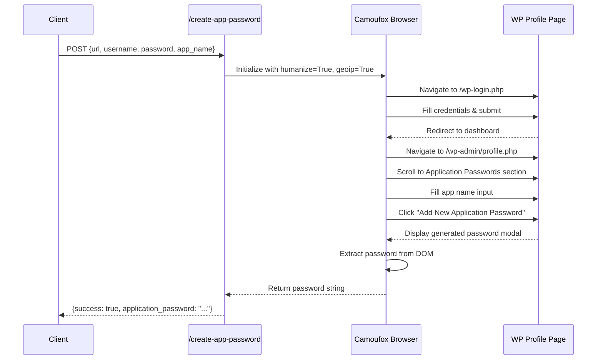

# Design: Application Password API

## Architecture Overview



## Component Design

### 1. Browser Automation Function
**Location**: `wp-setup-service/app/browser_setup.py`

```python
async def create_application_password(
    url: str,
    username: str,
    password: str,
    app_name: str = "WP Migrator"
) -> dict:
    """
    Create WordPress Application Password via browser automation
    
    Steps:
    1. Login to WordPress (reuse existing logic)
    2. Navigate to profile.php
    3. Find Application Passwords section
    4. Create new password with given name
    5. Extract and return password
    
    Returns:
        {
          'success': bool,
          'application_password': str,  # Format: "xxxx xxxx xxxx xxxx xxxx xxxx"
          'app_name': str,
          'message': str,
          'error_code': str (optional)
        }
    """
```

**Key DOM Selectors**:
- App name input: `input[name="new_application_password_name"]`
- Submit button: `#generate-application-password` or `button:has-text("Add New")`
- Password display: `.new-application-password-notice code` or `#new-application-password-value`
- Error message: `.notice-error` or `.application-passwords-not-available-message`

**Error Handling**:
- Login failure → Return `{success: false, error_code: 'LOGIN_FAILED'}`
- Section not found → Return `{success: false, error_code: 'APP_PASSWORD_NOT_SUPPORTED'}`
- Permission denied → Return `{success: false, error_code: 'PERMISSION_DENIED'}`
- Timeout → Return `{success: false, error_code: 'BROWSER_TIMEOUT'}`

### 2. REST API Endpoint
**Location**: `wp-setup-service/app/main.py`

```python
@app.post("/create-app-password")
async def create_app_password(request: dict):
    """
    Generate WordPress Application Password
    
    Request:
    {
      "url": "https://site.com",
      "username": "admin",
      "password": "admin-password",
      "app_name": "Optional Name" (default: "WP Migrator")
    }
    
    Response:
    {
      "success": true,
      "application_password": "Abcd 1234 EfGh 5678 IjKl 9012",
      "app_name": "WP Migrator",
      "message": "Application password created successfully"
    }
    """
```

**Validation**:
- Required fields: `url`, `username`, `password`
- Optional field: `app_name` (defaults to "WP Migrator")
- URL must be valid HTTP/HTTPS
- Credentials cannot be empty

### 3. Integration Points

**Standalone Utility Endpoint**:
- Client calls `/create-app-password` when they need an application password
- Client stores returned password for their use case
- Client uses password for REST API authentication in their own applications
- NO integration with existing `/clone` or `/restore` endpoints

## Implementation Flow

### Phase 1: Core Function (Step 1)
1. Add `create_application_password()` to `browser_setup.py`
2. Reuse login logic from `setup_wordpress_with_browser()`
3. Navigate to profile page
4. Handle DOM interaction for password creation
5. Extract password from modal/display element
6. Return structured result

### Phase 2: API Endpoint (Step 2)
1. Add `/create-app-password` route to `main.py`
2. Import `create_application_password` from `browser_setup`
3. Validate request body
4. Call browser automation function
5. Return response to client

### Phase 3: Testing (Step 3-4)
1. Test with bonnel.ai credentials
2. Verify generated password works with REST API
3. Test error cases (unsupported WP version, permission denied)
4. Verify timeout handling

### Phase 4: Deployment (Step 5)
1. Build Docker image: `docker build -t wp-setup-service:latest .`
2. Push to ECR: `docker tag` + `docker push`
3. SSH to EC2 instance
4. Stop existing container
5. Pull new image
6. Start container with same configuration
7. Verify endpoint accessible

## Edge Cases

### Case 1: Application Passwords Disabled
**Detection**: Check for `.application-passwords-not-available-message` selector
**Response**: `{success: false, error_code: 'APP_PASSWORD_DISABLED', message: '...'}`

### Case 2: WordPress < 5.6
**Detection**: Profile page doesn't have Application Passwords section
**Response**: `{success: false, error_code: 'APP_PASSWORD_NOT_SUPPORTED', message: 'Requires WordPress 5.6+'}`

### Case 3: User Lacks Permission
**Detection**: Error message appears after clicking generate button
**Response**: `{success: false, error_code: 'PERMISSION_DENIED', message: '...'}`

### Case 4: Bot Detection
**Detection**: Login page never shows form fields
**Mitigation**: Using Camoufox with `humanize=True`, `geoip=True` for realistic browser behavior
**Fallback**: Return timeout error with actionable message

## Success Criteria

- ✅ Function successfully creates application password on WordPress 5.6+
- ✅ Generated password works for REST API authentication
- ✅ Proper error handling for all edge cases
- ✅ Endpoint completes within 90 seconds
- ✅ No password storage (return once and discard)
- ✅ Clear error messages for debugging

## Security Considerations

1. **No Storage**: Never store application passwords in database/logs
2. **Single Display**: WordPress shows password only once after creation
3. **Revocation**: Users can revoke from wp-admin at any time
4. **Logging**: Mask passwords in all log output
5. **HTTPS Required**: Enforce HTTPS for production usage
