# Design: Kubernetes Migration Architecture

## Problem Statement

The current EC2/Docker architecture requires:
1. **SSH-based provisioning**: Remote Docker commands over SSH to create containers
2. **Manual configuration**: Nginx config files, port allocation, MySQL database creation
3. **ALB API management**: boto3 ELBv2 calls to create listener rules dynamically
4. **No auto-scaling**: Fixed EC2 capacity, cannot scale based on demand
5. **Complex deployments**: Manual Docker image updates, service restarts

**Current Provisioning Flow (ec2_provisioner.py - 905 lines):**
```
SSH into EC2 → Find available port → Create MySQL database →
Generate Nginx config → Restart Nginx → Run docker run command →
Create ALB target group → Create ALB listener rule → Poll for health
```

**Kubernetes-Native Flow (KRO + ACK):**
```
Create WordPressClone resource → KRO orchestrates everything automatically
```

## Solution Architecture

### High-Level System Architecture

```mermaid
graph LR
    User[User/Client] -->|API Request| ALB[AWS ALB<br/>Load Balancer]

    subgraph EKS["EKS Cluster"]
        ALB --> WP[wp-k8s-service<br/>FastAPI<br/>⚡ Auto-scales via HPA]

        subgraph Control["Control Plane"]
            KRO[KRO<br/>Orchestrator]
            ACK[ACK<br/>RDS Controller]
            HPA[Horizontal Pod<br/>Autoscaler]
            CA[Cluster<br/>Autoscaler]
        end

        HPA -.->|Scale Pods| WP
        CA -.->|Add/Remove Nodes| Nodes[Worker Nodes<br/>🔄 Auto-scaling]

        WP -->|Create Clone| KRO
        KRO -->|Manage| Clones[WordPress Clones<br/>Jobs + Services<br/>📈 On-demand scaling]
        KRO -->|Request DB| ACK

        Git[GitHub<br/>Repository] -.->|GitOps| ArgoCD[Argo CD]
        ArgoCD -.->|Deploy| WP
    end

    ACK -->|Provision| RDS[(RDS MySQL<br/>Databases)]
    Clones -->|Connect| RDS
    ALB -->|Route /clone-*| Clones
```



### Technology Stack Comparison

| Component | Current (EC2) | New (Kubernetes) |
|-----------|---------------|------------------|
| **Orchestration** | SSH + bash scripts | KRO ResourceGroups |
| **Container Runtime** | Docker via SSH | Kubernetes Jobs/Pods |
| **Load Balancing** | Manual ALB API calls | AWS Load Balancer Controller (Ingress) |
| **Database** | Shared MySQL container | ACK RDS Controller (per-clone or shared) |
| **Auto-scaling** | None (fixed capacity) | HPA (pods) + CA (nodes) |
| **Deployment** | Manual docker pull + restart | Argo CD GitOps (automatic) |
| **Configuration** | Nginx config files | Kubernetes ConfigMaps |
| **Secrets** | Environment variables | Kubernetes Secrets |
| **Observability** | Loki (external) | OpenTelemetry + CloudWatch |

## KRO ResourceGroup Design

### WordPress Clone ResourceGroup Definition

Each WordPress clone is represented as a single `WordPressClone` custom resource that KRO expands into multiple Kubernetes resources.

**File: `/kubernetes/kro/resourcegroups/wordpress-clone.yaml`**
```yaml
apiVersion: kro.run/v1alpha1
kind: ResourceGroup
metadata:
  name: wordpress-clone
  namespace: wordpress-production
spec:
  schema:
    apiVersion: v1alpha1
    kind: WordPressClone
    spec:
      # User-provided values
      sourceUrl: string
      sourceUsername: string
      sourcePassword: string
      cloneId: string  # e.g., clone-20260205-143022
      ttlSeconds: integer  # e.g., 7200 (2 hours)
      databaseSize: string  # e.g., db.t3.micro
      useDedicatedDatabase: boolean  # true = RDS per-clone, false = shared RDS
    status:
      # Computed values
      cloneUrl: string
      wordpressUsername: string
      wordpressPassword: string
      apiKey: string
      expiresAt: string

  resources:
    # 1. Secret for WordPress credentials
    - id: wordpress-secret
      template:
        apiVersion: v1
        kind: Secret
        metadata:
          name: ${schema.spec.cloneId}-secret
          namespace: ${metadata.namespace}
        type: Opaque
        stringData:
          username: admin
          password: ${generatePassword(16)}
          api-key: migration-master-key

    # 2. RDS Database (via ACK) - conditionally created
    - id: rds-database
      includeWhen:
        - ${schema.spec.useDedicatedDatabase}
      template:
        apiVersion: rds.services.k8s.aws/v1alpha1
        kind: DBInstance
        metadata:
          name: ${schema.spec.cloneId}-db
          namespace: ${metadata.namespace}
        spec:
          dbInstanceIdentifier: ${schema.spec.cloneId}-db
          dbInstanceClass: ${schema.spec.databaseSize}
          engine: mysql
          engineVersion: "8.0.35"
          masterUsername: wordpress
          masterUserPassword:
            name: ${resources.wordpress-secret.metadata.name}
            key: db-password
          allocatedStorage: 20
          storageType: gp3
          publiclyAccessible: false
          vpcSecurityGroupIDs:
            - ${env.RDS_SECURITY_GROUP_ID}
          dbSubnetGroupName: ${env.RDS_SUBNET_GROUP_NAME}
          backupRetentionPeriod: 1
          skipFinalSnapshot: true
          tags:
            - key: CloneId
              value: ${schema.spec.cloneId}
            - key: TTL
              value: ${schema.spec.ttlSeconds}

    # 3. Job for WordPress clone provisioning
    - id: clone-job
      template:
        apiVersion: batch/v1
        kind: Job
        metadata:
          name: ${schema.spec.cloneId}-job
          namespace: ${metadata.namespace}
        spec:
          ttlSecondsAfterFinished: ${schema.spec.ttlSeconds}
          template:
            metadata:
              labels:
                app: wordpress-clone
                clone-id: ${schema.spec.cloneId}
            spec:
              restartPolicy: OnFailure
              containers:
                - name: wordpress
                  image: 044514005641.dkr.ecr.us-east-1.amazonaws.com/wordpress-target-sqlite:latest
                  ports:
                    - containerPort: 80
                      name: http
                  env:
                    - name: WORDPRESS_DB_HOST
                      value: ${resources.rds-database.status.endpoint.address}
                    - name: WORDPRESS_DB_USER
                      value: wordpress
                    - name: WORDPRESS_DB_PASSWORD
                      valueFrom:
                        secretKeyRef:
                          name: ${resources.wordpress-secret.metadata.name}
                          key: db-password
                    - name: WORDPRESS_DB_NAME
                      value: wordpress
                    - name: CLONE_URL
                      value: http://${env.ALB_DNS_NAME}/${schema.spec.cloneId}/
                    - name: WORDPRESS_USERNAME
                      valueFrom:
                        secretKeyRef:
                          name: ${resources.wordpress-secret.metadata.name}
                          key: username
                    - name: WORDPRESS_PASSWORD
                      valueFrom:
                        secretKeyRef:
                          name: ${resources.wordpress-secret.metadata.name}
                          key: password
                  resources:
                    requests:
                      memory: "512Mi"
                      cpu: "250m"
                    limits:
                      memory: "1Gi"
                      cpu: "500m"

    # 4. Service for WordPress clone
    - id: clone-service
      template:
        apiVersion: v1
        kind: Service
        metadata:
          name: ${schema.spec.cloneId}-svc
          namespace: ${metadata.namespace}
        spec:
          selector:
            clone-id: ${schema.spec.cloneId}
          ports:
            - port: 80
              targetPort: 80
              protocol: TCP
          type: ClusterIP

    # 5. Ingress for path-based routing
    - id: clone-ingress
      template:
        apiVersion: networking.k8s.io/v1
        kind: Ingress
        metadata:
          name: ${schema.spec.cloneId}-ingress
          namespace: ${metadata.namespace}
          annotations:
            alb.ingress.kubernetes.io/group.name: wordpress-clones
            alb.ingress.kubernetes.io/scheme: internet-facing
            alb.ingress.kubernetes.io/target-type: ip
            alb.ingress.kubernetes.io/healthcheck-path: /wp-admin/install.php
            alb.ingress.kubernetes.io/success-codes: "200,302"
        spec:
          ingressClassName: alb
          rules:
            - http:
                paths:
                  - path: /${schema.spec.cloneId}
                    pathType: Prefix
                    backend:
                      service:
                        name: ${resources.clone-service.metadata.name}
                        port:
                          number: 80

  statusCollectors:
    - name: cloneUrl
      select:
        group: ""
        version: v1
        kind: Service
        name: ${resources.clone-service.metadata.name}
      value: http://${env.ALB_DNS_NAME}/${schema.spec.cloneId}/

    - name: wordpressUsername
      select:
        group: ""
        version: v1
        kind: Secret
        name: ${resources.wordpress-secret.metadata.name}
      value: ${data.username}

    - name: wordpressPassword
      select:
        group: ""
        version: v1
        kind: Secret
        name: ${resources.wordpress-secret.metadata.name}
      value: ${data.password}

    - name: apiKey
      select:
        group: ""
        version: v1
        kind: Secret
        name: ${resources.wordpress-secret.metadata.name}
      value: ${data.api-key}
```

### KRO Provisioner Implementation

**File: `/kubernetes/wp-k8s-service/app/kro_provisioner.py`**
```python
from kubernetes import client, config
from kubernetes.client.rest import ApiException
import datetime
import logging

logger = logging.getLogger(__name__)

class KROProvisioner:
    """
    Provisions WordPress clones using KRO ResourceGroups.
    Replaces ec2_provisioner.py (905 lines) with ~100 lines.
    """

    def __init__(self):
        # Load in-cluster Kubernetes config
        config.load_incluster_config()
        self.custom_api = client.CustomObjectsApi()
        self.namespace = "wordpress-production"  # or from env

    def create_clone(self, source_url: str, source_username: str,
                     source_password: str, ttl_minutes: int = 120) -> dict:
        """
        Create a WordPress clone by creating a WordPressClone resource.
        KRO automatically provisions: Secret → RDS → Job → Service → Ingress
        """
        clone_id = f"clone-{datetime.datetime.utcnow().strftime('%Y%m%d-%H%M%S')}"
        ttl_seconds = ttl_minutes * 60

        # Create WordPressClone custom resource
        clone_resource = {
            "apiVersion": "kro.run/v1alpha1",
            "kind": "WordPressClone",
            "metadata": {
                "name": clone_id,
                "namespace": self.namespace
            },
            "spec": {
                "sourceUrl": source_url,
                "sourceUsername": source_username,
                "sourcePassword": source_password,
                "cloneId": clone_id,
                "ttlSeconds": ttl_seconds,
                "databaseSize": "db.t3.micro",
                "useDedicatedDatabase": False  # Use shared RDS for staging
            }
        }

        try:
            # Create the resource - KRO handles everything else
            response = self.custom_api.create_namespaced_custom_object(
                group="kro.run",
                version="v1alpha1",
                namespace=self.namespace,
                plural="wordpressclones",
                body=clone_resource
            )

            logger.info(f"Created WordPressClone resource: {clone_id}")

            # Poll for status (KRO populates status fields)
            clone_status = self._wait_for_clone_ready(clone_id)

            return {
                "success": True,
                "clone_url": clone_status["cloneUrl"],
                "wordpress_username": clone_status["wordpressUsername"],
                "wordpress_password": clone_status["wordpressPassword"],
                "api_key": clone_status["apiKey"],
                "expires_at": (datetime.datetime.utcnow() +
                              datetime.timedelta(seconds=ttl_seconds)).isoformat(),
                "message": "Clone created successfully"
            }

        except ApiException as e:
            logger.error(f"Failed to create clone: {e}")
            return {
                "success": False,
                "error": str(e)
            }

    def _wait_for_clone_ready(self, clone_id: str, timeout: int = 300) -> dict:
        """
        Poll WordPressClone resource until status fields are populated.
        KRO updates status when all resources are ready.
        """
        import time
        start_time = time.time()

        while time.time() - start_time < timeout:
            try:
                response = self.custom_api.get_namespaced_custom_object(
                    group="kro.run",
                    version="v1alpha1",
                    namespace=self.namespace,
                    plural="wordpressclones",
                    name=clone_id
                )

                status = response.get("status", {})
                if status.get("cloneUrl") and status.get("wordpressPassword"):
                    logger.info(f"Clone {clone_id} is ready")
                    return status

            except ApiException as e:
                logger.warning(f"Clone not yet ready: {e}")

            time.sleep(5)

        raise TimeoutError(f"Clone {clone_id} did not become ready within {timeout}s")

    def delete_clone(self, clone_id: str) -> dict:
        """
        Delete a WordPress clone by deleting the WordPressClone resource.
        KRO automatically cleans up all child resources (Job, Service, Ingress, RDS).
        """
        try:
            self.custom_api.delete_namespaced_custom_object(
                group="kro.run",
                version="v1alpha1",
                namespace=self.namespace,
                plural="wordpressclones",
                name=clone_id
            )

            logger.info(f"Deleted WordPressClone resource: {clone_id}")
            return {"success": True, "message": f"Clone {clone_id} deleted"}

        except ApiException as e:
            logger.error(f"Failed to delete clone: {e}")
            return {"success": False, "error": str(e)}
```

## Namespace Isolation Strategy

### Staging vs Production Separation


**NetworkPolicy: Isolate Staging from Production**
```yaml
apiVersion: networking.k8s.io/v1
kind: NetworkPolicy
metadata:
  name: deny-cross-namespace
  namespace: wordpress-staging
spec:
  podSelector: {}
  policyTypes:
    - Ingress
  ingress:
    - from:
        - namespaceSelector:
            matchLabels:
              environment: staging
```

## Cost Optimization Strategies

### Current EC2 Cost: ~$163/month
- t3.large × 2: $121/mo
- EBS (MySQL storage): $20/mo
- ALB: $22/mo

### EKS Baseline Cost: ~$350-500/month
- **EKS control plane**: $73/mo (fixed)
- **t3.large × 2**: $121/mo
- **ALB**: $22/mo
- **RDS per clone** (variable):
  - Avg 5 concurrent clones: $70/mo
  - Avg 15 concurrent clones: $210/mo

### Optimization Target: ~$200-250/month

**Strategy 1: Shared RDS for Staging**
- Staging namespace uses ONE shared RDS db.t3.small ($25/mo)
- All staging clones share database (separate schemas like current EC2 approach)
- Savings: $45/mo (vs per-clone RDS)

**Strategy 2: Spot Instances for Clone Jobs**
- Use Spot instances for Kubernetes worker nodes
- 70% discount on compute (t3.large: $85/mo → $25/mo)
- Clones can tolerate interruptions (TTL-based, ephemeral)
- Savings: $60-80/mo

**Strategy 3: Aurora Serverless v2 for Production**
- Replace per-clone RDS with Aurora Serverless v2
- Scales to 0.5 ACU when idle ($0.12/hour = $87/mo baseline)
- Auto-scales under load
- Cost: $100-200/mo (vs $210/mo for 15 clones)

**Optimized Monthly Cost: ~$220/month**
- EKS control plane: $73
- Spot instances (t3.large × 2): $40
- Shared RDS (staging): $25
- Aurora Serverless (production): $60
- ALB: $22

## GitOps CI/CD Pipeline

### Argo CD Application Setup

**File: `/kubernetes/argocd/applications/wp-k8s-production.yaml`**
```yaml
apiVersion: argoproj.io/v1alpha1
kind: Application
metadata:
  name: wp-k8s-production
  namespace: argocd
spec:
  project: default
  source:
    repoURL: https://github.com/your-org/clone-restore.git
    targetRevision: main  # Production tracks main branch
    path: kubernetes/manifests/overlays/production
  destination:
    server: https://kubernetes.default.svc
    namespace: wordpress-production
  syncPolicy:
    automated:
      prune: true
      selfHeal: true
      allowEmpty: false
    syncOptions:
      - CreateNamespace=true
    retry:
      limit: 5
      backoff:
        duration: 5s
        factor: 2
        maxDuration: 3m
```

### GitHub Actions Workflow

**File: `/.github/workflows/build-wp-k8s-service.yaml`**
```yaml
name: Build and Push wp-k8s-service

on:
  push:
    branches: [main, staging]
    paths:
      - 'kubernetes/wp-k8s-service/**'
      - '.github/workflows/build-wp-k8s-service.yaml'

jobs:
  build:
    runs-on: ubuntu-latest
    steps:
      - uses: actions/checkout@v3

      - name: Configure AWS credentials
        uses: aws-actions/configure-aws-credentials@v2
        with:
          aws-access-key-id: ${{ secrets.AWS_ACCESS_KEY_ID }}
          aws-secret-access-key: ${{ secrets.AWS_SECRET_ACCESS_KEY }}
          aws-region: us-east-1

      - name: Login to Amazon ECR
        id: login-ecr
        uses: aws-actions/amazon-ecr-login@v1

      - name: Build, tag, and push image
        env:
          ECR_REGISTRY: ${{ steps.login-ecr.outputs.registry }}
          ECR_REPOSITORY: wp-k8s-service
          IMAGE_TAG: ${{ github.sha }}
        run: |
          cd kubernetes/wp-k8s-service
          docker build -t $ECR_REGISTRY/$ECR_REPOSITORY:$IMAGE_TAG .
          docker push $ECR_REGISTRY/$ECR_REPOSITORY:$IMAGE_TAG
          docker tag $ECR_REGISTRY/$ECR_REPOSITORY:$IMAGE_TAG $ECR_REGISTRY/$ECR_REPOSITORY:latest
          docker push $ECR_REGISTRY/$ECR_REPOSITORY:latest

      - name: Update Kustomize image tag
        run: |
          cd kubernetes/manifests/overlays/production
          kustomize edit set image wp-k8s-service=$ECR_REGISTRY/$ECR_REPOSITORY:$IMAGE_TAG
          git config user.name "GitHub Actions"
          git config user.email "actions@github.com"
          git add .
          git commit -m "Update wp-k8s-service image to $IMAGE_TAG"
          git push
```

## Migration Timeline

### Phase 1: Bootstrap EKS (Week 1)
**Duration**: 5 days
**Goal**: EKS cluster with KRO, ACK, Argo CD ready

**Tasks**:
- Create EKS cluster with Terraform
- Install ACK controllers (RDS, IAM)
- Install KRO
- Install Argo CD
- Create staging/production namespaces
- Deploy AWS Load Balancer Controller

### Phase 2: KRO ResourceGroups (Week 1-2)
**Duration**: 7 days
**Goal**: WordPress clone ResourceGroup definition working

**Tasks**:
- Create RDS subnet group & security group
- Deploy WordPress clone ResourceGroup
- Test manual WordPressClone creation
- Verify Secret → RDS → Job → Service → Ingress flow
- Test TTL cleanup

### Phase 3: wp-k8s-service (Week 2-3)
**Duration**: 7 days
**Goal**: New Python service deployed and functional

**Tasks**:
- Create `kro_provisioner.py` (KRO-based provisioner)
- Copy `main.py` from wp-setup-service (adapt for KRO)
- Build and push Docker image to ECR
- Deploy Kubernetes manifests (Deployment, Service, Ingress)
- Test `/clone` endpoint end-to-end

### Phase 4: GitOps Setup (Week 3)
**Duration**: 3 days
**Goal**: Argo CD managing deployments

**Tasks**:
- Create Argo CD Applications
- Setup Kustomize overlays (staging/production)
- Configure GitHub Actions for image builds
- Test GitOps workflow (push → auto-deploy → verify)

### Phase 5: Parallel Testing (Week 4)
**Duration**: 5 days
**Goal**: Both systems running, validation complete

**Tasks**:
- Run EC2 and EKS side-by-side
- Validation checklist (clone creation, restore, TTL cleanup)
- Load testing (100+ concurrent clones)
- Monitor observability (logs, metrics, traces)

### Phase 6: Cutover (Week 5)
**Duration**: 3 days
**Goal**: Production traffic on EKS

**Tasks**:
- DNS cutover (ALB → EKS ALB)
- Monitor for 48 hours
- Rollback plan ready (DNS switch back to EC2 ALB)
- Decommission EC2 infrastructure

## Success Criteria

- ✅ Clone creation time < 5 minutes
- ✅ TTL cleanup automatic (no orphaned resources)
- ✅ Path-based routing via Ingress (no manual ALB API calls)
- ✅ Browser automation works (Playwright + Camoufox in Kubernetes Job)
- ✅ Database isolation maintained (per-clone RDS or shared RDS with separate schemas)
- ✅ Auto-scaling functional (HPA scales wp-k8s-service, CA scales nodes)
- ✅ GitOps workflow (push to main → auto-deploy to production)
- ✅ Cost < $250/mo with optimizations
- ✅ No SSH dependencies (pure Kubernetes API)
- ✅ Observability equivalent to current (OpenTelemetry + CloudWatch)

## Rollback Plan

### If Migration Fails

1. **DNS Rollback** (< 5 minutes):
   - Switch DNS back to EC2 ALB
   - EC2 infrastructure remains running throughout migration

2. **Data Safety**:
   - RDS databases independent of compute layer
   - No data loss on rollback

3. **Code Rollback**:
   - EC2 version (`/wp-setup-service/`) never modified
   - Git revert for Kubernetes changes

4. **Cost Control**:
   - Delete EKS cluster if migration fails
   - Stop burning $73/mo EKS control plane cost
