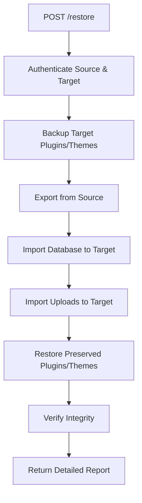

# Design: Safe Restore Architecture

## Problem Statement

WordPress sites consist of:
1. **Database** (MySQL): Posts, pages, comments, users, plugin settings, theme customizations
2. **Code** (Filesystem): Plugin PHP files, theme PHP/CSS/JS files
3. **Media** (Filesystem): Uploads directory with images, PDFs, etc.

When restoring from a backup/staging snapshot, we want to:
- ✅ Restore content and design settings (database)
- ✅ Restore media files (uploads)
- ❌ NOT overwrite updated plugins/themes on production

## Solution Architecture

### Restore Flow



### Data Preservation Strategy

| Component | Clone Behavior | Restore Behavior | Rationale |
|-----------|---------------|------------------|-----------||
| Database | Full replace | Full replace | Content must match snapshot |
| Plugins (code) | Full replace | **Preserve target** | Avoid plugin downgrades |
| Themes (code) | Full replace | **Restore from staging** | Deploy theme changes |
| Uploads | Merge/overwrite | Merge/overwrite | Media should match content |
| Plugin settings (DB) | Restored | Restored | Comes with database |
| Theme settings (DB) | Restored | Restored | Comes with database |

### Configuration Options

```json
{
  "options": {
    "preserve_plugins": true,     // Default: true
    "preserve_themes": false,     // Default: false (allow theme deployment)
    "preserve_uploads": false,    // Default: false
    "verify_integrity": true,     // Default: true
    "force_overwrite": false      // Override all preservation (dangerous)
  }
}
```

## Implementation Details

### Phase 1: Pre-Import Preservation

```php
// In class-importer.php
private function backup_plugins_directory() {
    $timestamp = time();
    $backup_dir = sys_get_temp_dir() . "/wp-restore-backup-{$timestamp}";
    
    // Backup plugins only
    $this->recursive_copy(
        WP_CONTENT_DIR . '/plugins',
        $backup_dir . '/plugins'
    );
    
    return $backup_dir;
}
```

### Phase 2: Selective Restore

```php
private function restore_files($source_wp_content, $options = []) {
    $preserve_plugins = $options['preserve_plugins'] ?? true;
    $preserve_themes = $options['preserve_themes'] ?? false;
    
    if (!$preserve_plugins) {
        // Delete and replace plugins
        $this->recursive_delete(WP_CONTENT_DIR . '/plugins');
        $this->recursive_copy(
            $source_wp_content . '/plugins',
            WP_CONTENT_DIR . '/plugins'
        );
    }
    
    // Always restore themes (default behavior for staging→production workflow)
    if (!$preserve_themes) {
        $this->recursive_delete(WP_CONTENT_DIR . '/themes');
        $this->recursive_copy(
            $source_wp_content . '/themes',
            WP_CONTENT_DIR . '/themes'
        );
    }
    
    // Always restore uploads
    $this->recursive_copy(
        $source_wp_content . '/uploads',
        WP_CONTENT_DIR . '/uploads'
    );
}
```

### Phase 3: Integrity Verification

```php
private function verify_integrity() {
    global $wpdb;
    
    $warnings = [];
    
    // Check active plugins exist on filesystem
    $active_plugins = get_option('active_plugins', []);
    foreach ($active_plugins as $plugin_file) {
        $plugin_path = WP_PLUGIN_DIR . '/' . $plugin_file;
        if (!file_exists($plugin_path)) {
            $warnings[] = "Active plugin not found: {$plugin_file}";
        }
    }
    
    // Check active theme exists
    $active_theme = get_option('template');
    $theme_path = WP_CONTENT_DIR . '/themes/' . $active_theme;
    if (!is_dir($theme_path)) {
        $warnings[] = "Active theme not found: {$active_theme}";
    }
    
    return [
        'status' => empty($warnings) ? 'healthy' : 'warnings',
        'warnings' => $warnings
    ];
}
```

## API Design

### New Endpoint: POST /restore

```json
{
  "source": {
    "url": "https://staging.bonnel.ai",
    "username": "admin",
    "password": "secure-password"
  },
  "target": {
    "url": "https://bonnel.ai",
    "username": "admin",
    "password": "secure-password"
  },
  "options": {
    "preserve_plugins": true,
    "preserve_themes": true,
    "verify_integrity": true
  }
}
```

### Response

```json
{
  "success": true,
  "message": "Restore completed successfully",
  "details": {
    "database": {
      "status": "restored",
      "tables_imported": 12,
      "rows_affected": 45234
    },
    "plugins": {
      "status": "preserved",
      "count": 15,
      "versions": {
        "elementor": "3.27.0",
        "woocommerce": "8.5.2"
      }
    },
    "themes": {
      "status": "preserved",
      "count": 3,
      "active": "hello-elementor"
    },
    "uploads": {
      "status": "restored",
      "files_copied": 1234,
      "size_mb": 456
    },
    "integrity": {
      "status": "warnings",
      "warnings": [
        "Plugin 'old-plugin' referenced in database but not found in filesystem"
      ]
    }
  }
}
```

## Edge Cases

### 1. Database Schema Mismatch
**Problem**: Restored database expects old plugin version's schema  
**Solution**: Integrity check detects this, user must manually fix or disable preserve_plugins

### 2. Missing Plugin in Target
**Problem**: Database references plugin that was removed from target  
**Solution**: Warning in integrity report, WordPress automatically deactivates missing plugins

### 3. Theme Not Found
**Problem**: Database specifies theme not in target filesystem  
**Solution**: WordPress falls back to default theme, integrity check warns user

### 4. Storage Space
**Problem**: Temporary backup requires disk space  
**Solution**: Use streaming backup/restore, cleanup immediately after operation

## Testing Strategy

### Test Case 1: Plugin Update Preservation
1. Export production (v1.0 plugin)
2. Update plugin on production (v1.5)
3. Restore from export with preserve_plugins=true, preserve_themes=false
4. **Assert**: Plugin is v1.5, theme changes from staging applied, content is from export

### Test Case 2: New Plugin Preservation
1. Export production
2. Install new plugin on production
3. Restore from export
4. **Assert**: New plugin still exists and active

### Test Case 3: Integrity Detection
1. Restore with missing plugin reference in DB
2. **Assert**: Integrity check warns about missing plugin

### Test Case 4: Force Overwrite Mode
1. Set preserve_plugins=false
2. Restore from export
3. **Assert**: Plugins are from export, updates lost

## Migration Path

1. **Phase 1**: Implement preservation logic in importer
2. **Phase 2**: Add /restore endpoint with options
3. **Phase 3**: Add integrity verification
4. **Phase 4**: Add detailed reporting
5. **Phase 5**: Consider UI in wp-setup-service static page

Existing `/clone` endpoint remains unchanged - it's for creating test environments where full replacement is desired.
